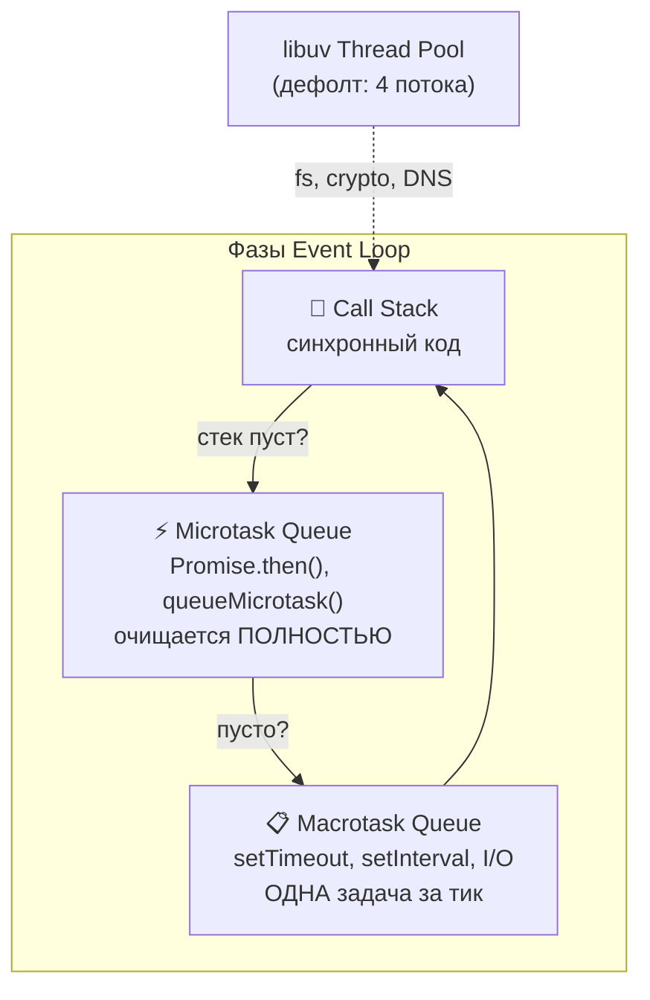

# Модуль 01 — JavaScript / Node.js

> **Для AI-архитектора:** не как писать, а как работает внутри.
> Один день изучения — полное понимание механики платформы.

---

## Содержание

1. [Как работает JS под капотом](#1-как-работает-js-под-капотом)
2. [Асинхронность — эволюция модели](#2-асинхронность--эволюция-модели)
3. [Модульная система и ESM](#3-модульная-система-и-esm)
4. [Потоки и параллелизм](#4-потоки-и-параллелизм)
5. [Node.js как платформа](#5-nodejs-как-платформа)
6. [Архитектурные паттерны](#6-архитектурные-паттерны)
7. [Антипаттерны](#7-антипаттерны)
8. [Чеклист архитектора](#8-чеклист-архитектора)
9. [Задачи AI-кодеру](#9-задачи-ai-кодеру--правильные-формулировки)

---

## Актуальные версии (июнь 2026)

| Версия | Статус | Рекомендация |
|--------|--------|-------------|
| Node.js 22 | Maintenance LTS | legacy / поддержка существующих проектов |
| Node.js 24 | **Active LTS** | **рекомендуется для production** |
| Node.js 25 | Maintenance | переходная ветка, не выбирать для нового проекта |
| Node.js 26 | Current | новые инструменты, эксперименты, ранний adoption |

**Важно:** с Node.js 27 переход на одну мажорную версию в год вместо двух.
Планируй миграции заранее.

---

## 1. Как работает JS под капотом

### Event Loop — главная идея платформы

JavaScript однопоточный. Это означает: в каждый момент времени
выполняется ровно одна операция. Никакого параллелизма на уровне
кода — только **видимость** параллелизма через асинхронность.

Вот что происходит внутри Node.js в каждый момент времени:



**Тик Event Loop** — это один полный цикл: проверить стек →
очистить микротаски → взять одну макротаску → снова.

### Call Stack

Стек вызовов — это список функций, которые сейчас выполняются.
Каждый вызов функции добавляет фрейм, возврат — удаляет.

Когда стек **пуст** — Event Loop берёт следующую задачу из очереди.
Пока стек **не пуст** — ничто другое не выполняется. Никогда.

**Практический вывод для архитектора:**
Любой тяжёлый синхронный код (большой цикл, сложные вычисления)
**блокирует весь процесс**. Пока он выполняется — никакие HTTP-запросы
не обрабатываются, никакие таймеры не срабатывают.
Это самая частая причина «зависания» Node.js сервера.

### Heap

Область памяти V8, где хранятся объекты. Управляется сборщиком мусора.
Архитектору важно знать два момента:

- **Утечки памяти** в Node.js почти всегда — это объекты в Heap,
  на которые остаётся ссылка дольше нужного (глобальные переменные,
  незакрытые EventEmitter подписки, кэши без ограничения размера)
- **--max-old-space-size** — флаг запуска Node.js, который
  ограничивает размер Heap. По умолчанию ~1.5GB. При обработке
  больших файлов нужно увеличивать явно

### V8 в Node.js 22+

Node.js 22 включает V8 12.x с улучшенным Maglev JIT-компилятором:
- Быстрее компиляция и оптимизация байткода
- Улучшенная сборка мусора с меньшими паузами
- Снижение латентности холодного старта

Для архитектора это означает: CPU-интенсивный код в Node.js 22+
работает значительно быстрее без изменений в исходниках.

### Microtasks vs Macrotasks — практическая разница

```javascript
// Порядок выполнения:
console.log('1');                        // синхронно → сразу

setTimeout(() => console.log('2'), 0);  // macrotask → в конце тика

Promise.resolve().then(
  () => console.log('3')                // microtask → до macrotask
);

console.log('4');                        // синхронно → сразу

// Вывод: 1, 4, 3, 2
```

**Почему это важно архитектору:**
Если AI-кодер ставит критическую логику в `setTimeout(fn, 0)` вместо
`Promise.resolve().then(fn)` — порядок выполнения может быть нарушен
в граничных случаях. Разница не в задержке, а в приоритете.

### libuv — невидимый движок

Node.js использует библиотеку **libuv** для всех I/O операций.
Именно она управляет:
- Файловой системой (fs)
- Сетевыми операциями
- Таймерами
- Thread Pool для операций, которые нельзя сделать асинхронно
  (например, DNS lookup, некоторые операции fs)

Thread Pool libuv по умолчанию = **4 потока**. При интенсивной
работе с файлами это узкое место. Настраивается через:
`UV_THREADPOOL_SIZE=16 node app.js`

---

## 2. Асинхронность — эволюция модели

### Почему асинхронность вообще нужна

Node.js оптимизирован под **I/O-bound задачи** — когда программа
большую часть времени ждёт: ответа от API, чтения файла, запроса к БД.

В этот момент ожидания CPU свободен. Асинхронность позволяет
использовать это время для другой работы — без создания новых потоков.

Именно поэтому Node.js держит тысячи одновременных соединений
там, где PHP или Java создали бы тысячи потоков и упали бы под
нагрузкой памяти.

### Callbacks — первое поколение (проблема)

```javascript
fs.readFile('a.txt', (err, dataA) => {
  fs.readFile('b.txt', (err, dataB) => {
    fs.readFile('c.txt', (err, dataC) => {
      // Callback Hell — пирамида смерти
      // Обработка ошибок в каждом уровне отдельно
      // Невозможно нормально прервать цепочку
    });
  });
});
```

Проблема не в синтаксисе. Проблема в том, что управление потоком
(try/catch, return, break) перестаёт работать предсказуемо.

### Promises — второе поколение (решение)

Promise — это объект, представляющий **будущий результат** операции.
Три состояния: `pending` → `fulfilled` или `rejected`.

```javascript
// Цепочка вместо вложенности
readFile('a.txt')
  .then(dataA => readFile('b.txt'))
  .then(dataB => readFile('c.txt'))
  .catch(err => /* одна точка обработки ошибок */);
```

**Ключевые методы — когда что выбирать:**

| Метод | Когда использовать |
|-------|-------------------|
| `Promise.all([...])` | Все операции нужны, при одной ошибке — стоп |
| `Promise.allSettled([...])` | Нужны все результаты, ошибки не критичны |
| `Promise.race([...])` | Нужен первый ответ (таймаут, fallback) |
| `Promise.any([...])` | Нужен первый успешный (несколько источников) |

**Граничный случай — необработанный rejected Promise:**

```javascript
// Это МОЛЧА проглатывает ошибку в старых версиях Node.js
somePromise.then(result => {
  throw new Error('упс');
  // .catch() не добавлен
});
```

В Node.js 15+ это вызывает `UnhandledPromiseRejection` и крашит
процесс. Всегда добавляй глобальный обработчик:

```javascript
process.on('unhandledRejection', (reason, promise) => {
  console.error('Unhandled Rejection:', reason);
  process.exit(1);
});
```

### async/await — третье поколение (синтаксический сахар)

`async/await` — это не новая асинхронная модель. Это синтаксис
поверх Promises, который делает асинхронный код похожим на синхронный.

```javascript
async function processFiles() {
  try {
    const dataA = await readFile('a.txt');  // ждёт, но не блокирует
    const dataB = await readFile('b.txt');
    return dataA + dataB;
  } catch (err) {
    // обычный try/catch работает
  }
}
```

**Главная ловушка async/await для архитектора:**

```javascript
// ❌ Последовательно — медленно (ждём каждый файл)
const a = await readFile('a.txt');
const b = await readFile('b.txt');
const c = await readFile('c.txt');

// ✅ Параллельно — быстро (все три запускаются одновременно)
const [a, b, c] = await Promise.all([
  readFile('a.txt'),
  readFile('b.txt'),
  readFile('c.txt')
]);
```

Когда AI-кодер генерирует последовательные `await` там, где
возможен `Promise.all` — это архитектурная проблема производительности,
не синтаксическая.

### Граничный случай: async в циклах

```javascript
// ❌ forEach не ждёт async callback — баг, который сложно заметить
items.forEach(async (item) => {
  await process(item); // выполняется, но forEach не ждёт
});
// код после forEach продолжается немедленно

// ✅ for...of ждёт каждую итерацию
for (const item of items) {
  await process(item);
}

// ✅ Параллельно для всех
await Promise.all(items.map(item => process(item)));
```

Это одна из самых частых ошибок в AI-генерированном коде.
Всегда проверяй циклы с async-операциями.

### Explicit Resource Management (Node.js 22+)

Новый синтаксис `using` / `await using` для автоматической
очистки ресурсов — аналог `using` в C# и `with` в Python:

```javascript
// ✅ Файл закроется автоматически при выходе из блока
{
  await using fileHandle = await fs.promises.open('file.txt', 'r');
  const content = await fileHandle.readFile('utf8');
  // fileHandle.close() вызывается автоматически
}

// Работает даже при исключениях — гарантированная очистка
```

Для архитектора: это решает класс ошибок с незакрытыми дескрипторами,
которые AI-кодеры часто упускают в ветках с исключениями.

---

## 3. Модульная система и ESM

### CommonJS — старый стандарт

```javascript
// require — синхронный, блокирующий
const fs = require('fs');
module.exports = { myFunction };
```

CommonJS загружает модули **синхронно** во время выполнения.
Это означает: `require()` можно вызвать в любом месте кода,
даже внутри `if` блока или функции.

### ESM — современный стандарт

```javascript
// import — статический, анализируется до выполнения
import fs from 'fs';
export { myFunction };
```

ESM импорты **статические** — движок знает все зависимости
до запуска кода. Это открывает tree-shaking, лучшую оптимизацию
и строгую цикличность зависимостей.

В Node.js ESM включается через:
- Расширение файла `.mjs`
- Поле `"type": "module"` в `package.json`

### `require()` ESM-модулей в Node.js 22+

Начиная с Node.js 22 LTS — `require()` синхронных ESM-модулей
стал **стабильным** (ранее был экспериментальным):

```javascript
// Node.js 22+ — теперь работает стабильно
const esModule = require('./sync-esm-module.js');
```

Ограничение: работает только с синхронными ESM-модулями
(без top-level `await`). Для модулей с top-level `await`
по-прежнему нужен динамический `import()`.

### Ключевые отличия для архитектора

| Аспект | CommonJS | ESM |
|--------|----------|-----|
| Загрузка | Синхронная, runtime | Асинхронная, compile-time |
| `require()` в условии | Можно | Нельзя |
| Top-level `await` | Нет | Да |
| `__dirname`, `__filename` | Есть | Нет (нужен `import.meta.url`) |
| Совместимость | Везде | Node.js 12+, современные бандлеры |
| `require()` ESM | Нет | Стабильно в Node.js 22+ (только sync) |

### Граничные случаи — где ломается

**`__dirname` в ESM:**
```javascript
// В ESM нет __dirname — нужен обходной путь
import { fileURLToPath } from 'url';
import { dirname } from 'path';

const __filename = fileURLToPath(import.meta.url);
const __dirname = dirname(__filename);
```
Это часто забывается AI-кодерами при переходе на ESM.

**Смешанные проекты — распространённая боль:**
Когда в одном проекте часть файлов `.js` (CommonJS по умолчанию),
а часть `.mjs` — AI-кодер часто путает контекст и генерирует
несовместимый код. Архитектурное решение: **сразу определить
стандарт модулей для всего проекта** и зафиксировать в `package.json`.

### Circular dependencies — скрытая проблема

```
moduleA.js импортирует moduleB.js
moduleB.js импортирует moduleA.js
```

В CommonJS это приводит к тому, что один из модулей получает
**пустой объект** вместо реального экспорта — без ошибки, молча.
В ESM — живые привязки решают часть проблем, но цикличность
всё равно является архитектурным запахом.

Признак проблемы в проекте: переменная импортирована, но равна
`undefined` в момент использования.

---

## 4. Потоки и параллелизм

### Streams — обработка без загрузки в память

Stream — это абстракция над последовательностью данных,
которые обрабатываются **по частям (chunks)**, не целиком.

```
Без Stream:    файл 2GB → загрузить всё в RAM → обработать
Со Stream:     файл 2GB → читать по 64KB → обрабатывать → писать
```

Четыре типа:
- **Readable** — источник данных (чтение файла, HTTP response)
- **Writable** — приёмник данных (запись файла, HTTP request)
- **Duplex** — и то, и другое (TCP socket)
- **Transform** — преобразование данных (gzip, шифрование)

**`stream.compose()` в Node.js 22+:**

```javascript
import { compose } from 'stream';

// Объединение нескольких transform-потоков в один
const pipeline = compose(
  createGzipTransform(),
  createEncryptTransform(),
  createBase64Transform()
);

readable.pipe(pipeline).pipe(writable);
```

**Pipe — основной паттерн работы со Streams:**
```javascript
// Читаем → сжимаем → пишем. Всё в потоке, память не накапливается
import { pipeline } from 'stream/promises';

await pipeline(
  fs.createReadStream('large-file.txt'),
  zlib.createGzip(),
  fs.createWriteStream('large-file.txt.gz')
);
// stream/promises автоматически обрабатывает ошибки и cleanup
```

**Граничный случай — backpressure:**
Если Readable генерирует данные быстрее, чем Writable их потребляет —
буфер переполняется. `pipeline()` из `stream/promises` управляет
этим автоматически и корректно обрабатывает ошибки.
При ручной работе со Streams нужно проверять возвращаемое значение
`.write()` и ждать событие `'drain'`. AI-кодеры это часто упускают.

### Worker Threads — настоящий параллелизм

Worker Threads — это потоки внутри одного Node.js процесса с
**отдельным Event Loop** и **отдельной памятью**.

Когда нужны:
- CPU-bound задачи (обработка изображений, парсинг, шифрование)
- Когда одна операция не должна блокировать остальные
- Когда нужно использовать несколько ядер CPU

```
Главный поток (Event Loop)
    ↓ postMessage(data)
Worker Thread 1 (отдельный Event Loop)
Worker Thread 2 (отдельный Event Loop)
    ↓ parentPort.postMessage(result)
Главный поток получает результат
```

**Передача данных между потоками:**

```javascript
// Обычная передача — данные КОПИРУЮТСЯ (медленно для больших объектов)
worker.postMessage({ buffer: largeData });

// Zero-copy передача — право собственности ПЕРЕДАЁТСЯ (быстро)
// После transfer largeBuffer в главном потоке становится пустым
worker.postMessage(
  { buffer: largeBuffer },
  [largeBuffer]  // transferList — список объектов для передачи
);
```

**`structuredClone()` — стандартный способ глубокого копирования:**

```javascript
// Node.js 17+ — встроенный глубокий клон без зависимостей
const copy = structuredClone(complexObject);

// Работает с Map, Set, Date, ArrayBuffer, TypedArray
// Не работает с функциями и DOM-узлами
```

### Piscina — пул Worker Threads

Piscina решает задачу управления пулом воркеров:
создание, переиспользование, очередь задач, ограничение concurrency.

```javascript
import Piscina from 'piscina';

const pool = new Piscina({
  filename: './worker.js',
  maxThreads: 8,        // максимум воркеров
  minThreads: 2,        // минимум (держать тёплыми)
});

// Отправка задачи в пул — автоматически выбирает свободный воркер
const result = await pool.run({ imageBuffer, options });
```

**Когда Piscina лучше прямых Worker Threads:**
- Много однотипных задач (обработка файлов, изображений)
- Нужна очередь с ограничением параллелизма
- Не хочется управлять жизненным циклом воркеров вручную

**Когда прямые Worker Threads лучше:**
- Долгоживущий фоновый поток с постоянным обменом данными
- Нужен двусторонний канал с сложным протоколом

### Child Processes — запуск внешних программ

`child_process` — для запуска внешних бинарников и команд:

```javascript
import { exec, spawn } from 'child_process';

// exec — буферизует весь вывод (не для больших данных)
exec('ffmpeg -version', (err, stdout) => { ... });

// spawn — стриминг вывода (для больших данных и долгих процессов)
const proc = spawn('ffmpeg', ['-i', 'input.mp4', 'output.webp']);
proc.stdout.pipe(outputStream);
```

**Разница spawn vs exec для архитектора:**
`exec` ждёт завершения и буферизует весь stdout. При большом
выводе — переполнение буфера и ошибка. `spawn` работает как Stream —
данные текут по мере появления.

---

## 5. Node.js как платформа

### Permission Model (Node.js 22+ Stable)

Начиная с Node.js 22.13.0 / 23.5.0 — Permission Model переведён
в **стабильный** статус. Это механизм гранулярного контроля доступа:

```bash
# Только файловая система (чтение)
node --permission --allow-fs-read=./data app.js

# Файловая система + сеть к конкретным хостам
node --permission \
  --allow-fs-read=./data \
  --allow-fs-write=./output \
  --allow-net=api.example.com:443,localhost:11434 \
  app.js

# Разрешить Worker Threads и Child Processes
node --permission --allow-worker --allow-child-process app.js
```

**Практическое значение для AI-архитектора:**
Изолируй сервисы, работающие с внешними API (Groq, Gemini),
от доступа к файловой системе и наоборот. При утечке ключей
или компрометации зависимости — радиус поражения ограничен.

**Важный граничный случай:**
`--allow-net` не покрывает Unix Domain Sockets (UDS) —
локальные сокеты не блокируются даже с ограниченными сетевыми
правами. Учитывай при проектировании изоляции.

### Встроенный fetch() — стабильный в Node.js 22

```javascript
// Нативный fetch без node-fetch и axios
const res = await fetch('https://api.example.com/data');
const data = await res.json();

// Полная совместимость с Web Fetch API
// RequestInit, Headers, Response — всё как в браузере
```

Для архитектора: убирает зависимость `node-fetch` / `axios`
для простых HTTP-запросов. Для сложных сценариев (retry, interceptors)
по-прежнему нужны библиотеки типа `ky` или `got`.

### Встроенный WebSocket Client (Node.js 22+)

```javascript
// Нативный WebSocket без зависимостей
const ws = new WebSocket('wss://api.example.com/stream');

ws.addEventListener('message', (event) => {
  console.log(event.data);
});

ws.send(JSON.stringify({ type: 'subscribe', channel: 'prices' }));
```

### Встроенный Test Runner (стабильный в Node.js 22+)

```javascript
import { test, describe, it, mock } from 'node:test';
import assert from 'node:assert/strict';

describe('Pipeline', () => {
  it('должен обработать документ', async () => {
    const result = await processDocument(mockDoc);
    assert.equal(result.status, 'processed');
  });
});
```

Запуск: `node --test` или `node --test **/*.test.js`

Для большинства задач Jest больше не нужен — встроенный runner
покрывает 90% сценариев без зависимостей.

### fs — файловая система

```javascript
import { promises as fsp } from 'fs';

// Синхронно — блокирует Event Loop. Только для инициализации
const config = JSON.parse(fs.readFileSync('config.json', 'utf8'));

// Асинхронно — правильный способ в runtime
const data = await fsp.readFile('data.json', 'utf8');
```

**Важные методы, которые AI-кодеры иногда путают:**

| Задача | Правильный метод |
|--------|-----------------|
| Создать директорию рекурсивно | `fs.mkdir(path, { recursive: true })` |
| Проверить существование файла | `try/catch` на `fs.stat()` |
| Скопировать файл | `fs.copyFile()` — атомарная операция |
| Переместить файл | `fs.rename()` — атомарно в пределах одного диска |
| Удалить директорию рекурсивно | `fs.rm(path, { recursive: true, force: true })` |

**Граничный случай — race condition:**
```javascript
// ❌ Проверка + действие — не атомарны
if (await fileExists(path)) {
  await readFile(path); // может упасть
}

// ✅ Проще и надёжнее
try {
  await readFile(path);
} catch (err) {
  if (err.code === 'ENOENT') { /* файл не найден */ }
}
```

### path — работа с путями

```javascript
import path from 'path';

path.join('/users', 'alex', 'file.txt')  // '/users/alex/file.txt'
path.resolve('./relative')               // абсолютный путь
path.dirname('/users/alex/file.txt')     // '/users/alex'
path.basename('/users/alex/file.txt')    // 'file.txt'
path.extname('file.txt')                 // '.txt'
```

**Никогда не конкатенируй пути строками** (`dir + '/' + file`).
На Windows разделитель `\`, на Unix `/`. `path.join()` решает это.

### process — управление процессом

```javascript
process.env.MY_VAR          // переменные окружения
process.argv                // аргументы командной строки
process.cwd()               // текущая рабочая директория
process.exit(0)             // завершение (0 — успех, 1 — ошибка)
process.memoryUsage()       // использование памяти (диагностика)

// Graceful shutdown — корректное завершение
process.on('SIGTERM', async () => {
  await cleanup();   // закрыть соединения, дописать файлы
  process.exit(0);
});
```

### EventEmitter — основа Node.js

Большинство встроенных объектов Node.js (fs, http, stream)
наследуют EventEmitter. Это паттерн publish/subscribe:

```javascript
import { EventEmitter } from 'events';

const emitter = new EventEmitter();

emitter.on('data', (chunk) => { /* обработчик */ });
emitter.emit('data', buffer);
```

**Граничный случай — утечка памяти через EventEmitter:**
По умолчанию Warning если > 10 обработчиков на одно событие.
Это не ошибка, но сигнал об архитектурной проблеме — обработчики
добавляются, но не удаляются.

```javascript
// Всегда удаляй обработчики когда они больше не нужны
emitter.off('data', handler);
// или одноразовый обработчик
emitter.once('data', handler);
```

### Почему Node.js плох для CPU-задач

Node.js оптимизирован для I/O. Для CPU:
- Нет встроенной многопоточности в основном потоке
- Тяжёлые вычисления блокируют весь Event Loop
- Другие запросы не обрабатываются в это время

**Архитектурное решение для CPU-задач в Node.js:**
1. Worker Threads / Piscina — для вычислений внутри процесса
2. Child Process — для запуска внешних бинарников (ffmpeg, imagemagick)
3. Микросервис на Go / Rust — для критически CPU-интенсивных операций

Именно поэтому raster-forge написан на Go, а не Node.js —
растеризация PDF является CPU-bound задачей.

---

## 6. Архитектурные паттерны

### Pipeline паттерн

Последовательная обработка данных через независимые шаги.
Каждый шаг получает данные, трансформирует, передаёт дальше.

```javascript
// Функциональный pipeline
const result = await pipeline(
  inputData,
  [
    validateStep,
    normalizeStep,
    transformStep,
    outputStep,
  ]
);

async function pipeline(data, steps) {
  let current = data;
  for (const step of steps) {
    current = await step(current);
  }
  return current;
}
```

**Признак правильного pipeline для AI-кодера:**
- Каждый шаг — чистая функция: один вход, один выход
- Шаг не знает о других шагах
- Шаг можно отключить, заменить, протестировать изолированно

### Config-driven design

Логика определяется конфигурацией, не кодом.

```javascript
// ❌ Логика в коде — нужна перекомпиляция для изменения
if (documentType === 'passport') {
  fields = ['series', 'number', 'issued_by'];
}

// ✅ Логика в конфиге — меняется без кода
const config = {
  passport: { fields: ['series', 'number', 'issued_by'] },
  inn:      { fields: ['number', 'date'] }
};
const fields = config[documentType].fields;
```

### Graceful Shutdown

```javascript
let isShuttingDown = false;

async function shutdown(signal) {
  if (isShuttingDown) return;
  isShuttingDown = true;

  console.log(`Получен ${signal}, завершаем...`);

  server.close();
  await processingQueue.drain();
  await database.close();
  await state.save();

  process.exit(0);
}

process.on('SIGTERM', () => shutdown('SIGTERM'));
process.on('SIGINT',  () => shutdown('SIGINT'));

// Таймаут принудительного завершения — обязательно
setTimeout(() => {
  console.error('Принудительное завершение по таймауту');
  process.exit(1);
}, 10000).unref(); // .unref() — не держит процесс если всё завершилось
```

**Типичные ошибки AI-кодеров в graceful shutdown:**
- Не обрабатывают `SIGTERM` (Docker stop)
- Не ждут завершения текущих операций
- Забывают `.unref()` на таймауте — процесс зависает

### Error Classes Hierarchy

```javascript
class AppError extends Error {
  constructor(message, code, statusCode = 500) {
    super(message);
    this.name = this.constructor.name;
    this.code = code;
    this.statusCode = statusCode;
  }
}

class ValidationError extends AppError {
  constructor(message, field) {
    super(message, 'VALIDATION_ERROR', 400);
    this.field = field;
  }
}

class ApiError extends AppError {
  constructor(message, apiName, statusCode) {
    super(message, 'API_ERROR', statusCode);
    this.apiName = apiName;
  }
}
```

**Почему это важно архитектору:**
Когда AI-кодер пишет `throw new Error('api rate limit')` — в
обработчике нельзя надёжно отличить rate limit от network error
от validation error. Типизированные ошибки делают обработку
детерминированной.

---


## 7. Антипаттерны

- **`setInterval` как бизнес-планировщик.** Интервалы легко наслаиваются, не дают backpressure и не масштабируются в распределённой системе. Для очередей и расписаний — внешний scheduler, Redis Streams, BullMQ, database advisory locks.
- **`async` внутри `forEach` без контроля завершения.** Код выглядит параллельным, но ошибки и порядок завершения становятся неявными. Для параллельной работы — `Promise.all`, `Promise.allSettled`, `p-limit` или worker pool.
- **Один огромный event-loop task.** Даже без блокирующего I/O длинный CPU-цикл держит все запросы. Для тяжёлых вычислений — chunking, worker threads, child process или отдельный service.
- **Глобальные кэши без TTL и лимита.** В serverless и multi-process это разные кэши с разным временем жизни. Любой in-memory cache должен иметь size limit, TTL и метрики hit/miss/eviction.
- **Worker Threads как замена потоковой обработке.** Для файлов и HTTP потоков обычно дешевле Streams. Worker Threads нужны там, где есть CPU-bound работа или изоляция выполнения.

---

## Anti-checklist ☠️

- [ ] Использовать `forEach` с async callback — ошибки и порядок завершения неконтролируемы
- [ ] `fs.readFileSync` в runtime — блокирует Event Loop, только для инициализации
- [ ] Последовательные `await` вместо `Promise.all` для независимых операций — в 3× медленнее
- [ ] `setInterval` как бизнес-планировщик — нет backpressure, не масштабируется
- [ ] Глобальный кэш без TTL и лимита — OOM в production незаметно
- [ ] `new Error(string)` без кода — в обработчике нельзя отличить rate limit от network error

## 8. Задачи AI-кодеру — правильные формулировки

Плохая формулировка — размытая, AI выберет простейшее решение:
> «Напиши функцию чтения файлов»

Хорошая формулировка — с архитектурными ограничениями:
> «Напиши функцию пакетного чтения файлов через Streams.
> Используй `pipeline` из `stream/promises`.
> Файлы могут быть до 10GB.
> Используй `await using` для управления файловыми дескрипторами.
> Верни AsyncIterator. Node.js 22+.»

Формула: **что делает** + **ограничения** + **конкретные API** + **версия платформы**

---

## 9. Чеклист архитектора

### Версия и конфигурация
- [ ] Node.js 24 LTS — текущая рекомендуемая версия
- [ ] `"engines": { "node": ">=24" }` в `package.json`
- [ ] Permission Model настроен для production-сервисов

### Event Loop и производительность
- [ ] Нет тяжёлых синхронных операций в hot path (циклы > 100ms)
- [ ] `fs.readFileSync` используется только при инициализации
- [ ] CPU-intensive задачи вынесены в Worker Threads

### Асинхронность
- [ ] Независимые async операции запускаются параллельно через `Promise.all`
- [ ] `forEach` не используется с async callback
- [ ] Есть `process.on('unhandledRejection')` глобальный обработчик
- [ ] `await using` используется для ресурсов с явным lifecycle

### Модули
- [ ] Стандарт модулей (CJS или ESM) определён для всего проекта
- [ ] Нет circular dependencies в критических модулях
- [ ] В ESM-проекте `__dirname` заменён на `import.meta.url`

### Память и ресурсы
- [ ] Большие файлы обрабатываются через `stream/promises` pipeline
- [ ] EventEmitter обработчики удаляются когда не нужны
- [ ] Worker Threads получают данные через transferList для больших буферов
- [ ] `structuredClone()` используется вместо JSON round-trip для глубокого копирования

### Завершение и ошибки
- [ ] Graceful shutdown обрабатывает SIGTERM и SIGINT
- [ ] Есть таймаут с `.unref()` для принудительного завершения
- [ ] Ошибки типизированы — не просто `new Error(string)`

### Встроенные возможности (не нужны зависимости)
- [ ] `fetch()` вместо `node-fetch` / `axios` для простых запросов
- [ ] `WebSocket` нативный вместо пакета `ws` для клиентских подключений
- [ ] `node:test` вместо Jest для простых тест-сьютов

---

*Модуль 01 завершён.*
*Следующий: [Модуль 02 — TypeScript](../02-typescript/README.md)*
