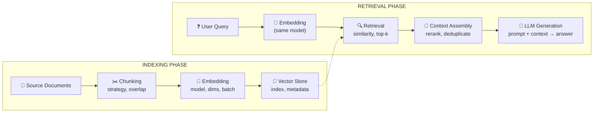

# Модуль 12 — RAG: архитектура и паттерны

> **Для AI-архитектора:** RAG — не «подключи векторную БД и готово». Это pipeline из шести независимых компонентов, каждый из которых влияет на итоговое качество ответа. Ошибка на уровне chunking не исправляется более мощной моделью. Неправильный выбор retrieval-стратегии не компенсируется reranker'ом.
> Один день изучения — полная механика pipeline, выбор компонентов с trade-offs, граничные случаи каждого этапа.

## Содержание

1. [Архитектура RAG-pipeline](#1-архитектура-rag-pipeline)
2. [Chunking — стратегии нарезки](#2-chunking--стратегии-нарезки)
3. [Embedding — выбор модели и размерность](#3-embedding--выбор-модели-и-размерность)
4. [Vector Store — выбор хранилища](#4-vector-store--выбор-хранилища)
5. [Retrieval — стратегии поиска](#5-retrieval--стратегии-поиска)
6. [Context Assembly — сборка контекста](#6-context-assembly--сборка-контекста)
7. [RAG Failure Modes — где ломается системно](#7-rag-failure-modes--где-ломается-системно)
8. [Agentic RAG и Graph RAG](#8-agentic-rag-и-graph-rag-следующий-уровень-retrieval)
9. [Реальный кейс](#9-реальный-кейс)
10. [Антипаттерны](#10-антипаттерны)
11. [Задачи AI-кодеру](#задачи-ai-кодеру)
12. [Чеклист архитектора](#чеклист-архитектора)

---

## Актуальные версии

| Инструмент | Версия | Дата проверки |
|:--|:--|:--|
| Node.js Active LTS | 24.x | март 2026 |
| pgvector | 0.8.2 | март 2026 |
| Qdrant | 1.17.0 | март 2026 |
| LM Studio | 0.4.8 | март 2026 |
| PostgreSQL | 17.x | март 2026 |

---

## 1. Архитектура RAG-pipeline

### Шесть компонентов

RAG-pipeline состоит из двух независимых фаз: **indexing** (разовая или периодическая) и **retrieval** (на каждый запрос).



### Зависимости между компонентами

Все три компонента образуют жёсткую цепочку зависимостей: изменение chunking или embedding модели инвалидирует весь индекс и требует переиндексации. Это не просто «медленно» — это операция, которую нужно планировать как migration.

| Изменение | Требует переиндексации | Почему |
|:--|:--|:--|
| Другая embedding модель | ✅ Да | Пространства векторов несовместимы |
| Другая chunking стратегия | ✅ Да | Другой размер и граница чанков |
| Другой chunk size | ✅ Да | Другие векторы, другая семантика |
| Другой top-k при retrieval | ❌ Нет | Параметр поиска, не индекса |
| Другой reranker | ❌ Нет | Постобработка retrieved чанков |
| Другой LLM для генерации | ❌ Нет | Последний шаг, независим |

**Практический вывод для архитектора:** Embedding модель и chunking стратегия — это архитектурные решения с высокой стоимостью изменения. Их нужно зафиксировать и валидировать на репрезентативных запросах до запуска indexing на полном корпусе документов.

---

## 2. Chunking — стратегии нарезки

### Механика

Chunking — разбиение документа на фрагменты для векторизации. Задача: каждый чанк должен быть семантически автономным (понятным без соседей) и достаточно малым для точного embedding.

Размер чанка создаёт фундаментальный trade-off:

```
Малый чанк (128–256 токенов):
  ✅ Точный embedding — вектор отражает узкую семантику
  ✅ Меньше шума в контексте
  ❌ Может разрывать логически связанные предложения
  ❌ Нет контекста для понимания частичных утверждений

Большой чанк (512–1024 токенов):
  ✅ Сохраняет локальный контекст
  ✅ Меньше чанков → быстрее индексация
  ❌ Усреднённый вектор: несколько тем в одном эмбеддинге
  ❌ При retrieval — больше нерелевантного текста в контексте
```

### Четыре стратегии

**Fixed-size with overlap** — базовый подход:

```typescript
function fixedSizeChunks(
  text: string,
  chunkSize: number = 512,    // в символах или токенах
  overlap: number = 64
): string[] {
  const chunks: string[] = [];
  let start = 0;

  while (start < text.length) {
    const end = Math.min(start + chunkSize, text.length);
    chunks.push(text.slice(start, end));
    start += chunkSize - overlap; // ✅ overlap сохраняет контекст на границе
  }

  return chunks;
}
```

**Sentence-based** — нарезка по предложениям с накоплением до лимита:

```typescript
function sentenceChunks(
  text: string,
  maxTokens: number = 256
): string[] {
  // Упрощённое разбиение — для production использовать NLP tokenizer
  const sentences = text.match(/[^.!?]+[.!?]+/g) ?? [text];
  const chunks: string[] = [];
  let current = '';

  for (const sentence of sentences) {
    const candidate = current + ' ' + sentence;
    // ✅ Грубая оценка токенов: 1 токен ≈ 4 символа для EN, ≈ 2-3 для RU
    if (candidate.length / 3 > maxTokens && current) {
      chunks.push(current.trim());
      current = sentence;
    } else {
      current = candidate;
    }
  }

  if (current.trim()) chunks.push(current.trim());
  return chunks;
}
```

**Hierarchical (Parent-Child)** — два уровня гранулярности:

```
Документ
  └── Parent chunk (512 токенов) — хранится как контекст
        ├── Child chunk (128 токенов) — индексируется
        ├── Child chunk (128 токенов) — индексируется
        └── Child chunk (128 токенов) — индексируется

Поиск → по child chunks (точный embedding)
Retrieval → возвращает parent chunk (полный контекст)
```

Стратегия решает конфликт между точностью поиска и полнотой контекста. Child chunk имеет узкий точный вектор. Parent chunk даёт модели достаточно контекста для генерации.

**Semantic chunking** — нарезка по смысловым границам через embedding:
Вычисляются cosine similarity между последовательными предложениями. Резкое падение similarity = граница чанка. Дорого при индексации (N embedding вызовов для разбиения), оправдано для документов со сложной структурой.

### Граничные случаи — где ломается

**Таблицы и списки.** Fixed-size чанкинг режет таблицы по строкам. Строка таблицы без заголовка — семантически бессмысленна. Заголовок «Цена» без значений — тоже.

```typescript
// ✅ Специальная обработка markdown-таблиц перед chunking
function extractTables(markdown: string): {
  tables: string[];
  textWithPlaceholders: string;
} {
  const tables: string[] = [];
  let index = 0;
  const text = markdown.replace(/(\|.+\|\n)+/g, (match) => {
    tables.push(match);
    return `[TABLE_${index++}]`;
  });
  return { tables, textWithPlaceholders: text };
}
```

**Русский текст и токенизация.** Русскоязычный текст токенизируется плотнее: 1 токен ≈ 2–3 символа против 4 для английского. При оценке chunk size в символах вместо токенов русские чанки будут в 1.5× больше по токенам, чем ожидалось. При работе с облачными API это прямо влияет на стоимость и context window.

**Почему это важно архитектору:** Неправильный chunking — единственная ошибка pipeline, которую невозможно исправить на этапе retrieval. Нерелевантные чанки будут найдены и отправлены в LLM.

**Практический вывод для архитектора:** Начинай с fixed-size + overlap (512/64 для EN, 350/48 для RU с учётом токенизации). Semantic и hierarchical — когда базовый вариант показал конкретную проблему на тестовых запросах.

---

## 3. Embedding — выбор модели и размерность

### Механика

Embedding — преобразование текста в вектор фиксированной размерности так, чтобы семантически близкие тексты имели близкие векторы в пространстве. Мера близости — cosine similarity или dot product.

```
"цена доставки" ──[embedding model]──▶ [0.12, -0.87, 0.34, ... 1536 dims]
"стоимость перевозки" ─────────────▶ [0.13, -0.85, 0.31, ... 1536 dims]
"рецепт борща" ─────────────────────▶ [0.91,  0.23, -0.67, ... 1536 dims]

cosine_sim("цена доставки", "стоимость перевозки") ≈ 0.96
cosine_sim("цена доставки", "рецепт борща") ≈ 0.12
```

### Выбор модели

Ключевые параметры: размерность вектора, максимальный контекст (в токенах), языковая поддержка.

| Модель | Dims | Max tokens | RU качество | Где запускать |
|:--|:--|:--|:--|:--|
| Актуальная облачная embedding-модель | 1536 | 8191 | ✅ | Cloud |
| Актуальная облачная embedding-large | 3072 | 8191 | ✅ | Cloud |
| CURRENT_LOCAL_EMBEDDING_MODEL | зависит от модели | зависит от модели | ✅ Native | LM Studio |
| multilingual-e5-large | 1024 | 512 | ✅ | Local |
| nomic-embed-text | 768 | 8192 | ⚠️ EN-first | Local |

Для русскоязычных корпусов — использовать текущую локальную embedding-модель с проверкой RU-качества или multilingual-e5-large локально; cloud-вариант выбирать по latency/cost/privacy. Модели типа nomic-embed-text обучены преимущественно на EN, качество RU хуже.

### Размерность и хранение

Размерность вектора влияет на объём индекса:

```
10 000 документов × 512 чанков/документ = 5 000 000 векторов
При dims=1536, float32 (4 байта):
  5 000 000 × 1536 × 4 bytes = ~29 ГБ raw
  С HNSW индексом: +20-40% overhead

При dims=768:
  ~14.5 ГБ raw — в 2× меньше при незначительной потере качества для русских текстов
```

### Граничные случаи — где ломается

**Смешение моделей при re-indexing.** Если часть документов проиндексирована одной моделью, часть — другой, поисковые результаты будут некорректны: пространства векторов несовместимы. В pgvector нет защиты от этого на уровне схемы.

```sql
-- ✅ Хранить версию embedding модели с каждым вектором
ALTER TABLE embeddings ADD COLUMN model_version VARCHAR(64) NOT NULL DEFAULT 'CURRENT_EMBEDDING-v1';
-- При запросе — фильтровать только по текущей версии
```

**Truncation длинных чанков.** Embedding модель имеет жёсткий лимит токенов. Превышение → текст обрезается токенизатором без предупреждения. Вектор строится по урезанному тексту — семантика теряется.

**Почему это важно архитектору:** При смене embedding модели индекс нужно пересобрать полностью. Это migration с downtime или blue-green с двойным объёмом storage.

**Практический вывод для архитектора:** Размерность — это trade-off между качеством и стоимостью хранения. Зафиксируй модель в конфиге как константу, версионируй в схеме БД. Смена модели = плановая migration, не hotfix.

---

## 4. Vector Store — выбор хранилища

### Механика

Vector Store — хранилище с поддержкой ANN (Approximate Nearest Neighbor) поиска. Два алгоритма индексации:

```
HNSW (Hierarchical Navigable Small World):
  ✅ Быстрый поиск: O(log N)
  ✅ Хорошая точность (recall ~0.95+)
  ❌ Медленное построение индекса
  ❌ Высокое потребление памяти при построении
  Используй: production, частые запросы, N > 100K векторов

IVFFlat (Inverted File Index):
  ✅ Быстрое построение
  ✅ Меньше памяти
  ❌ Требует предварительного обучения (VACUUM ANALYZE)
  ❌ Точность зависит от параметра lists
  Используй: bulk insert, периодическая переиндексация
```

### pgvector vs Qdrant

| Критерий | pgvector 0.8.2 | Qdrant 1.17.0 |
|:--|:--|:--|
| Интеграция с PostgreSQL | ✅ Нативная | ❌ Отдельный сервис |
| Фильтрация по метаданным | ✅ SQL WHERE | ✅ Qdrant filters |
| Гибридный поиск (sparse+dense) | ⚠️ Только dense | ✅ Нативно |
| Производительность при N>10M | ⚠️ Деградация | ✅ Горизонтальный scale |
| ACID транзакции | ✅ Postgres ACID | ❌ Eventually consistent |
| Zero-dependency (если Postgres уже есть) | ✅ | ❌ Docker/binary |
| Streaming updates | ⚠️ Postgres LISTEN/NOTIFY | ✅ Нативно |

**Правило выбора для архитектора:**

```
Есть Postgres в стеке + N < 5M векторов + нужны JOIN с реляционными данными?
  → pgvector

Нет Postgres + N > 5M + нужен hybrid search + multi-tenancy?
  → Qdrant
```

### pgvector: схема и индекс

```sql
-- Таблица с метаданными
CREATE TABLE documents (
  id          BIGSERIAL PRIMARY KEY,
  source_id   VARCHAR(255) NOT NULL,           -- ID исходного документа
  chunk_index INTEGER NOT NULL,                -- порядковый номер чанка
  content     TEXT NOT NULL,                   -- текст чанка
  embedding   vector(1536),                    -- вектор
  model_ver   VARCHAR(64) NOT NULL,            -- версия embedding модели
  created_at  TIMESTAMPTZ DEFAULT NOW(),
  metadata    JSONB DEFAULT '{}'
);

-- HNSW индекс для cosine similarity
-- m=16: количество связей в графе (точность vs память)
-- ef_construction=64: глубина поиска при построении (точность vs скорость build)
CREATE INDEX ON documents
  USING hnsw (embedding vector_cosine_ops)
  WITH (m = 16, ef_construction = 64);

-- Метаданные индексируются отдельно для фильтрации
CREATE INDEX ON documents (source_id);
CREATE INDEX ON documents USING gin (metadata);
```

```typescript
// Similarity search с фильтром по метаданным
async function similaritySearch(
  queryEmbedding: number[],
  topK: number = 5,
  filter?: { sourceType?: string }
): Promise<{ content: string; score: number }[]> {

  const vectorLiteral = `[${queryEmbedding.join(',')}]`;

  // ✅ 1 - cosine_distance = cosine_similarity
  const query = `
    SELECT content,
           1 - (embedding <=> $1::vector) AS score
    FROM documents
    WHERE model_ver = $2
    ${filter?.sourceType ? `AND metadata->>'source_type' = $3` : ''}
    ORDER BY embedding <=> $1::vector
    LIMIT $${filter?.sourceType ? 4 : 3}
  `;

  const params = filter?.sourceType
    ? [vectorLiteral, EMBEDDING_MODEL_VERSION, filter.sourceType, topK]
    : [vectorLiteral, EMBEDDING_MODEL_VERSION, topK];

  const { rows } = await pool.query(query, params);
  return rows;
}
```

### Граничные случаи — где ломается

**HNSW и параллельный build (pgvector < 0.8.2 CVE).** pgvector 0.8.2 исправил buffer overflow при параллельном построении HNSW индекса — утечка данных из соседних отношений. При параллельной индексации на старых версиях возможна утечка данных.

**ef_search занижен — точность падает незаметно.** `hnsw.ef_search` (дефолт 40) определяет глубину поиска при запросе. При низком значении HNSW возвращает не точный top-k, а приближённый. Это не ошибка — ANN по определению приближённый. Но если recall деградирует до 0.7 — это незаметная потеря качества RAG.

```sql
-- Устанавливать на уровне сессии при критичных поисках
SET hnsw.ef_search = 100; -- выше точность, выше latency
```

**Почему это важно архитектору:** ANN — approximation. Recall индекса нужно измерять на тестовом наборе запросов, а не предполагать.

**Практический вывод для архитектора:** Для нового проекта на Node.js стеке с Postgres — начинай с pgvector. Qdrant вводится как отдельный сервис, это операционный overhead. Мигрировать с pgvector на Qdrant проще, чем объяснять лишний сервис в инфраструктуре.

---

## 5. Retrieval — стратегии поиска

### Механика

Retrieval — поиск чанков по векторной близости запроса к индексу. Базовый вариант: cosine similarity, top-k. Реальные pipeline требуют больше.

### Dense vs Hybrid Search

**Dense-only:** только векторный поиск. Хорошо находит семантически близкое, плохо — точные совпадения (артикулы, имена, даты).

```
Запрос: "договор № 1234-А от 15.03.2024"
Dense: найдёт "похожие договоры" по смыслу — но не этот конкретный
BM25: найдёт точное совпадение по номеру — но не вариации в формулировке
```

**Hybrid (RRF — Reciprocal Rank Fusion):** комбинация dense и sparse (BM25) с нормализацией рангов:

```typescript
interface RankedResult {
  id: string;
  content: string;
  rank: number;
}

function reciprocalRankFusion(
  denseResults: RankedResult[],
  sparseResults: RankedResult[],
  k: number = 60  // константа сглаживания RRF
): RankedResult[] {
  const scores = new Map<string, number>();

  // RRF score = Σ 1/(k + rank_i)
  for (const [i, result] of denseResults.entries()) {
    scores.set(result.id, (scores.get(result.id) ?? 0) + 1 / (k + i + 1));
  }
  for (const [i, result] of sparseResults.entries()) {
    scores.set(result.id, (scores.get(result.id) ?? 0) + 1 / (k + i + 1));
  }

  // Объединить все результаты
  const allResults = [...denseResults, ...sparseResults].filter(
    (r, idx, arr) => arr.findIndex(x => x.id === r.id) === idx
  );

  return allResults
    .sort((a, b) => (scores.get(b.id) ?? 0) - (scores.get(a.id) ?? 0));
}
```

### Reranking

После top-k retrieval — опциональный reranker переупорядочивает результаты по точности. Cross-encoder обрабатывает пары (запрос, чанк) — медленнее, но точнее bi-encoder.

```typescript
async function rerankWithLLM(
  query: string,
  chunks: string[],
  topN: number = 3
): Promise<string[]> {
  const prompt = `Запрос: "${query}"

Оцени релевантность каждого фрагмента от 0 до 10.
Верни JSON массив индексов по убыванию релевантности (только топ ${topN}).

${chunks.map((c, i) => `[${i}] ${c}`).join('\n\n')}

Ответ (JSON array of indices): `;

  const response = await llm.complete(prompt);
  const indices: number[] = JSON.parse(response);
  return indices.slice(0, topN).map(i => chunks[i]);
}
```

LLM-reranking дорог: N вызовов на каждый запрос. Использовать только при top-k > 10 и когда точность критична.

### MMR — Maximum Marginal Relevance

Снижает дублирование в retrieved чанках: выбирает следующий чанк максимизируя relevance и минимизируя сходство с уже выбранными.

```typescript
function mmrSelect(
  queryVector: number[],
  candidates: { vector: number[]; content: string }[],
  topK: number,
  lambda: number = 0.5  // 0 = max diversity, 1 = max relevance
): string[] {
  const selected: typeof candidates = [];
  const remaining = [...candidates];

  while (selected.length < topK && remaining.length > 0) {
    let bestScore = -Infinity;
    let bestIdx = 0;

    for (const [i, candidate] of remaining.entries()) {
      const relevance = cosineSim(queryVector, candidate.vector);
      const maxRedundancy = selected.length > 0
        ? Math.max(...selected.map(s => cosineSim(s.vector, candidate.vector)))
        : 0;

      const mmrScore = lambda * relevance - (1 - lambda) * maxRedundancy;
      if (mmrScore > bestScore) {
        bestScore = mmrScore;
        bestIdx = i;
      }
    }

    selected.push(remaining[bestIdx]);
    remaining.splice(bestIdx, 1);
  }

  return selected.map(s => s.content);
}
```

### Граничные случаи — где ломается

**Top-k слишком мал — правильный ответ не retrieved.** Если правильный чанк не попал в top-k, никакой reranker его не восстановит. Recall@k нужно измерять на тестовых запросах. Типичная ошибка: top-3 достаточно для demo, недостаточно для production.

**Query-document mismatch.** Embedding модели хуже работают когда запрос — короткое ключевое слово, а документ — развёрнутое предложение. Решение: HyDE (Hypothetical Document Embedding) — LLM генерирует гипотетический ответ, его вектор использовается для поиска.

```typescript
async function hydeRetrieval(query: string): Promise<string[]> {
  // ✅ Генерируем гипотетический документ который мог бы отвечать на вопрос
  const hypothetical = await llm.complete(
    `Напиши фрагмент документа который отвечает на вопрос: "${query}"`
  );
  const hydeVector = await embed(hypothetical); // вектор гипотетического ответа
  return similaritySearch(hydeVector);          // ищем похожие реальные чанки
}
```

**Почему это важно архитектору:** Качество retrieval определяет потолок качества всего RAG. LLM не может сгенерировать правильный ответ из нерелевантного контекста.

**Практический вывод для архитектора:** Начинай с dense top-10 + MMR. Hybrid search добавляй когда в корпусе есть точные идентификаторы (коды, номера, даты). Reranker — только при доказанной нехватке precision в top-3.

---

## 6. Context Assembly — сборка контекста

### Механика

Context Assembly — формирование финального prompt из retrieved чанков. Порядок, форматирование и размер контекста влияют на качество генерации.

### Lost in the Middle

Экспериментально подтверждённый феномен: LLM хуже использует информацию из середины длинного контекста. Наиболее внимательно — начало и конец.

```
Context window:
┌─────────────────────────────────────────┐
│ [Chunk A] — начало — высокое внимание   │ ← ✅
│ [Chunk B] — середина — низкое внимание  │ ← ⚠️
│ [Chunk C] — середина — низкое внимание  │ ← ⚠️
│ [Chunk D] — конец — высокое внимание    │ ← ✅
└─────────────────────────────────────────┘
```

```typescript
function assembleContext(
  chunks: { content: string; score: number }[],
  query: string
): string {
  // ✅ "Lost in the middle" mitigation: наиболее релевантные — в начало и конец
  const sorted = [...chunks].sort((a, b) => b.score - a.score);
  const reordered = sorted.length > 2
    ? [sorted[0], ...sorted.slice(2), sorted[1]]  // ✅ top-1 первый, top-2 последний
    : sorted;

  const contextParts = reordered.map((c, i) =>
    `[Источник ${i + 1}]:\n${c.content}`
  );

  return `Контекст для ответа:\n\n${contextParts.join('\n\n---\n\n')}

Вопрос: ${query}`;
}
```

### Граничные случаи — где ломается

**Context overflow.** Сумма retrieved чанков + prompt + ожидаемый ответ превышает context window модели. Токенизация молча обрезает промпт с конца — пропадают чанки или инструкции.

```typescript
// ✅ Всегда считать токены перед отправкой
function truncateToContextLimit(
  chunks: string[],
  systemPrompt: string,
  maxTokens: number = 4096,
  reserveForAnswer: number = 512
): string[] {
  const available = maxTokens - reserveForAnswer - estimateTokens(systemPrompt);
  const result: string[] = [];
  let used = 0;

  for (const chunk of chunks) {
    const chunkTokens = estimateTokens(chunk);
    if (used + chunkTokens > available) break;
    result.push(chunk);
    used += chunkTokens;
  }

  return result;
}

function estimateTokens(text: string): number {
  // RU: ~3 символа/токен, EN: ~4 символа/токен
  return Math.ceil(text.length / 3);
}
```

**Contradiction в контексте.** Два чанка из разных версий документа содержат противоречивую информацию. LLM не знает какому верить — галлюцинирует компромисс.

**Почему это важно архитектору:** Context assembly — последний шанс повлиять на качество до LLM. Плохой порядок чанков теряет 10–20% качества даже при правильном retrieval.

**Практический вывод для архитектора:** Резервируй токены для ответа явно. Порядок чанков важен — наиболее релевантный первым. Источник каждого чанка должен быть трассируем.

---

## 7. RAG Failure Modes — где ломается системно

### Failure Mode #1: Retrieval Miss

Правильная информация есть в корпусе, но не попадает в top-k. Причины: плохой chunking разорвал ответ между чанками, embedding модель не умеет в domain-специфичную терминологию, слишком малый top-k.

**Диагностика:** Recall@10 на тестовом наборе запросов с известными ответами.

### Failure Mode #2: Faithful Hallucination

LLM генерирует ответ, который выглядит как обобщение контекста, но содержит факты которых в контексте нет. Особенно характерно при недостаточном контексте.

**Диагностика:** LLM-judge: отдельный вызов LLM с вопросом «всё ли в ответе подтверждено контекстом?»

### Failure Mode #3: Stale Index

Документы обновились, индекс — нет. RAG уверенно отвечает на основе устаревших данных.

**Решение:** версионирование документов + incremental re-indexing по `updated_at`.

### Failure Mode #4: Chunk Boundary Artifacts

Ответ на вопрос находится на границе двух чанков — ни один не содержит полного ответа. Overlap при fixed-size chunking смягчает, но не исключает.

**Диагностика:** manual review retrieved чанков для запросов с неверными ответами.

## 8. Agentic RAG и Graph RAG: следующий уровень retrieval

Классический RAG делает один проход: query → retrieve → generate. Для сложных задач этого недостаточно. Agentic RAG превращает retrieval в управляемый loop:

```text
query → plan → retrieve → inspect gaps → retrieve again → verify → answer
```

Агент может:

- уточнять query;
- искать по vector, BM25, graph и temporal retrievers;
- проверять противоречия;
- возвращаться за дополнительными источниками;
- отказываться от ответа при недостатке evidence.

### Graph RAG

Graph RAG добавляет entities и relations:

```text
Contract ── hasParty ── Company
Company ── hasDirector ── Person
Clause ── requires ── Approval
Approval ── belongsTo ── Policy
```

Это полезно для multi-hop вопросов, legal/finance/contract domains и объяснимости: модель может показать путь по graph, а не только top-k chunks.

### Temporal RAG

Temporal RAG учитывает версии документов:

- `valid_from`;
- `valid_to`;
- `superseded_by`;
- `updated_at`;
- as-of date запроса.

Без temporal awareness агент может ответить по старой версии policy.

### Verification

Agentic RAG требует verifier:

- citations per claim;
- contradiction detection;
- confidence score;
- source freshness;
- abstain policy.

Главное правило: больше агентности = больше observability и evals. Нужно логировать каждый retrieval step, gaps, unsupported claims и итоговый evidence pack.

---

## 9. Реальный кейс

> ⚠️ **Раздел ожидает данных от автора.**
> Формат: входные данные → гипотеза → результат → вывод противоречащий интуиции.
> Кандидаты для кейса: документооборот (юридические документы, суды), WooCommerce каталог, Telegram-контент.

---

## 10. Антипаттерны

### «Один промпт с chunk_size=1024 справится»

**Выглядит правильно:** большой чанк = больше контекста = лучше ответы.

**Почему ошибка:** embedding 1024-токенного чанка усредняет несколько тем. При поиске вектор «размыт» — релевантность снижается. Правильный ответ может присутствовать в корпусе, но не достигать top-k из-за усреднённого вектора.

---

### «RAG решит проблему знания устаревшей модели»

**Выглядит правильно:** загружаем актуальные документы → модель знает актуальное.

**Почему ошибка:** RAG решает проблему _отсутствия_ информации в модели, но не гарантирует _использование_ retrieved контекста. Модель может игнорировать контекст и отвечать из весов — особенно если контекст противоречит обучению. Это требует специального промпта с явным указанием приоритета.

---

### «Использовать готовый RAG фреймворк = не думать об архитектуре»

**Выглядит правильно:** LangChain/LlamaIndex абстрагируют сложность.

**Почему ошибка:** фреймворки прячут параметры chunking, embedding и retrieval за дефолтами — которые часто неоптимальны для твоего корпуса. Архитектор должен понимать что происходит под абстракцией. Zero-dependency реализация на pg + OpenAI client — 200 строк кода и полный контроль над каждым параметром.

---

### «Оптимизировать embedding модель до измерения Recall@k»

**Выглядит правильно:** более мощная embedding модель = лучше поиск.

**Почему ошибка:** смена embedding модели = переиндексация всего корпуса. Если текущий Recall@10 = 0.85 и проблема в chunking — смена модели не поможет. Сначала измеряй, потом меняй.

---

## Anti-checklist ☠️

- [ ] Выбирать embedding модель до измерения Recall@k — без baseline неясно, помогла ли смена
- [ ] Доверять `similarity > 0.8` как индикатору релевантности — ANN approximation, не точная метрика
- [ ] Использовать LangChain/LlamaIndex дефолты для production — спроектированы для demos
- [ ] Одна embedding модель для RU и EN текстов — специализированные модели дают +10-15% Recall
- [ ] top-3 и считать что ответ всегда в них — измеряй Recall@k, а не предполагай
- [ ] Chunking текста без учёта таблиц — таблица разрезанная пополам = потерянный контекст
- [ ] Писать full re-index без blue-green индекса — downtime на время переиндексации

---

## Задачи AI-кодеру

**Задача 1 — Chunking с метаданными**

Плохая формулировка:
> «Реализуй chunking документов»

Хорошая формулировка:
> «Реализуй fixed-size chunker на TypeScript. Параметры: `chunkSize: number` (в символах), `overlap: number`, `sourceId: string`. Возвращает массив объектов `{ content: string, chunkIndex: number, sourceId: string, charStart: number, charEnd: number }`. Добавь отдельный обработчик для markdown-таблиц: таблица целиком попадает в один чанк независимо от `chunkSize`. Покрой unit-тестами: пустой документ, документ короче chunkSize, документ с таблицей.»

Формула: конкретный алгоритм + структура output + edge cases явно + тесты.

---

**Задача 2 — Similarity search с pgvector**

Плохая формулировка:
> «Напиши поиск по векторной БД»

Хорошая формулировка:
> «Реализуй `similaritySearch` на TypeScript с pg driver (не ORM). Параметры: `queryEmbedding: number[]` (1536 dims), `topK: number`, `modelVersion: string`, опциональный `filter: { sourceType?: string }`. SQL запрос через pgvector `<=>` оператор (cosine distance). Результат: `{ content: string, sourceId: string, chunkIndex: number, score: number }[]` где `score = 1 - cosine_distance`. Фильтрация только по `model_version` — исключить чанки от других версий embedding модели. Обработай edge case: пустой результат возвращает пустой массив, не бросает исключение.»

Формула: конкретный driver + dims + SQL оператор + model versioning + структура output.

---

**Задача 3 — Context assembly с token budget**

Плохая формулировка:
> «Собери контекст из retrieved чанков»

Хорошая формулировка:
> «Реализуй `assembleContext` на TypeScript. Принимает: `chunks: {content: string, score: number, sourceId: string}[]`, `query: string`, `maxTokens: number` (дефолт 3500), `reserveForAnswer: number` (дефолт 512). Оценка токенов: `Math.ceil(text.length / 3)` (русский текст). Алгоритм: обрежь чанки по token budget (наиболее релевантные первыми), примени "lost in the middle" переупорядочивание (top-1 первый, top-2 последний). Формат output: каждый чанк с меткой `[Источник N (sourceId)]`. Верни объект `{ context: string, chunksUsed: number, tokensUsed: number }`.»

Формула: конкретный алгоритм оценки токенов для RU + lost-in-middle + метаданные в output.

---

## Чеклист архитектора

### Indexing
- [ ] Chunking стратегия выбрана и протестирована на реальных документах корпуса
- [ ] Chunk size учитывает плотность токенизации языка (RU: ~3 симв/токен)
- [ ] Таблицы и структурированные блоки обрабатываются отдельно от текста
- [ ] Embedding модель зафиксирована в конфиге и версионируется в схеме БД
- [ ] Максимальный размер чанка не превышает max_tokens embedding модели

### Vector Store
- [ ] pgvector 0.8.2+ (CVE-2026-3172 с параллельным HNSW build исправлен)
- [ ] HNSW индекс создан с явными `m` и `ef_construction`
- [ ] `hnsw.ef_search` настроен для production нагрузки
- [ ] ANN Recall@10 измерен на тестовом наборе запросов

### Retrieval
- [ ] top-k выбран с запасом — финальный отбор на reranking/MMR этапе
- [ ] Hybrid search рассмотрен если корпус содержит точные идентификаторы
- [ ] HyDE рассмотрен если запросы значительно короче документов

### Context Assembly
- [ ] Token budget считается до отправки, не после
- [ ] Резерв токенов для ответа задан явно
- [ ] Источник каждого чанка трассируем в ответе

### Observability
- [ ] Recall@k измеряется на тестовом наборе при каждом изменении pipeline
- [ ] Retrieval miss логируется (запрос без уверенного top-1 результата)
- [ ] Stale index детектируется через `updated_at` документов

---

*Модуль 12 завершён.*
*Следующий: [Модуль 13 — Fine-tuning / LoRA](../13-fine-tuning/README.md)*
