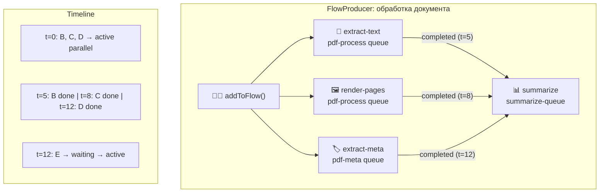

# Модуль 18 — Очереди задач и фоновая обработка

> **Для AI-архитектора:** Очередь — не просто «запустить что-то асинхронно». Это гарантия доставки, retry семантика, backpressure, observability. Выбор между BullMQ (Redis) и pg-boss (Postgres) — это выбор между отдельным хранилищем и транзакционной гарантией. Для AI pipeline — очереди определяют throughput всей системы.
> Один день изучения — модель очереди, BullMQ production-паттерны, pg-boss как zero-infra альтернатива, FlowProducer для DAG-пайплайнов, graceful shutdown, rate limiting, observability.

## Содержание

1. [Модель очереди: гарантии доставки](#1-модель-очереди-гарантии-доставки)
2. [BullMQ: архитектура и lifecycle задачи](#2-bullmq-архитектура-и-lifecycle-задачи)
3. [Queue и Worker: базовый паттерн](#3-queue-и-worker-базовый-паттерн)
4. [Retry, backoff и dead letter queue](#4-retry-backoff-и-dead-letter-queue)
5. [FlowProducer: DAG-пайплайны](#5-flowproducer-dag-пайплайны)
6. [Rate limiting и приоритеты](#6-rate-limiting-и-приоритеты)
7. [pg-boss: очередь без Redis](#7-pg-boss-очередь-без-redis)
8. [Graceful shutdown](#8-graceful-shutdown)
9. [Observability: метрики и трассировка](#9-observability-метрики-и-трассировка)
10. [Паттерны для AI pipeline](#10-паттерны-для-ai-pipeline)
11. [Реальный кейс](#11-реальный-кейс)
12. [Антипаттерны](#12-антипаттерны)
13. [Задачи AI-кодеру](#задачи-ai-кодеру)
14. [Чеклист архитектора](#чеклист-архитектора)

---

## Актуальные версии

| Инструмент | Версия | Дата проверки |
|:--|:--|:--|
| Node.js Active LTS | 24.x | март 2026 |
| BullMQ | 5.71.0 | март 2026 |
| ioredis | 5.x | март 2026 |
| pg-boss | 12.8.0 | март 2026 |
| Redis | 7.x | март 2026 |
| PostgreSQL | 17.x | март 2026 |
| @bull-board/express | 6.x | март 2026 |
| bullmq-otel | 1.x | март 2026 |

---

## 1. Модель очереди: гарантии доставки

### Три уровня гарантий

```
At-most-once (fire and forget):
  Producer → Queue → Worker
  Задача может быть потеряна при падении Worker до завершения
  Применение: метрики, аналитика, где потеря допустима

At-least-once:
  Producer → Queue → Worker → ACK
  Задача будет выполнена минимум один раз
  При падении Worker до ACK — задача возвращается в очередь
  Применение: большинство production задач, нужна идемпотентность

Exactly-once:
  Требует транзакционную гарантию между Queue и обработкой
  Producer INSERT в той же транзакции что и бизнес-данные → pg-boss
  Redis-based очереди (BullMQ) — at-least-once, не exactly-once
  Применение: финансовые операции, дедупликация критична
```

### Выбор: BullMQ vs pg-boss

| Критерий | BullMQ 5.x | pg-boss 12.x |
|:--|:--|:--|
| Хранилище | Redis 7.x | PostgreSQL 13+ |
| Гарантия | At-least-once | Exactly-once (SKIP LOCKED) |
| Дополнительная инфра | ✅ Нужен Redis | ❌ Уже есть Postgres |
| Производительность | ✅ 10K–100K job/s | ~1K–5K job/s |
| FlowProducer / DAG | ✅ Нативно | ❌ Вручную |
| Cron scheduling | ✅ | ✅ |
| Transactional enqueue | ❌ | ✅ |
| Observability | ✅ Bull Board + OTel | SQL queries |
| Serverless совместимость | ⚠️ | ✅ |

**Правило:**
```
Высокий throughput + DAG + нужен отдельный Redis → BullMQ
Уже есть Postgres + exactly-once + нет Redis → pg-boss
Финансовые операции + enqueue в транзакции → pg-boss
AI document pipeline + parallel processing → BullMQ
```

**Практический вывод для архитектора:** pg-boss — недооценённый выбор. Если в стеке уже есть Postgres (а он обычно есть) — добавлять Redis только ради очереди не всегда оправдано. BullMQ оправдан когда нужен FlowProducer, высокий throughput или Redis уже в стеке.

---

## 2. BullMQ: архитектура и lifecycle задачи

### Состояния задачи

```
                    ┌─────────────────────────────────────────┐
                    │              Redis                       │
                    │                                          │
  queue.add() ──→  [waiting] ──→ [active] ──→ [completed]    │
                    │                │                         │
                    │           (при ошибке)                   │
                    │                ↓                         │
                    │           [failed]                       │
                    │                │                         │
                    │        attempts > maxAttempts            │
                    │                ↓                         │
                    │      [failedReason + stored]             │
                    │                                          │
  delayed jobs: ──→ [delayed] ──→ [waiting] (по таймеру)      │
  priority:         [waiting] с score для сортировки          │
                    └─────────────────────────────────────────┘
```

### Ключевые характеристики хранения в Redis

```typescript
// BullMQ использует несколько Redis структур на очередь:
// bull:{queueName}:waiting   → LIST (FIFO)
// bull:{queueName}:active    → LIST (задачи в работе)
// bull:{queueName}:completed → ZSET (sorted by timestamp)
// bull:{queueName}:failed    → ZSET
// bull:{queueName}:delayed   → ZSET (sorted by processAt timestamp)
// bull:{queueName}:{jobId}   → HASH (данные задачи)

// ioredis: maxRetriesPerRequest: null — ОБЯЗАТЕЛЬНО для BullMQ
// BullMQ использует блокирующие команды Redis (BLPOP, BRPOPLPUSH)
// которые несовместимы с retry логикой ioredis по умолчанию
```

### Redis connection: правила

```typescript
import { Redis } from 'ioredis';

// ✅ Одно соединение для Queue (publishing)
// ✅ Отдельное соединение для Worker (subscribing/blocking)
// BullMQ создаёт соединения внутри — передавать connection options, не экземпляр

export const redisConnectionOptions = {
  host: process.env.REDIS_HOST ?? 'localhost',
  port: parseInt(process.env.REDIS_PORT ?? '6379'),
  maxRetriesPerRequest: null, // ✅ ОБЯЗАТЕЛЬНО для BullMQ
  enableReadyCheck: false,    // ✅ рекомендовано BullMQ
  password: process.env.REDIS_PASSWORD,
  // TLS для production
  ...(process.env.REDIS_TLS === 'true' && {
    tls: { rejectUnauthorized: true },
  }),
};

// ❌ НЕ передавать один Redis экземпляр в несколько Queue/Worker
// BullMQ клонирует соединение внутри — передавать options объект
```

---

## 3. Queue и Worker: базовый паттерн

### Queue: публикация задач

```typescript
import { Queue, QueueEvents } from 'bullmq';
import { redisConnectionOptions } from './redis.config';

// Типизированная очередь
interface PdfProcessJobData {
  documentId: string;
  pdfPath: string;
  operations: ('extract-text' | 'render-pages' | 'ocr')[];
  priority?: number;
}

interface PdfProcessJobResult {
  documentId: string;
  text?: string;
  pageCount: number;
  processingMs: number;
}

export const pdfQueue = new Queue<PdfProcessJobData, PdfProcessJobResult>('pdf-process', {
  connection: redisConnectionOptions,
  defaultJobOptions: {
    attempts: 3,
    backoff: {
      type: 'exponential',
      delay: 2000, // 2s → 4s → 8s
    },
    removeOnComplete: { count: 500 },  // хранить последние 500 выполненных
    removeOnFail: { count: 2000 },     // хранить последние 2000 упавших
  },
});

// Добавить задачу
export async function enqueuePdfProcessing(
  data: PdfProcessJobData,
  opts?: { priority?: number; delay?: number; jobId?: string }
): Promise<string> {
  const job = await pdfQueue.add('process', data, {
    priority: opts?.priority,     // 1 = highest, undefined = normal
    delay: opts?.delay,           // ms до начала обработки
    jobId: opts?.jobId,           // для дедупликации (повторный add игнорируется)
  });
  return job.id!;
}

// Мониторинг очереди
export async function getQueueStats() {
  const [waiting, active, completed, failed, delayed] = await Promise.all([
    pdfQueue.getWaitingCount(),
    pdfQueue.getActiveCount(),
    pdfQueue.getCompletedCount(),
    pdfQueue.getFailedCount(),
    pdfQueue.getDelayedCount(),
  ]);
  return { waiting, active, completed, failed, delayed };
}
```

### Worker: обработка задач

```typescript
import { Worker, Job, UnrecoverableError } from 'bullmq';
import { redisConnectionOptions } from './redis.config';

async function processPdfJob(
  job: Job<PdfProcessJobData, PdfProcessJobResult>
): Promise<PdfProcessJobResult> {
  const startMs = Date.now();
  const { documentId, pdfPath, operations } = job.data;

  // ✅ Прогресс — видно в Bull Board и через QueueEvents
  await job.updateProgress(0);

  let text: string | undefined;
  let pageCount = 0;

  if (operations.includes('extract-text')) {
    await job.updateProgress(20);
    text = await extractText(pdfPath);
  }

  if (operations.includes('render-pages')) {
    await job.updateProgress(50);
    const pages = await renderPages(pdfPath);
    pageCount = pages.length;
  }

  if (operations.includes('ocr')) {
    await job.updateProgress(80);
    // Если OCR сервис недоступен — UnrecoverableError не ретраит
    const ocrAvailable = await checkOcrService();
    if (!ocrAvailable) {
      throw new UnrecoverableError('OCR сервис недоступен — задача отменена');
    }
    text = await runOcr(pdfPath);
  }

  await job.updateProgress(100);

  return {
    documentId,
    text,
    pageCount,
    processingMs: Date.now() - startMs,
  };
}

export const pdfWorker = new Worker<PdfProcessJobData, PdfProcessJobResult>(
  'pdf-process',
  processPdfJob,
  {
    connection: redisConnectionOptions,
    concurrency: 4,           // параллельных задач на воркер
    limiter: {
      max: 10,                // максимум 10 задач
      duration: 1000,         // за 1 секунду (глобальный rate limit)
    },
  }
);

// Events
pdfWorker.on('completed', (job, result) => {
  console.log(`[PDF] Job ${job.id} completed in ${result.processingMs}ms`);
});

pdfWorker.on('failed', (job, err) => {
  console.error(`[PDF] Job ${job?.id} failed: ${err.message}`);
  // ⚠️ job может быть undefined при неожиданных ошибках — null-check обязателен
});

pdfWorker.on('stalled', (jobId) => {
  // Задача была active но воркер не отвечал (lock expiry)
  console.warn(`[PDF] Job ${jobId} stalled — будет перезапущен`);
});
```

**Практический вывод для архитектора:** `concurrency` — критичный параметр. Для CPU-intensive (рендеринг PDF) — `concurrency = os.cpus().length`. Для IO-intensive (HTTP запросы, DB) — `concurrency = 20–50`. Для AI API с rate limit — `concurrency = 1–2` + `limiter`.

---

## 4. Retry, backoff и dead letter queue

### Backoff стратегии

```typescript
// Exponential backoff — стандарт для нестабильных внешних API
const exponentialBackoff = {
  attempts: 5,
  backoff: { type: 'exponential', delay: 1000 },
  // Попытки: немедленно → 1s → 2s → 4s → 8s
};

// Fixed backoff — для ресурсов с известным временем восстановления
const fixedBackoff = {
  attempts: 3,
  backoff: { type: 'fixed', delay: 30_000 }, // 3 попытки каждые 30s
};

// Custom backoff через глобальный settings
import { Worker, backoffStrategies } from 'bullmq';
// backoffStrategies не экспортируется напрямую в 5.x
// Кастомный backoff — через attemptsMade в processor

async function processorWithCustomBackoff(
  job: Job
): Promise<void> {
  // Кастомная логика задержки прямо в processor
  if (job.attemptsMade > 0) {
    const delay = Math.min(
      1000 * Math.pow(2, job.attemptsMade - 1),
      60_000 // cap at 60s
    );
    await new Promise(r => setTimeout(r, delay));
  }
  await doWork(job.data);
}
```

### Dead letter queue

BullMQ не имеет встроенного DLQ — строится вручную через `failed` event:

```typescript
import { Queue, QueueEvents, Worker, Job } from 'bullmq';

const dlqQueue = new Queue('pdf-process-dlq', {
  connection: redisConnectionOptions,
  defaultJobOptions: {
    removeOnComplete: false, // хранить все — DLQ для анализа
    removeOnFail: false,
  },
});

// Обёртка Worker с DLQ
function createWorkerWithDlq<T, R>(
  queueName: string,
  processor: (job: Job<T, R>) => Promise<R>,
  options: { concurrency?: number } = {}
): Worker<T, R> {
  const worker = new Worker<T, R>(queueName, processor, {
    connection: redisConnectionOptions,
    concurrency: options.concurrency ?? 4,
  });

  worker.on('failed', async (job, err) => {
    if (!job) return;

    const isExhausted = job.attemptsMade >= (job.opts.attempts ?? 1);
    if (!isExhausted) return; // ещё будут retry

    // Переместить в DLQ после исчерпания попыток
    await dlqQueue.add(
      `${queueName}:failed`,
      {
        originalQueue: queueName,
        originalJobId: job.id,
        originalData: job.data,
        error: {
          message: err.message,
          stack: err.stack,
        },
        failedAt: new Date().toISOString(),
        attemptsMade: job.attemptsMade,
      },
      { jobId: `dlq:${job.id}` } // дедупликация в DLQ
    );
  });

  return worker;
}

// Replay из DLQ
async function replayDlqJob(dlqJobId: string): Promise<void> {
  const dlqJob = await dlqQueue.getJob(dlqJobId);
  if (!dlqJob) throw new Error(`DLQ job ${dlqJobId} not found`);

  const { originalQueue, originalData } = dlqJob.data;
  const targetQueue = new Queue(originalQueue, { connection: redisConnectionOptions });

  await targetQueue.add('replay', originalData, {
    attempts: 3,
    backoff: { type: 'exponential', delay: 1000 },
  });

  await dlqJob.remove(); // убрать из DLQ после replay
}
```

**Практический вывод для архитектора:** DLQ — обязателен для production. Задачи в `failed` состоянии в BullMQ теряются при `removeOnFail`. DLQ + алерт на рост очереди DLQ = ранняя диагностика системных проблем.

---

## 5. FlowProducer: DAG-пайплайны

### Модель зависимостей

FlowProducer позволяет объявить дерево зависимостей задач: родительская задача запускается только когда все дочерние завершены.



```typescript
import { FlowProducer, Queue } from 'bullmq';

const flowProducer = new FlowProducer({ connection: redisConnectionOptions });

interface DocumentFlowData {
  documentId: string;
  pdfPath: string;
}

async function enqueueDocumentPipeline(
  documentId: string,
  pdfPath: string
): Promise<string> {
  const flow = await flowProducer.add({
    name: 'summarize',
    queueName: 'summarize-queue',
    data: { documentId } satisfies Partial<DocumentFlowData>,
    opts: {
      attempts: 2,
      backoff: { type: 'exponential', delay: 5000 },
    },
    children: [
      {
        name: 'extract-text',
        queueName: 'pdf-process',
        data: { documentId, pdfPath, operations: ['extract-text'] },
        opts: { attempts: 3, backoff: { type: 'exponential', delay: 1000 } },
      },
      {
        name: 'render-pages',
        queueName: 'pdf-process',
        data: { documentId, pdfPath, operations: ['render-pages'] },
        opts: { attempts: 3, backoff: { type: 'exponential', delay: 1000 } },
      },
      {
        name: 'extract-meta',
        queueName: 'pdf-meta',
        data: { documentId, pdfPath },
        opts: { attempts: 2 },
      },
    ],
  });

  return flow.job.id!;
}
```

### Получение результатов children в родителе

```typescript
// Worker для summarize-queue
const summarizeWorker = new Worker(
  'summarize-queue',
  async (job: Job) => {
    // Результаты children доступны через job.getChildrenValues()
    const childResults = await job.getChildrenValues<{
      text?: string;
      pageCount?: number;
      metadata?: Record<string, string>;
    }>();

    // childResults: Map<childJobKey, result>
    // Key формат: "queueName:jobId"
    const texts: string[] = [];
    const pageCounts: number[] = [];

    for (const [, result] of Object.entries(childResults)) {
      if (result?.text) texts.push(result.text);
      if (result?.pageCount) pageCounts.push(result.pageCount);
    }

    const combinedText = texts.join('\n\n---\n\n');
    return await summarizeWithLLM(combinedText, job.data.documentId);
  },
  { connection: redisConnectionOptions, concurrency: 2 }
);
```

### Граничные случаи FlowProducer

**Частичный сбой children.** Если один child падает после всех retry — родитель остаётся в `waiting-children` навсегда. Мониторить `waiting-children` count как отдельную метрику.

**Разные очереди для children.** Children могут быть в разных очередях (разные Workers, разный concurrency). Это feature, не баг — позволяет масштабировать разные этапы независимо.

**Почему это важно архитектору:** FlowProducer — замена ручной оркестрации через callback/events. Без него DAG пайплайн реализуется через цепочки `completed` событий — хрупко и сложно для observability.

---

## 6. Rate limiting и приоритеты

### Глобальный rate limit (через Queue limiter)

```typescript
// Rate limit на уровне Queue — работает через Redis,
// применяется ко всем Worker на всех нодах
const aiApiQueue = new Queue('ai-api-calls', {
  connection: redisConnectionOptions,
  defaultJobOptions: { attempts: 3, backoff: { type: 'exponential', delay: 2000 } },
});

const aiWorker = new Worker(
  'ai-api-calls',
  async (job) => callAiApi(job.data),
  {
    connection: redisConnectionOptions,
    concurrency: 2,
    limiter: {
      max: 60,          // 60 запросов
      duration: 60_000, // в минуту
    },
  }
);
```

### Приоритеты

```typescript
// Числовой приоритет: 1 = наивысший, без значения = обычный
// При добавлении задачи:
await pdfQueue.add('process', data, { priority: 1 }); // срочно
await pdfQueue.add('process', data, { priority: 10 }); // обычно
await pdfQueue.add('process', data, { priority: 100 }); // фоново

// Паттерн: разные типы пользователей
const PRIORITY = {
  PAID_USER:    1,
  FREE_USER:    10,
  BATCH_IMPORT: 50,
  MAINTENANCE:  100,
} as const;

async function enqueueForUser(
  data: PdfProcessJobData,
  userTier: keyof typeof PRIORITY
): Promise<string> {
  const job = await pdfQueue.add('process', data, {
    priority: PRIORITY[userTier],
    jobId: `${userTier}:${data.documentId}`, // дедупликация по documentId
  });
  return job.id!;
}
```

### Throttled queue: задержка между задачами

```typescript
// Для API с rate limit "не более 1 запроса в 2 секунды":
const throttledQueue = new Queue('slow-api', {
  connection: redisConnectionOptions,
  defaultJobOptions: {
    attempts: 3,
    // Нет встроенного delay между задачами в BullMQ 5.x
    // Реализуется через limiter max:1 duration:2000
  },
});

const throttledWorker = new Worker(
  'slow-api',
  async (job) => callSlowApi(job.data),
  {
    connection: redisConnectionOptions,
    concurrency: 1,        // ✅ один за раз
    limiter: {
      max: 1,
      duration: 2000,      // 1 запрос каждые 2 секунды
    },
  }
);
```

---

## 7. pg-boss: очередь без Redis

### Установка и инициализация

```typescript
import { PgBoss } from 'pg-boss';

// pg-boss требует Node.js 22.12+ (CommonJS require(esm))
const boss = new PgBoss({
  connectionString: process.env.DATABASE_URL,
  // Или отдельные параметры:
  // host, port, database, user, password
  max: 10,              // размер пула соединений
  archiveCompletedAfterSeconds: 60 * 60 * 24,  // архивировать через 24h
  deleteAfterDays: 7,   // удалять через 7 дней
});

boss.on('error', (err) => console.error('[pg-boss]', err));

await boss.start();
// pg-boss создаёт схему pgboss в базе автоматически
// Таблицы: pgboss.job, pgboss.archive, pgboss.schedule
```

### Transactional enqueue: главное преимущество

```typescript
import { PgBoss } from 'pg-boss';
import { Pool } from 'pg';

const pool = new Pool({ connectionString: process.env.DATABASE_URL });
const boss = new PgBoss({ connectionString: process.env.DATABASE_URL });

// ✅ Задача создаётся в той же транзакции что и бизнес-данные
// Если транзакция откатится — задача тоже откатится
async function createOrderAndEnqueue(
  orderData: OrderData
): Promise<string> {
  const client = await pool.connect();
  try {
    await client.query('BEGIN');

    // 1. Создать заказ
    const { rows } = await client.query(
      'INSERT INTO orders(customer_id, total) VALUES($1, $2) RETURNING id',
      [orderData.customerId, orderData.total]
    );
    const orderId = rows.id;

    // 2. Поставить задачу в ТОЙ ЖЕ транзакции
    // Задача появится в очереди ТОЛЬКО если транзакция закоммитится
    await boss.send(
      { name: 'send-order-confirmation', data: { orderId } },
      { tx: client } // ← передаём pg client = та же транзакция
    );

    await client.query('COMMIT');
    return orderId;
  } catch (err) {
    await client.query('ROLLBACK');
    throw err;
  } finally {
    client.release();
  }
}
```

### Worker в pg-boss

```typescript
interface SendEmailData {
  orderId: string;
  customerEmail: string;
  templateId: string;
}

// Создать очередь
await boss.createQueue('send-order-confirmation');

// Воркер
await boss.work<SendEmailData>(
  'send-order-confirmation',
  {
    batchSize: 5,          // получать до 5 задач за раз
    pollingIntervalSeconds: 2,
    teamSize: 3,           // параллельных обработчиков
    teamRefill: true,      // immediately poll for more after completion
    retryLimit: 3,
    retryBackoff: true,    // exponential backoff
    expireInSeconds: 60,   // задача считается stalled через 60s
  },
  async (jobs) => {
    // pg-boss передаёт массив (batchSize) — обрабатываем все
    await Promise.all(
      jobs.map(async (job) => {
        try {
          await sendOrderEmail(job.data);
        } catch (err) {
          // ✅ Выбросить для retry; вернуть для skip
          throw err;
        }
      })
    );
  }
);

// Cron scheduling в pg-boss
await boss.schedule(
  'daily-report',
  '0 9 * * *',    // каждый день в 09:00
  { reportType: 'daily' }
);
```

### Мониторинг через SQL

```sql
-- Активные задачи
SELECT name, state, COUNT(*) as count
FROM pgboss.job
GROUP BY name, state
ORDER BY count DESC;

-- Провалившиеся задачи за последние 24h
SELECT id, name, data, output, retrycount, createdon, completedon
FROM pgboss.job
WHERE state = 'failed'
  AND createdon > NOW() - INTERVAL '24 hours'
ORDER BY createdon DESC;

-- Throughput по очередям
SELECT
  name,
  DATE_TRUNC('hour', completedon) as hour,
  COUNT(*) as completed
FROM pgboss.job
WHERE state = 'completed'
  AND completedon > NOW() - INTERVAL '24 hours'
GROUP BY name, hour
ORDER BY hour DESC;
```

---

## 8. Graceful shutdown

### Проблема

При SIGTERM без graceful shutdown:
- BullMQ: активные задачи теряют lock → становятся stalled → перезапускаются
- pg-boss: задачи в обработке помечаются как failed

```typescript
// ✅ BullMQ graceful shutdown
async function setupGracefulShutdown(
  workers: Worker[],
  queues: Queue[],
  timeoutMs = 30_000
): Promise<void> {
  let isShuttingDown = false;

  const shutdown = async (signal: string): Promise<void> => {
    if (isShuttingDown) return;
    isShuttingDown = true;

    console.log(`[Shutdown] Получен ${signal}, начинаю graceful shutdown...`);

    const deadline = setTimeout(() => {
      console.error('[Shutdown] Таймаут! Принудительный выход.');
      process.exit(1);
    }, timeoutMs);

    try {
      // 1. Остановить приём новых задач
      // Worker.close() ждёт завершения текущих задач
      await Promise.all(workers.map(w => w.close()));
      console.log('[Shutdown] Workers остановлены');

      // 2. Закрыть Queue соединения
      await Promise.all(queues.map(q => q.close()));
      console.log('[Shutdown] Queues закрыты');

    } finally {
      clearTimeout(deadline);
      console.log('[Shutdown] Завершено');
      process.exit(0);
    }
  };

  process.on('SIGTERM', () => shutdown('SIGTERM'));
  process.on('SIGINT',  () => shutdown('SIGINT'));
}

// ✅ pg-boss graceful shutdown
process.on('SIGTERM', async () => {
  console.log('[pg-boss] Graceful shutdown...');
  await boss.stop();
  await pool.end();
  process.exit(0);
});
```

### Stalled jobs в BullMQ

```typescript
// Stalled job = задача была active но Worker не продлил lock
// Причины: Worker упал, бесконечный цикл, deadlock

// Параметр stalledInterval — как часто проверять stalled tasks
const worker = new Worker(queueName, processor, {
  connection: redisConnectionOptions,
  stalledInterval: 30_000, // проверка каждые 30s
  lockDuration: 30_000,    // lock истекает через 30s без продления
  lockRenewTime: 15_000,   // продлять lock каждые 15s (lockDuration / 2)
});

// Для длительных задач (рендеринг 100-страничного PDF):
// lockDuration должен быть > максимального времени задачи
// Или: вызывать job.extendLock() вручную внутри processor

async function longProcessor(job: Job): Promise<void> {
  for (let page = 0; page < totalPages; page++) {
    await renderPage(page);
    // Продлевать lock каждые N страниц
    if (page % 10 === 0) {
      await job.extendLock(30_000); // ещё 30s
    }
  }
}
```

---

## 9. Observability: метрики и трассировка

### Bull Board: UI мониторинг

```typescript
import { createBullBoard } from '@bull-board/api';
import { BullMQAdapter } from '@bull-board/api/bullMQAdapter';
import { ExpressAdapter } from '@bull-board/express';
import express from 'express';

const serverAdapter = new ExpressAdapter();
serverAdapter.setBasePath('/admin/queues');

createBullBoard({
  queues: [
    new BullMQAdapter(pdfQueue),
    new BullMQAdapter(aiApiQueue),
    new BullMQAdapter(dlqQueue),
  ],
  serverAdapter,
  options: {
    uiConfig: { boardTitle: 'AI Pipeline Queues' },
  },
});

const app = express();

// ✅ Защитить UI от публичного доступа
app.use('/admin/queues', authMiddleware, serverAdapter.getRouter());
```

### Prometheus метрики

```typescript
import { Queue } from 'bullmq';

// Экспорт метрик для Prometheus
async function collectQueueMetrics(
  queues: Record<string, Queue>
): Promise<string> {
  const lines: string[] = [];

  for (const [name, queue] of Object.entries(queues)) {
    const [waiting, active, completed, failed, delayed] = await Promise.all([
      queue.getWaitingCount(),
      queue.getActiveCount(),
      queue.getCompletedCount(),
      queue.getFailedCount(),
      queue.getDelayedCount(),
    ]);

    const label = `queue="${name}"`;
    lines.push(
      `bullmq_waiting{${label}} ${waiting}`,
      `bullmq_active{${label}} ${active}`,
      `bullmq_completed_total{${label}} ${completed}`,
      `bullmq_failed_total{${label}} ${failed}`,
      `bullmq_delayed{${label}} ${delayed}`,
    );
  }

  return lines.join('\n');
}

// Endpoint для Prometheus scrape
app.get('/metrics', async (req, res) => {
  const metrics = await collectQueueMetrics({
    'pdf-process': pdfQueue,
    'ai-api': aiApiQueue,
    'dlq': dlqQueue,
  });
  res.type('text/plain').send(metrics);
});
```

### OpenTelemetry (BullMQ 5.x)

```typescript
import { NodeSDK } from '@opentelemetry/sdk-node';
import { OTLPTraceExporter } from '@opentelemetry/exporter-trace-otlp-http';
import { BullMQInstrumentation } from 'bullmq-otel';

const sdk = new NodeSDK({
  traceExporter: new OTLPTraceExporter({
    url: process.env.OTEL_EXPORTER_OTLP_ENDPOINT,
  }),
  instrumentations: [
    new BullMQInstrumentation(), // ✅ автоматически трассирует enqueue + process
  ],
});

await sdk.start();
// Теперь каждая задача BullMQ создаёт span:
// → queue.add() → span: "bullmq.add pdf-process"
// → worker.process() → span: "bullmq.process pdf-process/process"
//   → дочерние spans внутри processor видны в Jaeger/Grafana Tempo
```

---

## 10. Паттерны для AI pipeline

### PDF → LLM pipeline через FlowProducer

```
Входящий документ:
  ┌──────────────────────────────────────────────────┐
  │  enqueueDocumentPipeline(docId, pdfPath)          │
  └──────────────────────┬───────────────────────────┘
                         │ FlowProducer.add()
                         ▼
              ┌──────────────────────┐
              │   llm-summarize      │  ← ждёт children
              └──────────┬───────────┘
           ┌─────────────┼──────────────┐
           ▼             ▼              ▼
    ┌────────────┐ ┌──────────┐ ┌─────────────┐
    │extract-text│ │render-pg │ │extract-meta │
    └────────────┘ └──────────┘ └─────────────┘
    pdf-process    pdf-process   pdf-meta
    concurrency=4  concurrency=2 concurrency=8
```

### Request-reply через QueueEvents

```typescript
import { QueueEvents } from 'bullmq';

const queueEvents = new QueueEvents('pdf-process', {
  connection: redisConnectionOptions,
});

// Ждать результат конкретной задачи (timeout)
async function processAndWait(
  data: PdfProcessJobData,
  timeoutMs = 60_000
): Promise<PdfProcessJobResult> {
  const job = await pdfQueue.add('process', data);

  // waitUntilFinished ждёт completed или failed события
  const result = await job.waitUntilFinished(queueEvents, timeoutMs);
  return result as PdfProcessJobResult;
}

// ✅ Использовать для синхронных API endpoints где допустимо ждать
// ❌ Не использовать в serverless (timeout контейнера может сработать раньше)
```

### Batch processing с контролем backpressure

```typescript
// Паттерн: не добавлять задачи быстрее чем воркеры обрабатывают
async function batchEnqueueWithBackpressure(
  items: PdfProcessJobData[],
  queue: Queue,
  maxQueueDepth = 100
): Promise<void> {
  for (const item of items) {
    // Backpressure: ждать пока очередь не освободится
    while (true) {
      const waiting = await queue.getWaitingCount();
      if (waiting < maxQueueDepth) break;
      await new Promise(r => setTimeout(r, 500)); // polling 500ms
    }

    await queue.add('process', item);
  }
}
```

**Практический вывод для архитектора:** `waitUntilFinished` — удобный Request-reply, но держит HTTP соединение открытым на время обработки. Для документов с обработкой >5s — лучше webhook/polling паттерн: сразу вернуть `jobId`, клиент поллит `/status/:jobId`.

---

## 11. Реальный кейс

**Задача:** batch-обработка 2000+ входящих PDF-документов.
Каждый документ: text extraction → render preview → LLM summarization.
Документы приходят пачками после парсинга Telegram-канала.

**Стек:** Node.js 24, BullMQ 5.71, Redis 7, LM Studio, Got 14.

**Гипотеза:** BullMQ FlowProducer с DAG «extract → render → summarize»
даст чистый pipeline. Дети параллельно, родитель ждёт все результаты.

**Что получилось:**

FlowProducer оказался избыточен. Разные типы документов дают разную
latency (DOCX ~200ms, 50-страничный PDF ~15s). FlowProducer держит
все children активными до завершения самого долгого. Для 2000
документов → 1500 задач в active → Redis memory растёт до 1.2 GB.

**Решение:** замена FlowProducer на две последовательные очереди
с разным concurrency:

```typescript
// Queue 1: обработка (extract + render) — CPU-bound, concurrency=2
// Queue 2: LLM summarization — I/O bound, concurrency=8
```

Вторая проблема — **stalled jobs при долгом рендеринге**. PDFium
50 страниц @ 200dpi = 5–15s. Lock 30s, batch 4 → 60s → lock expiry.
Решение: `await job.extendLock(30_000)` каждые 10 страниц.

**Вывод, противоречащий интуиции:**

FlowProducer красиво выглядел на диаграмме, но две последовательные
очереди с разным concurrency оказались проще, надёжнее и быстрее.

| Метрика | FlowProducer | Две очереди |
|---------|-------------|-------------|
| Время 2000 документов | ~3.5 ч | ~2.1 ч |
| Max Redis memory | 1.2 GB | 280 MB |
| Stalled jobs | 12–20 | 0–1 |
| Complexity кода | ~400 строк | ~200 строк |

---

## 12. Антипаттерны

### «maxRetriesPerRequest без null»

**Выглядит правильно:** стандартный ioredis конфиг.

**Почему ошибка:** BullMQ использует блокирующие Redis команды (`BLPOP`). ioredis по умолчанию ретраит команды ограниченное число раз. При временной недоступности Redis + стандартный `maxRetriesPerRequest` → Worker выбрасывает исключения и падает. `maxRetriesPerRequest: null` отключает этот лимит — BullMQ сам управляет reconnect.

---

### «Один Redis экземпляр для Queue и Worker»

**Выглядит правильно:** меньше соединений.

**Почему ошибка:** BullMQ внутри клонирует соединение для Worker. При передаче готового `Redis` экземпляра вместо options — клонирование не работает корректно в некоторых случаях. Передавать `connection: redisConnectionOptions` (plain object), не `connection: redisInstance`.

---

### «Не мониторить waiting-children в FlowProducer»

**Выглядит правильно:** FlowProducer сам управляет зависимостями.

**Почему ошибка:** задача-родитель в `waiting-children` остаётся там навсегда если один из children исчерпал попытки. Нет автоматического фейла родителя. `waiting-children` count — обязательная метрика для DAG-пайплайнов.

---

### «pg-boss без { tx: client } для критических операций»

**Выглядит правильно:** `boss.send()` вне транзакции проще.

**Почему ошибка:** если бизнес-данные записаны а задача не попала в очередь (сбой между двумя операциями) — данные есть, обработки нет. Phantom record. Для финансовых и критических операций `{ tx: client }` — единственная корректная реализация exactly-once.

---

### «concurrency = 1 для IO-bound задач»

**Выглядит правильно:** консервативно, надёжно.

**Почему ошибка:** IO-bound задачи (HTTP запросы к AI API, DB операции) ждут ответа большую часть времени. `concurrency = 1` означает последовательную обработку с огромным idle time. Для 100ms задачи с 50ms IO-wait — `concurrency = 20` даёт 20x throughput без дополнительных ресурсов.

---

### «Бесконечный рост completed/failed списков»

**Выглядит правильно:** история задач полезна.

**Почему ошибка:** без `removeOnComplete` и `removeOnFail` списки растут бесконечно в Redis. 1M completed задач = сотни МБ памяти Redis. Использовать `{ count: N }` или `{ age: seconds }` — хранить только нужное.

---

## Задачи AI-кодеру

**Задача 1 — PDF processing queue с DLQ**

Плохая формулировка:
> «Сделай очередь для обработки PDF»

Хорошая формулировка:
> «Реализуй TypeScript модуль `pdf-queue.ts`. Экспортировать: `pdfQueue: Queue<PdfJobData, PdfJobResult>` (BullMQ 5.71, connection из env REDIS_HOST/REDIS_PORT), `pdfWorker: Worker` (concurrency=4, limiter max=20/1000ms), `dlqQueue: Queue`. Тип `PdfJobData`: `{documentId: string, pdfPath: string, priority: 1|10|50}`. Тип `PdfJobResult`: `{pageCount: number, textLength: number, durationMs: number}`. defaultJobOptions: attempts=3, exponential backoff delay=2000, removeOnComplete count=500, removeOnFail count=2000. При исчерпании попыток (attemptsMade >= attempts) — копировать в dlqQueue с полем originalData + error.message. Worker processor — заглушка: return {pageCount: 0, textLength: 0, durationMs: 0}. Graceful shutdown через SIGTERM: worker.close() с таймаутом 30s.»

Формула: полные типы + все параметры BullMQ + DLQ логика + graceful shutdown.

---

**Задача 2 — FlowProducer DAG для документа**

Плохая формулировка:
> «Создай pipeline для обработки документа»

Хорошая формулировка:
> «Реализуй TypeScript функцию `enqueueDocumentFlow(documentId: string, pdfPath: string): Promise<{flowJobId: string, childJobIds: string[]}>`. Использовать BullMQ 5.71 FlowProducer. Структура: родитель `llm-summarize` в очереди `summarize-queue` ждёт трёх children: `extract-text` (очередь `pdf-process`, attempts=3), `render-pages` (очередь `pdf-process`, attempts=3), `extract-meta` (очередь `pdf-meta`, attempts=2). Все children получают `{documentId, pdfPath}` как data. Родитель получает `{documentId}`. Вернуть id родительской задачи и массив id children. FlowProducer создавать как singleton, connection из redisConnectionOptions.»

Формула: точная структура дерева + очереди + attempts + возврат всех id.

---

**Задача 3 — pg-boss transactional enqueue**

Плохая формулировка:
> «Добавь задачу в очередь при создании документа»

Хорошая формулировка:
> «Реализуй TypeScript функцию `createDocumentAndEnqueue(data: {userId: string, pdfBuffer: Buffer, filename: string}): Promise<{documentId: string, jobId: string}>`. Использовать pg-boss 12.8.0 + pg Pool. Алгоритм: 1) BEGIN транзакция через pg client; 2) INSERT в таблицу documents (userId, filename, status='pending') RETURNING id; 3) сохранить PDF в /tmp/{documentId}.pdf; 4) boss.send('process-document', {documentId, pdfPath}, {tx: client}) — та же транзакция; 5) COMMIT. При ошибке — ROLLBACK + удалить временный файл если создан. Вернуть documentId и jobId. boss и pool — синглтоны из внешнего модуля.»

Формула: точный алгоритм с tx + rollback cleanup + file cleanup + синглтоны.

---

## Чеклист архитектора

### BullMQ конфигурация
- [ ] `maxRetriesPerRequest: null` в ioredis options — обязательно
- [ ] `connection` передаётся как options объект, не Redis экземпляр
- [ ] `removeOnComplete: { count: N }` и `removeOnFail: { count: N }` — Redis не растёт

### Надёжность
- [ ] DLQ реализован для критических очередей
- [ ] `UnrecoverableError` используется для неисправимых ошибок (не тратить retry)
- [ ] `lockDuration` > максимального времени задачи или используется `job.extendLock()`
- [ ] Graceful shutdown: `worker.close()` + таймаут на SIGTERM

### FlowProducer
- [ ] `waiting-children` count мониторится как отдельная метрика
- [ ] При сбое child после всех retry — есть механизм алерта или cleanup

### pg-boss
- [ ] Критические задачи создаются через `{ tx: client }` в одной транзакции с данными
- [ ] `boss.stop()` вызывается при shutdown

### Observability
- [ ] Bull Board (или аналог) развёрнут и закрыт от публичного доступа
- [ ] `waiting`, `active`, `failed` метрики экспортируются в мониторинг
- [ ] Алерт на рост DLQ очереди
- [ ] OpenTelemetry трассировка настроена для production

---

*Модуль 18 завершён.*
*Следующий: [Модуль 19 — HTTP клиенты и retry стратегии](../19-http-clients/README.md)*
