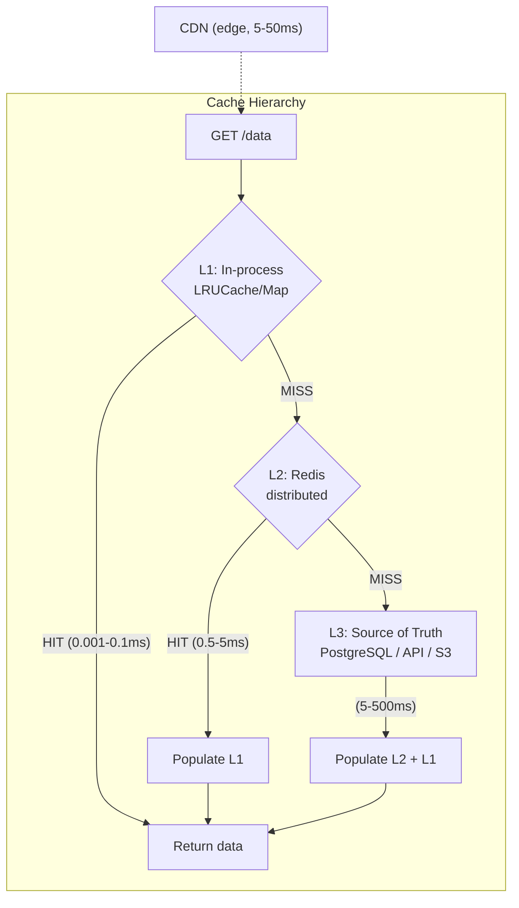

# Модуль 20 — Backend caching: Redis, in-memory, CDN

> **Для AI-архитектора:** Кэш — не «сохранить чтобы быстрее». Кэш — это явный trade-off: скорость против консистентности. Каждый слой кэша имеет свою инвалидацию, TTL и failure mode. Неправильная инвалидация убивает данные. Отсутствие TTL — память. Кэш без метрик — чёрный ящик. Для AI pipeline — кэш LLM ответов, embeddings и промежуточных результатов может снизить стоимость на порядок.
> Один день изучения — иерархия кэшей, in-memory (LRUCache, Map), Redis как distributed cache, паттерны Cache-Aside / Write-Through / Write-Behind, инвалидация, stampede protection, CDN-кэширование, observability.

## Содержание

1. [Иерархия кэшей: три уровня](#1-иерархия-кэшей-три-уровня)
2. [In-memory: LRUCache и Map](#2-in-memory-lrucache-и-map)
3. [Redis: distributed cache](#3-redis-distributed-cache)
4. [Паттерны записи: Cache-Aside, Write-Through, Write-Behind](#4-паттерны-записи-cache-aside-write-through-write-behind)
5. [Инвалидация: стратегии и граничные случаи](#5-инвалидация-стратегии-и-граничные-случаи)
6. [Cache stampede: защита](#6-cache-stampede-защита)
7. [Кэширование AI: embeddings и LLM ответы](#7-кэширование-ai-embeddings-и-llm-ответы)
8. [CDN-кэширование: HTTP заголовки](#8-cdn-кэширование-http-заголовки)
9. [Observability: hit rate, eviction, memory](#9-observability-hit-rate-eviction-memory)
10. [Реальный кейс](#10-реальный-кейс)
11. [Антипаттерны](#11-антипаттерны)
12. [Задачи AI-кодеру](#задачи-ai-кодеру)
13. [Чеклист архитектора](#чеклист-архитектора)

---

## Актуальные версии

| Инструмент | Версия | Дата проверки |
|:--|:--|:--|
| Node.js | **24.x Active LTS** | июнь 2026 |
| Node.js | **26.x Current** | июнь 2026 | для новых инструментов и экспериментов |
| ioredis | **5.11.1** | июнь 2026 |
| lru-cache | **11.5.1** | июнь 2026 |
| node-cache | **5.1.2** | июнь 2026 |
| quick-lru | **7.3.0** | июнь 2026 |
| redis | **6.0.0** | июнь 2026 | npm client package |

---

## 1. Иерархия кэшей: три уровня

### Модель L1 → L2 → L3



### Когда какой уровень

```typescript
// L1 (in-memory): данные которые нужны часто в одном процессе
//   - конфиг приложения (редко меняется)
//   - справочники: список стран, типы документов
//   - результаты embeddings для повторяющихся запросов
//   - compiled regex, parsed templates

// L2 (Redis): данные разделяемые между инстанциями
//   - сессии пользователей
//   - результаты дорогих запросов к БД
//   - rate limit counters
//   - distributed locks
//   - очереди (BullMQ — модуль 18)

// L3 (DB/API): источник истины, кэш не помог
//   - всегда при промахе L1 + L2
//   - при явной инвалидации

// CDN: статика и публичный контент
//   - изображения, JS/CSS бандлы
//   - страницы с медленно меняющимся контентом
//   - API ответы без персонализации
```

**Практический вывод для архитектора:** L1 + L2 стратегия — стандарт. Только L2 (Redis) без L1 = каждый запрос ходит в Redis (0.5–5ms vs 0.001ms). Для справочников с 1000 запросов/сек — L1 экономит 500–5000ms суммарного latency каждую секунду.

---

## 2. In-memory: LRUCache и Map

### LRUCache 11.x

```typescript
import { LRUCache } from 'lru-cache';

// Базовый LRU с TTL
const configCache = new LRUCache<string, AppConfig>({
  max: 100,                  // максимум 100 записей (по количеству)
  ttl: 1000 * 60 * 5,        // TTL: 5 минут
  allowStale: false,         // не возвращать просроченные записи
  updateAgeOnGet: false,     // не сбрасывать TTL при чтении
  updateAgeOnHas: false,
});

// LRU с ограничением по памяти
interface CachedEmbedding {
  vector: Float32Array;
  model: string;
  createdAt: number;
}

const embeddingCache = new LRUCache<string, CachedEmbedding>({
  maxSize: 500 * 1024 * 1024,  // 500 MB
  sizeCalculation: (entry) =>
    entry.vector.byteLength + 100, // размер вектора + overhead объекта
  ttl: 1000 * 60 * 60 * 24,      // 24 часа
  allowStale: true,               // ✅ отдать устаревший пока идёт revalidation
  dispose: (value, key, reason) => {
    // Вызывается при вытеснении: cleanup если нужен
    if (reason === 'evict') {
      console.debug(`[Cache] Evicted embedding: ${key}`);
    }
  },
});
```

### fetchMethod: stale-while-revalidate

```typescript
// fetchMethod — killer feature LRUCache 10+
// Множественные одновременные get() на один ключ → один реальный запрос
// Пока идёт revalidation — отдаётся stale значение (если allowStale: true)

const documentCache = new LRUCache<string, DocumentSummary>({
  max: 1000,
  ttl: 1000 * 60 * 15,   // 15 минут
  allowStale: true,
  fetchMethod: async (
    documentId: string,
    staleValue: DocumentSummary | undefined,
    { signal }
  ): Promise<DocumentSummary> => {
    // Вызывается при cache.fetch() когда записи нет или она устарела
    const summary = await db.documents.findSummary(documentId, { signal });
    if (!summary) throw new Error(`Document ${documentId} not found`);
    return summary;
  },
});

// Использование:
// cache.fetch() — async, использует fetchMethod при промахе
// cache.get() — sync, возвращает undefined при промахе
const summary = await documentCache.fetch('doc-123');

// Конкурентные запросы к тому же ключу — один реальный DB запрос:
const [a, b, c] = await Promise.all([
  documentCache.fetch('doc-123'), // → запрос к DB
  documentCache.fetch('doc-123'), // → ждёт тот же запрос
  documentCache.fetch('doc-123'), // → ждёт тот же запрос
]);
// Результат: 1 запрос к DB вместо 3
```

### Когда Map, а не LRUCache

```typescript
// Map: когда данные никогда не устаревают и нужна максимальная скорость
// Примеры: compiled regex, конфиг загруженный один раз, enum маппинги

// ✅ Map для compiled regex (иммутабельные, не нужен TTL)
const regexCache = new Map<string, RegExp>();

function getOrCompileRegex(pattern: string, flags = ''): RegExp {
  const key = `${pattern}::${flags}`;
  let regex = regexCache.get(key);
  if (!regex) {
    regex = new RegExp(pattern, flags);
    regexCache.set(key, regex);
  }
  return regex;
}

// ⚠️ НЕ использовать Map для:
// - данных которые могут обновиться (нет TTL → stale навсегда)
// - неограниченного роста ключей (нет eviction → OOM)
// - пользовательских данных в multi-tenant (нет изоляции по size)
```

### Граничные случаи LRUCache

**TTL vs max конфликт.** При `max: 100` и `ttl: 5min` — LRU вытесняет записи по частоте использования, TTL — по времени. Запись вытесняется по первому из условий. При `allowStale: true` — вытесненная по TTL запись может быть возвращена если `max` не превышен. Это counter-intuitive: `allowStale` возвращает данные после TTL истёк.

**Memory bloat при объектах.** `max: 1000` считает в штуках, не байтах. 1000 объектов по 1 МБ = 1 ГБ. Для переменного размера значений — всегда указывать `maxSize` + `sizeCalculation`.

**Почему это важно архитектору:** Без `maxSize` in-memory кэш — потенциальный OOM. Node.js не имеет GC принудительного под давлением памяти — процесс падает.

---

## 3. Redis: distributed cache

### ioredis: правильная инициализация

```typescript
import { Redis, type RedisOptions } from 'ioredis';

const REDIS_OPTIONS: RedisOptions = {
  host: process.env.REDIS_HOST ?? 'localhost',
  port: parseInt(process.env.REDIS_PORT ?? '6379'),
  password: process.env.REDIS_PASSWORD,
  db: parseInt(process.env.REDIS_DB ?? '0'),

  // Connection pool
  maxRetriesPerRequest: 3,      // для обычных команд (не блокирующих)
  enableReadyCheck: true,
  connectTimeout: 5_000,
  commandTimeout: 5_000,        // таймаут на команду

  // Reconnect
  retryStrategy: (times) => {
    if (times > 10) return null; // прекратить после 10 попыток
    return Math.min(times * 200, 5_000); // 200ms, 400ms, ..., 5s
  },

  // TLS в production
  ...(process.env.REDIS_TLS === 'true' && {
    tls: { rejectUnauthorized: true },
  }),

  // Lazy connect: не подключаться сразу, только при первой команде
  lazyConnect: true,
};

// Singleton
let redisInstance: Redis | null = null;

export function getRedis(): Redis {
  if (!redisInstance) {
    redisInstance = new Redis(REDIS_OPTIONS);

    redisInstance.on('error', (err) => {
      console.error('[Redis] Error:', err.message);
    });
    redisInstance.on('connect', () => {
      console.log('[Redis] Connected');
    });
    redisInstance.on('reconnecting', () => {
      console.warn('[Redis] Reconnecting...');
    });
  }
  return redisInstance;
}
```

### Типизированная обёртка над Redis

```typescript
import { Redis } from 'ioredis';

interface CacheOptions {
  ttlSeconds?: number;
  compress?: boolean; // для больших значений
}

export class RedisCache {
  constructor(
    private readonly redis: Redis,
    private readonly prefix: string,
    private readonly defaultTtl = 3600 // 1 час
  ) {}

  private key(k: string): string {
    return `${this.prefix}:${k}`;
  }

  async get<T>(key: string): Promise<T | null> {
    const raw = await this.redis.get(this.key(key));
    if (raw === null) return null;

    try {
      return JSON.parse(raw) as T;
    } catch {
      // Невалидный JSON в Redis — инвалидировать
      await this.del(key);
      return null;
    }
  }

  async set<T>(
    key: string,
    value: T,
    options?: CacheOptions
  ): Promise<void> {
    const ttl = options?.ttlSeconds ?? this.defaultTtl;
    const serialized = JSON.stringify(value);

    if (ttl > 0) {
      await this.redis.setex(this.key(key), ttl, serialized);
    } else {
      await this.redis.set(this.key(key), serialized);
    }
  }

  async del(key: string): Promise<void> {
    await this.redis.del(this.key(key));
  }

  // Атомарный get-or-set (без stampede — через SET NX)
  async getOrSet<T>(
    key: string,
    factory: () => Promise<T>,
    options?: CacheOptions
  ): Promise<T> {
    const cached = await this.get<T>(key);
    if (cached !== null) return cached;

    const value = await factory();
    await this.set(key, value, options);
    return value;
  }

  // Pipeline: batch операции
  async mget<T>(keys: string[]): Promise<(T | null)[]> {
    if (keys.length === 0) return [];

    const pipeline = this.redis.pipeline();
    keys.forEach(k => pipeline.get(this.key(k)));
    const results = await pipeline.exec();

    return (results ?? []).map(([err, raw]) => {
      if (err || raw === null) return null;
      try { return JSON.parse(raw as string) as T; }
      catch { return null; }
    });
  }

  // Инвалидация по паттерну — ОСТОРОЖНО (scan, не keys)
  async invalidatePattern(pattern: string): Promise<number> {
    const fullPattern = `${this.prefix}:${pattern}`;
    let cursor = '0';
    let deleted = 0;

    do {
      // ✅ SCAN вместо KEYS — не блокирует Redis
      const [nextCursor, keys] = await this.redis.scan(
        cursor,
        'MATCH', fullPattern,
        'COUNT', 100
      );
      cursor = nextCursor;

      if (keys.length > 0) {
        deleted += await this.redis.del(...keys);
      }
    } while (cursor !== '0');

    return deleted;
  }
}

// Инстанции по доменам
export const documentCache = new RedisCache(getRedis(), 'doc', 3600);
export const embeddingCache = new RedisCache(getRedis(), 'emb', 86400);
export const userSessionCache = new RedisCache(getRedis(), 'sess', 1800);
```

### Redis структуры для кэша

```typescript
// Hash: кэш нескольких полей одного объекта — один ключ вместо N
const redis = getRedis();

// ✅ HSET + HGETALL для документа с несколькими полями
await redis.hset(`doc:${docId}`, {
  title: doc.title,
  summary: doc.summary,
  pageCount: String(doc.pageCount),
  updatedAt: doc.updatedAt.toISOString(),
});
await redis.expire(`doc:${docId}`, 3600);

// Читать только нужные поля
const [title, summary] = await redis.hmget(`doc:${docId}`, 'title', 'summary');

// ✅ ZSET для leaderboard / sorted результатов с автовытеснением
await redis.zadd('popular:docs', { score: viewCount, member: docId });
await redis.zremrangebyrank('popular:docs', 0, -101); // хранить top-100

// ✅ SET (множество) для быстрой проверки membership
await redis.sadd(`user:${userId}:permissions`, 'read', 'write');
const canWrite = await redis.sismember(`user:${userId}:permissions`, 'write');
```

**Практический вывод для архитектора:** `JSON.stringify` на большие объекты — узкое место. 10K документов по 50KB = 500MB в Redis. Кэшировать только необходимые поля или использовать `HSET`. Не кэшировать бинарные данные через JSON — использовать `Buffer` с `redis.set(key, buffer)`.

---

## 4. Паттерны записи: Cache-Aside, Write-Through, Write-Behind

### Cache-Aside (Lazy Loading)

```typescript
// Самый распространённый паттерн
// Чтение: проверить кэш → при промахе читать из DB → положить в кэш
// Запись: писать в DB → инвалидировать кэш

async function getDocument(docId: string): Promise<Document> {
  // 1. L1 check
  const l1 = documentL1Cache.get(docId);
  if (l1) return l1;

  // 2. L2 check
  const l2 = await documentCache.get<Document>(docId);
  if (l2) {
    documentL1Cache.set(docId, l2); // populate L1
    return l2;
  }

  // 3. DB
  const doc = await db.documents.findById(docId);
  if (!doc) throw new NotFoundError(`Document ${docId}`);

  // populate both levels
  await documentCache.set(docId, doc, { ttlSeconds: 3600 });
  documentL1Cache.set(docId, doc);

  return doc;
}

async function updateDocument(
  docId: string,
  data: Partial<Document>
): Promise<Document> {
  // 1. Писать в DB
  const updated = await db.documents.update(docId, data);

  // 2. Инвалидировать оба уровня
  documentL1Cache.delete(docId);
  await documentCache.del(docId);
  // ✅ НЕ обновлять кэш здесь — следующий get() заполнит актуальными данными

  return updated;
}
```

### Write-Through

```typescript
// Запись: писать в DB И в кэш одновременно
// Профит: кэш всегда консистентен после записи
// Риск: write latency = DB latency + cache latency

async function updateDocumentWriteThrough(
  docId: string,
  data: Partial<Document>
): Promise<Document> {
  const updated = await db.documents.update(docId, data);

  // Одновременно обновить кэш
  await Promise.all([
    documentCache.set(docId, updated, { ttlSeconds: 3600 }),
    // L1 обновить синхронно
    Promise.resolve(documentL1Cache.set(docId, updated)),
  ]);

  return updated;
}

// Когда использовать Write-Through:
// - Данные читаются сразу после записи (read-your-writes)
// - Нельзя допустить cache miss после update
// - Низкая частота записи (иначе кэш постоянно перезаписывается)

// Когда НЕ использовать:
// - Высокая частота записи при редком чтении — кэш перегрет
// - Multi-step update (промежуточные состояния не нужны в кэше)
```

### Write-Behind (Write-Back)

```typescript
// Запись: только в кэш → async flush в DB
// Профит: минимальный write latency
// Риск: потеря данных при падении процесса до flush

// Для большинства production задач — избегать.
// Оправдан только для: счётчики просмотров, аналитика,
// данные где потеря нескольких записей допустима

class WriteBehindCache<T> {
  private readonly dirty = new Map<string, { value: T; dirtyAt: number }>();
  private flushInterval: NodeJS.Timeout | null = null;

  constructor(
    private readonly cache: RedisCache,
    private readonly persistFn: (key: string, value: T) => Promise<void>,
    private readonly flushIntervalMs = 5_000
  ) {}

  start(): void {
    this.flushInterval = setInterval(
      () => this.flush(),
      this.flushIntervalMs
    );
  }

  set(key: string, value: T): void {
    this.dirty.set(key, { value, dirtyAt: Date.now() });
    // Записать в кэш немедленно — не ждать flush
    this.cache.set(key, value).catch(console.error);
  }

  async flush(): Promise<void> {
    if (this.dirty.size === 0) return;

    const entries = [...this.dirty.entries()];
    this.dirty.clear();

    await Promise.allSettled(
      entries.map(([key, { value }]) => this.persistFn(key, value))
    );
  }

  async stop(): Promise<void> {
    if (this.flushInterval) {
      clearInterval(this.flushInterval);
    }
    await this.flush(); // финальный flush при shutdown
  }
}

// Graceful shutdown — обязателен для write-behind
process.on('SIGTERM', async () => {
  await writeBehindCache.stop(); // не потерять pending writes
  process.exit(0);
});
```

---

## 5. Инвалидация: стратегии и граничные случаи

### Стратегии инвалидации

```typescript
// 1. TTL-based: автоматическое устаревание
//    Плюс: нет кода инвалидации
//    Минус: stale window = TTL

// 2. Event-based: явная инвалидация при изменении
//    Плюс: немедленная консистентность
//    Минус: нужно знать что инвалидировать

// 3. Version-based: версия в ключе
//    Плюс: нет удаления ключей, просто новый ключ
//    Минус: старые ключи остаются (нужна отдельная очистка)

// Версионный кэш
async function getDocumentV(
  docId: string,
  version: number
): Promise<Document | null> {
  const key = `${docId}:v${version}`;
  return documentCache.get<Document>(key);
}

async function setDocumentV(
  docId: string,
  version: number,
  doc: Document
): Promise<void> {
  const key = `${docId}:v${version}`;
  await documentCache.set(key, doc, { ttlSeconds: 86400 });
}

// 4. Tag-based инвалидация через Redis SET
// Тег = множество ключей которые нужно инвалидировать вместе

async function tagKey(tag: string, cacheKey: string): Promise<void> {
  const redis = getRedis();
  await redis.sadd(`tag:${tag}`, cacheKey);
  await redis.expire(`tag:${tag}`, 86400); // тег живёт 24h
}

async function invalidateTag(tag: string): Promise<void> {
  const redis = getRedis();
  const keys = await redis.smembers(`tag:${tag}`);

  if (keys.length > 0) {
    const pipeline = redis.pipeline();
    keys.forEach(k => pipeline.del(k));
    pipeline.del(`tag:${tag}`);
    await pipeline.exec();
  }
}

// Пример: инвалидировать весь кэш пользователя
await tagKey(`user:${userId}`, `doc:${docId}`);
await tagKey(`user:${userId}`, `sess:${userId}`);
// При удалении пользователя:
await invalidateTag(`user:${userId}`); // инвалидирует все связанные ключи
```

### Граничные случаи инвалидации

**Race condition: обновление vs кэш.**

```typescript
// ❌ Проблема: параллельные запросы могут закэшировать устаревшие данные
// T1: read DB → получил v1 (outdated)
// T2: write DB → v2
// T2: delete cache
// T1: set cache(v1) ← перезаписал v2 устаревшим значением!

// ✅ Решение: SET с версией (optimistic locking)
async function safeSetCache<T extends { updatedAt: Date }>(
  key: string,
  value: T,
  ttlSeconds: number
): Promise<void> {
  const redis = getRedis();
  const existing = await redis.get(key);

  if (existing) {
    const cached = JSON.parse(existing) as T;
    // Не перезаписывать если в кэше более свежая версия
    if (new Date(cached.updatedAt) > value.updatedAt) {
      return;
    }
  }

  await redis.setex(key, ttlSeconds, JSON.stringify(value));
}
```

**KEYS vs SCAN.** `REDIS KEYS pattern` — блокирует Redis полностью на время поиска. Для 1M ключей — сотни миллисекунд freeze. Всегда использовать `SCAN` с `COUNT` для поиска по паттерну.

**Почему это важно архитектору:** `redis.keys('user:*')` в production на большой базе = DoS Redis на несколько секунд. Блокировка Redis блокирует все операции всех клиентов.

---

## 6. Cache stampede: защита

### Проблема

```
Cache stampede (thundering herd для кэша):
  1. Популярный ключ истекает
  2. N параллельных запросов видят cache miss
  3. Все N запросов идут в DB одновременно
  4. DB перегружен N одинаковыми запросами

Критично для:
  - Высоконагруженных endpoint
  - AI pipeline (дорогие LLM запросы)
  - Начала дня / события (burst трафик)
```

### Решение 1: LRUCache fetchMethod (in-process)

```typescript
// Уже рассмотрено в разделе 2.
// fetchMethod гарантирует один вызов на ключ при конкурентных запросах
// Работает только в одном процессе
```

### Решение 2: Redis lock (distributed)

```typescript
import { Redis } from 'ioredis';

const LOCK_TTL = 10; // секунды

async function getOrSetWithLock<T>(
  redis: Redis,
  key: string,
  factory: () => Promise<T>,
  ttlSeconds: number
): Promise<T> {
  // 1. Проверить кэш
  const cached = await redis.get(key);
  if (cached !== null) return JSON.parse(cached) as T;

  const lockKey = `lock:${key}`;

  // 2. Попробовать взять lock (SET NX = только если не существует)
  const lockAcquired = await redis.set(lockKey, '1', 'EX', LOCK_TTL, 'NX');

  if (lockAcquired === 'OK') {
    // Мы держим lock — вычислить и закэшировать
    try {
      const value = await factory();
      await redis.setex(key, ttlSeconds, JSON.stringify(value));
      return value;
    } finally {
      await redis.del(lockKey); // освободить lock
    }
  } else {
    // Другой процесс держит lock — подождать и прочитать из кэша
    const maxWaitMs = LOCK_TTL * 1000;
    const pollIntervalMs = 100;
    const deadline = Date.now() + maxWaitMs;

    while (Date.now() < deadline) {
      await new Promise(r => setTimeout(r, pollIntervalMs));
      const result = await redis.get(key);
      if (result !== null) return JSON.parse(result) as T;
    }

    // Lock timeout — последняя попытка напрямую
    return factory();
  }
}
```

### Решение 3: Probabilistic early expiration

```typescript
// Стохастическое обновление до истечения TTL
// Предотвращает одновременный stampede плавным прогревом

function shouldEarlyRefresh(
  remainingTtlMs: number,
  beta: number = 1.0 // выше = агрессивнее обновление
): boolean {
  // Вероятность растёт экспоненциально по мере приближения TTL
  // При 20% оставшегося TTL вероятность ~50%
  const probability = Math.exp(-remainingTtlMs / (beta * 10_000));
  return Math.random() < probability;
}

async function getWithEarlyRefresh<T>(
  redis: Redis,
  key: string,
  factory: () => Promise<T>,
  ttlSeconds: number
): Promise<T> {
  const raw = await redis.get(key);
  const ttlRemaining = await redis.pttl(key); // ms

  if (raw !== null) {
    // Возможно обновить досрочно (не блокируя текущий запрос)
    if (shouldEarlyRefresh(ttlRemaining)) {
      factory()
        .then(v => redis.setex(key, ttlSeconds, JSON.stringify(v)))
        .catch(console.error); // fire and forget
    }
    return JSON.parse(raw) as T;
  }

  const value = await factory();
  await redis.setex(key, ttlSeconds, JSON.stringify(value));
  return value;
}
```

**Практический вывод для архитектора:** Для большинства систем — `LRUCache.fetchMethod` (L1, in-process) закрывает stampede. Redis lock нужен только при multi-process stampede на дорогие операции (LLM inference). Early expiration — для систем с очень высоким трафиком где lock overhead неприемлем.

---

## 7. Кэширование AI: embeddings и LLM ответы

### Кэш embeddings

```typescript
import { LRUCache } from 'lru-cache';
import { createHash } from 'node:crypto';

interface EmbeddingEntry {
  vector: number[];
  model: string;
  dimensions: number;
}

// L1: in-memory для горячих embeddings
const embeddingL1 = new LRUCache<string, EmbeddingEntry>({
  max: 10_000,           // 10K векторов
  maxSize: 200 * 1024 * 1024,  // 200 MB (1536-dim = 6KB, 10K = 60MB)
  sizeCalculation: (e) => e.dimensions * 4 + 64, // float32 + overhead
  ttl: 1000 * 60 * 60 * 24,  // 24h (embeddings не меняются для одного текста)
  allowStale: false,
});

// Ключ = хэш текста + модель (не хранить сам текст в ключе)
function embeddingKey(text: string, model: string): string {
  const hash = createHash('sha256')
    .update(text)
    .update(model)
    .digest('hex')
    .slice(0, 32); // 32 символа достаточно
  return hash;
}

async function getOrCreateEmbedding(
  text: string,
  model: string = 'text-embedding-3-small'
): Promise<number[]> {
  const key = embeddingKey(text, model);

  // L1 check
  const l1 = embeddingL1.get(key);
  if (l1) return l1.vector;

  // L2 check (Redis)
  const l2 = await embeddingCache.get<EmbeddingEntry>(key);
  if (l2) {
    embeddingL1.set(key, l2);
    return l2.vector;
  }

  // Вычислить embedding (дорого: ~10–50ms + стоимость API)
  const vector = await callEmbeddingApi(text, model);
  const entry: EmbeddingEntry = {
    vector,
    model,
    dimensions: vector.length,
  };

  // Кэшировать оба уровня
  embeddingL1.set(key, entry);
  await embeddingCache.set(key, entry, { ttlSeconds: 86400 * 7 }); // 7 дней

  return vector;
}
```

### Кэш LLM ответов: семантическое сходство

```typescript
// Точный кэш: идентичный prompt → тот же ответ
// Семантический кэш: похожий prompt → похожий ответ (через embeddings)

// Точный кэш — просто:
function llmPromptKey(
  prompt: string,
  model: string,
  temperature: number
): string {
  // temperature = 0 → детерминированный ответ → кэшируемо
  // temperature > 0 → случайный ответ → не кэшировать или кэшировать осторожно
  if (temperature > 0) {
    throw new Error('LLM cache only for temperature=0');
  }
  return createHash('sha256')
    .update(`${model}:${temperature}:${prompt}`)
    .digest('hex');
}

const llmCache = new RedisCache(getRedis(), 'llm', 3600 * 24);

async function cachedLlmCompletion(
  prompt: string,
  options: { model: string; temperature?: number }
): Promise<string> {
  const { model, temperature = 0 } = options;

  if (temperature > 0) {
    // Не кэшируем недетерминированные ответы
    return callLlm(prompt, options);
  }

  const key = llmPromptKey(prompt, model, temperature);
  const cached = await llmCache.get<string>(key);
  if (cached !== null) return cached;

  const response = await callLlm(prompt, options);
  await llmCache.set(key, response, { ttlSeconds: 86400 }); // 24h
  return response;
}

// Когда кэшировать LLM ответы:
// ✅ temperature = 0 (детерминированные)
// ✅ Системные промпты (одинаковый вход = одинаковый выход)
// ✅ Batch обработка: одни и те же документы обрабатываются несколько раз
// ❌ Диалоги с историей (контекст меняется)
// ❌ temperature > 0 (разные ответы желательны)
// ❌ Реал-тайм данные в промпте (дата, цены)
```

---

## 8. CDN-кэширование: HTTP заголовки

### Cache-Control механика

```typescript
import { type Response } from 'express';

// Профили Cache-Control для разных типов контента

const CACHE_PROFILES = {
  // Статика с immutable хэшем: кэшировать навсегда
  immutableAsset: 'public, max-age=31536000, immutable',
  //   max-age=31536000 = 1 год
  //   immutable = браузер не ревалидирует до истечения

  // HTML страницы: CDN кэш + stale-while-revalidate
  htmlPage: 'public, max-age=300, stale-while-revalidate=3600',
  //   max-age=300 = свежий 5 минут
  //   stale-while-revalidate=3600 = ещё 1 час отдавать stale пока обновляется

  // API с персонализацией: только браузер, не CDN
  privateApi: 'private, max-age=60',

  // Не кэшировать вообще
  noCache: 'no-store',

  // Кэшировать но всегда ревалидировать
  mustRevalidate: 'no-cache',
  //   Браузер хранит копию но каждый раз делает conditional request

  // Публичный API без персонализации
  publicApi: 'public, max-age=60, stale-while-revalidate=300',
} as const;

// Middleware
export function setCacheHeaders(
  profile: keyof typeof CACHE_PROFILES,
  options?: { vary?: string[] }
) {
  return (req: any, res: Response, next: () => void) => {
    res.setHeader('Cache-Control', CACHE_PROFILES[profile]);

    // Vary: указывает CDN/браузеру по каким заголовкам запроса различать кэш
    if (options?.vary?.length) {
      res.setHeader('Vary', options.vary.join(', '));
    }

    next();
  };
}

// Использование
app.get('/static/:hash/*', setCacheHeaders('immutableAsset'));
app.get('/api/public/catalog', setCacheHeaders('publicApi'));
app.get('/api/user/profile', setCacheHeaders('privateApi'));
app.get('/page/:slug', setCacheHeaders('htmlPage', { vary: ['Accept-Encoding'] }));
```

### ETag и conditional requests

```typescript
import { createHash } from 'node:crypto';
import { type Request, type Response } from 'express';

// ETag позволяет браузеру/CDN ревалидировать без получения полного тела
function generateETag(content: string | Buffer): string {
  return `"${createHash('sha1').update(content).digest('hex').slice(0, 16)}"`;
}

async function serveDocument(req: Request, res: Response): Promise<void> {
  const doc = await getDocument(req.params.id);
  const etag = generateETag(JSON.stringify(doc));

  // Conditional GET: клиент уже имеет эту версию
  if (req.headers['if-none-match'] === etag) {
    res.status(304).end(); // Not Modified — не отправлять тело
    return;
  }

  res
    .setHeader('ETag', etag)
    .setHeader('Cache-Control', 'public, max-age=300')
    .json(doc);
}

// Last-Modified вместо ETag (для файлов)
async function serveFile(req: Request, res: Response): Promise<void> {
  const stat = await fs.stat(req.params.path);
  const lastModified = stat.mtime.toUTCString();

  if (req.headers['if-modified-since'] === lastModified) {
    res.status(304).end();
    return;
  }

  res
    .setHeader('Last-Modified', lastModified)
    .setHeader('Cache-Control', 'public, max-age=3600')
    .sendFile(req.params.path);
}
```

### Surrogate-Key / Cache-Tag инвалидация (Cloudflare / Fastly)

```typescript
// Surrogate-Key (Fastly) = Cache-Tag (Cloudflare)
// Позволяет инвалидировать группу CDN ресурсов по тегу

// При отдаче ответа — пометить тегами
app.get('/api/documents/:id', async (req, res) => {
  const doc = await getDocument(req.params.id);

  // Cloudflare: Cache-Tag заголовок
  res.setHeader('Cache-Tag', [
    `doc:${doc.id}`,
    `user:${doc.authorId}`,
    `category:${doc.categoryId}`,
  ].join(','));

  res.setHeader('Cache-Control', 'public, max-age=300');
  res.json(doc);
});

// При обновлении документа — инвалидировать в Cloudflare
async function invalidateCloudflareTag(tag: string): Promise<void> {
  await fetch(
    `https://api.cloudflare.com/client/v4/zones/${process.env.CF_ZONE_ID}/purge_cache`,
    {
      method: 'POST',
      headers: {
        'Authorization': `Bearer ${process.env.CF_API_TOKEN}`,
        'Content-Type': 'application/json',
      },
      body: JSON.stringify({ tags: [tag] }),
    }
  );
}

// При обновлении документа:
await db.documents.update(docId, data);
await invalidateCloudflareTag(`doc:${docId}`);
```

---

## 9. Observability: hit rate, eviction, memory

### LRUCache метрики

```typescript
import { LRUCache } from 'lru-cache';

function getLruCacheMetrics<K, V>(
  cache: LRUCache<K, V>,
  name: string
): Record<string, number> {
  return {
    [`cache_${name}_size`]: cache.size,
    [`cache_${name}_max`]: cache.max ?? 0,
    [`cache_${name}_calculated_size`]: cache.calculatedSize ?? 0,
    [`cache_${name}_max_size`]: cache.maxSize ?? 0,
    // hit rate требует ручного счётчика — LRUCache не хранит stats нативно
  };
}

// Обёртка с метриками
class InstrumentedLRUCache<K, V> {
  private hits = 0;
  private misses = 0;
  private readonly cache: LRUCache<K, V>;

  constructor(options: LRUCache.Options<K, V>) {
    this.cache = new LRUCache(options);
  }

  get(key: K): V | undefined {
    const value = this.cache.get(key);
    value !== undefined ? this.hits++ : this.misses++;
    return value;
  }

  set(key: K, value: V, options?: LRUCache.SetOptions<K, V>): this {
    this.cache.set(key, value, options);
    return this;
  }

  delete(key: K): boolean { return this.cache.delete(key); }

  getStats() {
    const total = this.hits + this.misses;
    return {
      hits: this.hits,
      misses: this.misses,
      hitRate: total > 0 ? this.hits / total : 0,
      size: this.cache.size,
    };
  }
}
```

### Redis INFO: ключевые метрики

```typescript
async function getRedisStats(redis: Redis): Promise<Record<string, string | number>> {
  const info = await redis.info('all');
  const lines = info.split('\r\n');
  const stats: Record<string, string> = {};
  for (const line of lines) {
    const [key, value] = line.split(':');
    if (key && value) stats[key.trim()] = value.trim();
  }

  return {
    // Память
    usedMemoryMb: parseFloat(stats['used_memory'] ?? '0') / 1024 / 1024,
    maxMemoryMb: parseFloat(stats['maxmemory'] ?? '0') / 1024 / 1024,
    memFragmentationRatio: parseFloat(stats['mem_fragmentation_ratio'] ?? '1'),

    // Hit rate — самая важная метрика кэша
    keyspaceHits: parseInt(stats['keyspace_hits'] ?? '0'),
    keyspaceMisses: parseInt(stats['keyspace_misses'] ?? '0'),
    hitRate: (() => {
      const h = parseInt(stats['keyspace_hits'] ?? '0');
      const m = parseInt(stats['keyspace_misses'] ?? '0');
      return h + m > 0 ? h / (h + m) : 0;
    })(),

    // Eviction
    evictedKeys: parseInt(stats['evicted_keys'] ?? '0'),
    expiredKeys: parseInt(stats['expired_keys'] ?? '0'),
    evictionPolicy: stats['maxmemory_policy'] ?? 'noeviction',

    // Connections
    connectedClients: parseInt(stats['connected_clients'] ?? '0'),
    blockedClients: parseInt(stats['blocked_clients'] ?? '0'),

    // Ops
    instantaneousOpsPerSec: parseInt(stats['instantaneous_ops_per_sec'] ?? '0'),
    totalCommandsProcessed: parseInt(stats['total_commands_processed'] ?? '0'),
  };
}

// Health endpoint включающий cache stats
app.get('/health', async (req, res) => {
  const [redisStats, l1Stats] = await Promise.all([
    getRedisStats(getRedis()),
    Promise.resolve(documentL1Cache.getStats()),
  ]);

  res.json({
    status: 'ok',
    cache: {
      redis: {
        hitRate: redisStats.hitRate,
        usedMemoryMb: redisStats.usedMemoryMb,
        evictedKeys: redisStats.evictedKeys,
      },
      l1: l1Stats,
    },
  });
});
```

**Практический вывод для архитектора:** Целевой hit rate для production: L1 ≥ 60%, L2 ≥ 85%. Hit rate ниже 50% = кэш не приносит пользы или TTL слишком короткий. Резкое падение hit rate = признак изменения паттернов доступа или атаки.

---

## 10. Реальный кейс

**Задача:** кэширование embeddings для RAG pipeline. ~50K документов
в корпусе, ~500 запросов/день. Каждый запрос → embedding вызов
(∼50ms, ∼$0.0001) → pgvector search.

**Стек:** Node.js 24, LRUCache 11.5 (L1), ioredis 5.11 (L2),
OpenAI text-embedding-3-small, pgvector.

**Гипотеза:** L1 (in-memory) + L2 (Redis) кэш embeddings сократит
количество API вызовов в 3–5× за счёт повторяющихся запросов.

**Что получилось:**

Кэш L1 (LRUCache, max=10K, maxSize=200MB) дал hit rate 47% —
значительно меньше ожидаемых 80%.

Причина: ключом был SHA-256 полного текста запроса. Запросы
«цена доставки» и «стоимость доставки» — разные ключи, хотя
semantically идентичны. Кэш не работал для синонимичных запросов.

```typescript
// ❌ Точный хэш — не ловит синонимы
const key = sha256(text + model); // 'цена доставки' ≠ 'стоимость доставки'

// ✅ Семантический кэш: embedding запроса как ключ кэша
// Нормализовать запрос перед хэшированием
const normalized = text
  .toLowerCase()
  .replace(/\s+/g, ' ')
  .trim();
const key = sha256(normalized + model);
```

Normalisation поднял L1 hit rate с 47% до 63%.

**L2 (Redis)** дал дополнительно 31% — итого 94% combined hit rate.
Но Redis memory: 50K векторов × 1536 dims × 4 bytes = ~300 MB,
плюс overhead ключей ~50 MB. Влезло в 512 MB Redis instance.

**Неожиданная проблема — TTL конфликт между L1 и L2.**

```typescript
L1: ttl = 24h → L2 hit, populate L1, L1 expires через 24h
L2: ttl = 7d → entry живёт 7 дней
```

После 24h: L1 miss → L2 hit → populate L1. Каждый день L1
перезаполняется для горячих ключей. Hit rate стабилен, но
L1 «трясёт» — каждый день перезаписываются одни и те же 10K
записей. Решение: синхронизировать TTL (L1 = L2 / 2) + refresh
на L1 hit обновляет возраст.

**Экономика:**

| Уровень | До кэша | После |
|---------|---------|-------|
| API calls/day | 500 | 30 (94% кэш) |
| Cost/day | $0.05 | $0.003 |
| Latency p50 | 52ms | L1: 0.04ms, L2: 1.2ms |
| Redis memory | — | 370 MB |

**Вывод, противоречащий интуиции:**

Кэш embeddings окупился не столько деньгами ($0.05/день —
тривиально), сколько **latency**. L1 (0.04ms) vs прямой вызов
(52ms) = 1000× быстрее. Для пользовательского опыта разница
заметна. Нормализация текста перед хэшем дала +16% hit rate
без единой строчки кэш-логики.

---

## 11. Антипаттерны

### «redis.keys('prefix:*') для инвалидации»

**Выглядит правильно:** просто, понятно.

**Почему ошибка:** `KEYS` — O(N) по всем ключам Redis, блокирует event loop Redis-сервера на время выполнения. На базе с 1M ключей = несколько сотен миллисекунд freeze всех операций всех клиентов. `SCAN` — итеративный, не блокирующий, O(1) за итерацию.

---

### «Кэшировать всё с одним TTL»

**Выглядит правильно:** единообразно.

**Почему ошибка:** конфиг приложения и результат AI inference имеют разные lifecycle. Конфиг меняется раз в день → TTL 24h. AI ответ для конкретного документа — стабилен неделями → TTL 7d. Список товаров в магазине → TTL 5–15 минут. Один TTL = либо stale data либо cache thrashing.

---

### «JSON.serialize больших объектов в Redis»

**Выглядит правильно:** простой формат.

**Почему ошибка:** `JSON.stringify` объекта на 1 МБ = ~5ms CPU на сериализацию + ~5ms на десериализацию = 10ms overhead. При 1000 req/s = 10s CPU/s только на сериализацию. Для больших объектов: кэшировать только нужные поля через `HSET`, или использовать MessagePack / CBOR вместо JSON.

---

### «Кэшировать LLM ответы с temperature > 0»

**Выглядит правильно:** экономия API вызовов.

**Почему ошибка:** temperature > 0 означает что одинаковый prompt намеренно должен давать разные ответы. Кэш убивает вариативность — пользователи всегда получают первый сгенерированный ответ. Кэшировать LLM только при `temperature = 0`.

---

### «in-memory Map без ограничения размера»

**Выглядит правильно:** быстро, без зависимостей.

**Почему ошибка:** Map растёт неограниченно. При обработке 100K уникальных документов — Map содержит 100K записей, GC начинает тормозить, в итоге OOM. Даже для «маленького» кэша — использовать LRUCache с `max` или `maxSize`.

---

### «Не проверять eviction policy Redis»

**Выглядит правильно:** Redis сам разберётся.

**Почему ошибка:** дефолтная политика Redis — `noeviction`: при заполнении памяти команды записи возвращают ошибку `OOM command not allowed`. Для кэша нужна `allkeys-lru` или `volatile-lru`. Проверять через `CONFIG GET maxmemory-policy` при деплое.

---

## Задачи AI-кодеру

**Задача 1 — L1+L2 cache с метриками**

Плохая формулировка:
> «Добавь кэш для документов»

Хорошая формулировка:
> «Реализуй TypeScript класс `TwoLevelCache<T>` с конструктором `(options: {prefix: string, l1Max: number, l1TtlMs: number, l2TtlSeconds: number})`. Методы: `get(key: string): Promise<T | null>` — проверять L1 (LRUCache 11.2.6), потом L2 (RedisCache с ioredis 5.9.3), при L2 hit — populate L1; `set(key: string, value: T): Promise<void>` — писать оба уровня; `del(key: string): Promise<void>` — удалять оба уровня; `getStats(): {l1: {hits, misses, hitRate, size}, l2HitRate: number}` — возвращать статистику обоих уровней. L1 использовать InstrumentedLRUCache (ручные счётчики). L2 hit rate — считать через собственные counters в классе. Redis — singleton getRedis() из внешнего модуля.»

Формула: оба уровня + populate on L2 hit + stats обоих уровней + singleton Redis.

---

**Задача 2 — Embedding cache с хэш-ключом**

Плохая формулировка:
> «Закэшируй embeddings»

Хорошая формулировка:
> «Реализуй TypeScript функцию `getOrCreateEmbedding(text: string, model: string, callApi: (text: string, model: string) => Promise<number[]>): Promise<number[]>`. Ключ = SHA-256 от `model + ':' + text`, первые 32 символа hex. L1: LRUCache 11.2.6, max=5000, maxSize=100MB, sizeCalculation=(v)=>v.length*4+64 (float32), ttl=24h. L2: RedisCache prefix='emb', ttl=7 days. Кэшировать `{vector: number[], model: string, dimensions: number}`. При L2 hit — populate L1. Функцию `callApi` вызывать только при промахе обоих уровней. Не хранить исходный текст в Redis (только хэш как ключ).»

Формула: ключ через хэш + размер по float32 + оба уровня + no plaintext в Redis.

---

**Задача 3 — Stampede protection через Redis lock**

Плохая формулировка:
> «Защити кэш от stampede»

Хорошая формулировка:
> «Реализуй TypeScript функцию `getOrSetWithLock<T>(redis: Redis, key: string, factory: () => Promise<T>, ttlSeconds: number, lockTtlSeconds?: number): Promise<T>`. lockTtlSeconds дефолт 10. Алгоритм: 1) redis.get(key) → вернуть если есть; 2) redis.set(lockKey, '1', 'EX', lockTtlSeconds, 'NX'); 3) если lock получен — вызвать factory(), redis.setex(key, ttlSeconds, JSON), освободить lock в finally через redis.del(lockKey); 4) если lock занят — поллить redis.get(key) каждые 100ms максимум lockTtlSeconds секунд; 5) если после ожидания ключ так и не появился — вызвать factory() напрямую (fallback). lockKey = `lock:${key}`. Ошибку factory() пробрасывать, lock освобождать в finally.»

Формула: точный алгоритм 5 шагов + fallback + finally release + polling interval.

---

## Чеклист архитектора

### Стратегия
- [ ] Определены L1/L2 уровни для каждого типа данных
- [ ] TTL обоснован lifecycle данных (не единый на всё)
- [ ] Выбрана стратегия записи: Cache-Aside / Write-Through / Write-Behind
- [ ] Write-Behind имеет graceful shutdown с финальным flush

### In-memory (LRUCache)
- [ ] `max` или `maxSize` указан — не растёт неограниченно
- [ ] `sizeCalculation` задан для переменного размера значений
- [ ] Не используется plain `Map` для кэша с потенциально неограниченным ростом

### Redis
- [ ] `maxmemory-policy` = `allkeys-lru` или `volatile-lru` (не `noeviction`)
- [ ] `maxmemory` задан явно
- [ ] `SCAN` вместо `KEYS` везде где нужен поиск по паттерну
- [ ] Ключи с префиксом по домену: `doc:`, `emb:`, `sess:`

### Инвалидация
- [ ] Tag-based или event-based инвалидация для связанных ключей
- [ ] Race condition при параллельном update + set рассмотрен
- [ ] Cache stampede protection реализована для дорогих операций

### AI кэш
- [ ] Embeddings кэшируются по хэшу текста (не plaintext в ключе)
- [ ] LLM кэш только при `temperature = 0`
- [ ] Размер L1 для embeddings ограничен по `maxSize` (не по `max`)

### Observability
- [ ] Hit rate L1 и L2 в `/health` endpoint
- [ ] Redis `evicted_keys` алерт настроен
- [ ] CDN Cache-Control заголовки настроены по профилям

---

*Модуль 20 завершён.*
*Следующий: [Модуль 21 — Тестирование: unit, integration, e2e](../21-testing/README.md)*
