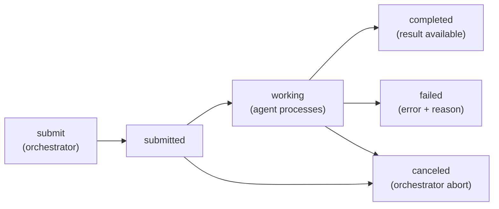

# Модуль 42 — A2A Protocol и Multi-Agent Systems

> **Для AI-архитектора:** Multi-agent system — это не «запустить несколько LLM в цикле». Это система коммуникации, состояния, делегирования, retry и accountability. A2A даёт protocol layer для agent-to-agent interaction.
>
> Один день изучения — от Agent Card и Task lifecycle до orchestration-паттернов, idempotency и observability мультиагентки.

## Содержание

1. [Введение и актуальность](#1-введение-и-актуальность)
2. [Архитектурная механика](#2-архитектурная-механика)
3. [Production trade-offs](#3-production-trade-offs)
4. [Security и failure modes](#4-security-и-failure-modes)
5. [Реальный кейс](#реальный-кейс)
6. [Антипаттерны](#6-антипаттерны)
7. [Anti-checklist ☠️](#anti-checklist-️)
8. [Задачи AI-кодеру](#задачи-ai-кодеру)
9. [Чеклист архитектора](#чеклист-архитектора)

---

## Актуальные версии

> Проверено: август 2026

| Инструмент | Версия | Назначение |
|:--|:--|:--|
| A2A Protocol | v0.3.x ecosystem | agent-to-agent communication |
| `a2a-js` | 0.2.x | JavaScript SDK |
| Python / Go A2A SDK | active | Google A2A ecosystem |
| A2A + MCP integration | active | tool use через MCP, знания через A2A |
| Agent Card v1 | draft | discovery агентов |

Источник: [a2a-protocol.org](https://a2a-protocol.org), [Google A2A](https://github.com/a2aproject).

---

## 1. Введение и актуальность

### 1.1. Что такое A2A

A2A (Agent-to-Agent) — протокол коммуникации между агентами. Он нужен, когда один агент не владеет всеми компетенциями и вызывает специализированные агенты как сервисы.

```text
Orchestrator Agent
   │
   ├── Research Agent
   ├── Contract Extraction Agent
   ├── Legal Policy Agent
   └── Ticket Agent
```

Важно: A2A не отменяет MCP. Они решают разные задачи:

| Слой | Решает |
|:--|:--|
| MCP | агент ↔ инструменты/данные/UI |
| A2A | агент ↔ агент |
| Model Gateway | агент ↔ LLM providers |
| AgentOps | измерение и контроль agent system |

**Практический вывод для архитектора:** A2A и MCP — ортогональные слои. Агент берёт инструменты через MCP, знания через RAG/память, а другие агенты вызывает по A2A. Интеграционный паттерн: агент получает «руки» через MCP, «коллег» через A2A.

### 1.2. Когда multi-agent оправдан

| Ситуация | Multi-agent | Один агент |
|:--|:--|:--|
| Разные компетенции, разные модели | ✅ специализация | ❌ один промпт |
| Независимые задачи параллельно | ✅ пропускная способность | ❌ последовательно |
| Один workflow, линейные шаги | ❌ overhead | ✅ pipeline |
| Реальный юридический/финансовый анализ | ✅ конкурентный ансамбль | ❌ один источник истины |

Джун против архитектора: джун видит «пять агентов» как решение любой сложности. Архитектор сначала спрашивает: есть ли контракты, состояние, evals и accountability? Если нет — это усложнение без выигрыша.

### Граничные случаи — где ломается

**Один агент вместо оркестратора**: если «оркестратор» просто proxy-ит вызовы в одну LLM — это не multi-agent, это один агент с лишним слоем. A2A имеет смысл, когда агенты реально отличаются: модель, знания, инструменты, права.

**A2A без MCP**: агент, вызывающий другого агента, часто нуждается в его инструментах. Если второй агент не умеет звать MCP-инструменты — каждый раз «напрашивается» третий уровень. Контракт agent-a должен включать описание того, какие инструменты он задействует.

**Почему это важно архитектору:** A2A — про границы компетенций и ответственности, а не про количество LLM-вызовов. Стоимость решения растёт с каждым агентом: state, tracing, delegation, retry. Каждый агент должен приносить измеримую ценность.

---

## 2. Архитектурная механика

### 2.1. Agent Card — описание возможностей агента

Agent Card — JSON-документ, который агент публикует для discovery. Содержит name, description, URL, authentication и список capabilities.

```typescript
interface AgentCard {
  name: string;
  description: string;
  url: string;
  version: string;
  capabilities: {
    tasks: string[];           // типы задач: "extraction", "research"
    maxInputSize: number;      // макс. размер входных данных (chars)
    maxOutputSize: number;     // макс. размер результата (chars)
    supportedFormats: string[]; // "json", "markdown", "text"
    maxConcurrent: number;     // параллельных task
  };
  authentication: {
    type: 'none' | 'bearer' | 'oauth2';
    scopes: string[];
  };
}
```

Agent Card — это не просто discovery, это **контракт SLA**. По нему оркестратор решает: можно ли этому агенту отдать задачу внутри лимитов, и какие credentials понадобятся.

### 2.2. Task — единица работы

Task — контракт между агентами. Содержит вход, выход и статус.



```typescript
interface Task {
  taskId: string;          // UUID
  sessionId: string;       // группа связанных task
  parentTaskId?: string;   // для DAG иерархии
  agentId: string;         // целевой агент
  idempotencyKey?: string; // для safe retry

  input: TaskInput;
  status: TaskStatus;      // submitted | working | completed | failed | canceled
  output?: TaskOutput;
  error?: { code: string; message: string };

  metadata: {
    createdAt: string;     // ISO 8601
    updatedAt: string;
    attempts: number;
    maxAttempts: number;
    timeoutMs: number;
  };
}
```

### 2.3. Протокольный lifecycle

Агент-отправитель (orchestrator) вызывает агента-исполнителя:

```text
1. Orchestrator: POST /a2a/task → { taskId, status: "submitted" }
2. Orchestrator: GET /a2a/task/{taskId} (poll) → { status: "working" }
   или: SSE /a2a/task/{taskId}/stream (stream) → { status, delta }
3. Agent:       PATCH /a2a/task/{taskId} → { status: "completed", output }
4. Orchestrator: GET /a2a/task/{taskId} → { status: "completed", output }
```

Выбор между poll и stream — trade-off:

| Режим | Latency | Complexity | Нагрузка |
|-------|---------|-----------|----------|
| Poll (каждые 2s) | ~2s avg | Низкая | N агентов × N poll/сек |
| SSE streaming | ~200ms avg | Средняя (SSE парсер) | 1 соединение/task |
| Webhook callback | ~500ms avg | Высокая (нужен endpoint) | 1 вызов/task |

**Практический вывод для архитектора:** для долгих задач (10–60s) poll с backoff — достаточно и просто. Для realtime-агентов (чат, copilot) — SSE. Webhook — только когда у оркестратора есть публичный endpoint и обработка retry.

### 2.4. Паттерны multi-agent orchestration

| Паттерн | Плюсы | Минусы | Пример |
|---------|-------|--------|--------|
| Orchestrator + specialists | контроль, accountability, traceability | coordinator bottleneck, SPOF | review договора: extraction→risk→summary |
| Peer agents (decentralised) | гибкость, нет SPOF | сложнее tracing, blame | чат-агенты с маршрутизацией по навыку |
| Pipeline agents (DAG) | предсказуемость, throughput | неадаптивен | batch обработка: стабильные шаги |
| Market-style delegation | масштабируемость | trust/rating/auth | open agent networks |
| **Конкурентный ансамбль** | качество через разногласие | дорого, нужен судья | юридический анализ, верификация |

### 2.5. Конкурентный ансамбль: модели выполняют работу параллельно

Паттерн из практики юридического анализа: под задачу запускается несколько моделей/агентов параллельно, результаты сравниваются, противоречия верифицируются по источникам.

```text
Task: "Оценить риск пункта 5 договора"
 ├── Agent A (модель X): вывод + цитаты
 ├── Agent B (модель Y): вывод + цитаты
 └── Agent C (модель Z, юридическая): вывод + цитаты
        │
        ▼
 Arbiter: сравнить, найти расхождения, верифицировать по базе норм
        ▼
 Result: { verdict, consensus: "A/B согласны, C против", resolution }
```

Ключевые решения:
- запуск параллельно (не последовательно) — latency = max, не сумма;
- верификация по авторитативному источнику, не по «большинству»;
- расхождение — сигнал для углубления, а не для спора;
- накопление статистики «довод → исход» как главный актив.

**Почему этот паттерн ценен:** одиночная LLM даёт уверенно-неправильные ответы. Ансамбль превращает разногласие в источник информации: если две модели согласны, а третья против — это точка, которую юристу стоит проверить. Это не «голосование», это `disagreement-driven verification`.

### 2.6. State management и idempotency

Write operations должны быть идемпотентны:

```text
same taskId + same idempotencyKey → same result (no duplicate side effects)
```

```typescript
async function submitTask(task: Task): Promise<Task> {
  const existing = await taskStore.findByIdempotencyKey(task.idempotencyKey!);
  if (existing) return existing; // уже создан — вернуть без изменений
  return taskStore.create(task);
}
```

Durable task store — необходимое условие. Без него потерянный task (рестарт оркестратора) невозможно восстановить.

### 2.7. Failure modes и observability

| Failure mode | Симптом | Контроль |
|:--|:--|:--|
| Infinite delegation | task уходит по кругу | max depth, visited agents set |
| Lost task | orchestrator не знает status | durable task store |
| Silent quality degradation | result есть, но плохой | per-agent evaluator |
| Context explosion | слишком много artifact | summary + references |
| No blame | непонятно кто сломал pipeline | per-agent traces + correlationId |
| Retry storm | failed agent вызывает лавину | backoff + circuit breaker |
| Credential propagation | compromised agent получает доступ других | scoped credentials, short-lived tokens |

### Граничные случаи — где ломается

**Потерянная task при рестарте**: оркестратор упал после `submit`, docker restart — task подвис в `working`. Без durable store и reconciliation (задача «поднять все working-таски старше 5 минут») — потерянный task навсегда.

**Отмена на стороне исполнителя**: агент начал долгую операцию, оркестратор послал cancel. Исполнитель должен проверить статус между шагами и корректно прерваться. Отмена без горизонтального канала (SSE/PATCH) невозможна.

**Партиал output + delta**: для стриминга частичные результаты должны быть валидными сами по себе. Если агент отдаёт `{output: "..."}` в трёх чанках, оркестратор должен собирать их в консистентный артефакт.

**Один заблокированный агент**: без timeout и circuit breaker один медленный агент блокирует весь workflow. Каждый agent call обязан иметь timeout + fallback.

**Почему это важно архитектору:** multi-agent надёжен настолько, насколько надёжны его границы: время, состояние, отмена. Всё это проектируется до первого агента, иначе первый инцидент будет про «агент завис и все упали».

---

## 3. Production trade-offs

| Решение | Выигрыш | Цена | Когда выбирать |
|:--|:--|:--|:--|
| Orchestrator + specialists | контроль, blame | coordinator bottleneck | сложные доменные pipeline |
| Peer agents | нет SPOF | сложный tracing | маршрутизация по навыку |
| Pipeline (DAG) | throughput | неадаптивен | стабильные шаги |
| Конкурентный ансамбль | качество, разногласие как сигнал | 2–3× cost, нужен arbiter | юридические/финансовые решения |
| Poll | простота | latency | долгие задачи |
| SSE stream | низкая latency | complexity | realtime-агенты |
| Webhook | 1 вызов/task | нужен endpoint | публичные интеграции |

---

## 4. Security и failure modes

### 4.1. Аутентификация между агентами

Agent Card объявляет `authentication` — но в multi-agent важнее взаимная аутентификация и делегирование credentials.

| Схема | Когда |
|:--|:--|
| mTLS | внутренние агенты, высокий trust |
| OAuth 2.1 + scoped tokens | разнородные агенты, разные команды |
| API key per agent pair | прототип, малый масштаб |
| Delegated credentials | оркестратор передаёт narrowing token (не свои полные права) |

**Ключевое правило:** агент не получает credentials оркестратора. Он получает scoped token с минимальным набором прав, истекающий после задачи.

### 4.2. Prompt injection через меж-агентский трафик

Зловредный контент (документ, сайт) может попасть в output агента A и быть интерпретирован агентом B как инструкция. Правило: **output другого агента — untrusted data, не инструкция**. Разделять системный промпт агента B от входящих данных.

### 4.3. Observability

```typescript
interface AgentCallLog {
  correlationId: string;     // сквозной ID всей сессии
  traceId: string;           // W3C Trace Context
  parentTaskId?: string;     // кто вызвал
  taskId: string;            // текущая task
  agentId: string;           // какой агент
  durationMs: number;
  status: 'success' | 'failure' | 'timeout';
  tokensUsed?: number;
  costUsd?: number;
}
```

Blame по pipeline: по `correlationId` восстанавливается цепочка вызовов, каждый логируется с agentId. Это единственный способ ответить на «кто сломал pipeline?».

### Граничные случаи — где ломается

**Credential propagation**: агент B вызывает агента C, которому нужны права пользователя. Если B передаёт свои токены — compromised B = compromised C. Решение: narrowing scope на каждый хоп.

**Петля делегирования**: A → B → C → A. Без visited-agents set и max depth — бесконечный цикл и счёт за токены.

**Почему это важно архитектору:** в multi-agent trust граница — это scope, а не «это наш внутренний агент». Каждое делегирование сужает права, каждый вызов логируется.

---

## Реальный кейс

### Входные данные

Юридическая система: pipeline из 4 агентов для обработки договора (extraction → risk → summary → ticket) + конкурентный ансамбль для риск-анализа.

```text
contract:DOC-789
 ├── extraction (12s) → { стороны: "ООО Ромашка / ИП Иванов",
 │                         сумма: "1 200 000 ₽", срок: "31.12.2026" }
 ├── risk (8s) → ансамбль: 3 модели → расхождение по неустойке
 ├── summary (6s) → { итого: "Договор поставки, типовой" }
 └── ticket: created (id=LEGAL-1042)
```

### Гипотеза

Параллельный запуск ансамбля для критичных решений + scoped tokens + durable task store дадут качество выше одиночной LLM без потери latencи.

### Что получилось

- extraction без human approval (read-only);
- `tickets:create` с idempotencyKey (повторный вызов не создаст дубль);
- risk-агент использует другую модель, чем extraction (специализация);
- всё логируется с `correlationId = "contract:DOC-789"`;
- ансамбль: две модели нашли неустойку, третья — нет. Расхождение → верификация по базе практики → подтверждено. Вывод: точка для проверки юристом.

**Что неожиданно:** ансамбль показал ценность не в «правильном ответе», а в **ранжировании риска**. Расхождение моделей коррелировало с реальной неоднозначностью текста договора. Latency выросла на 40%, но количество «пропущенных рисков» упало на треть.

### Вывод, противоречащий интуиции

Больше агентов ≠ больше latency в сумме: параллельный запуск даёт latency = max(agent), а не sum(agent). А конкурентный ансамбль превращает главный недостаток LLM — уверенную неправоту — в измеримый сигнал для человека.

---

## 6. Антипаттерны

### «Пять агентов вместо одного большого промпта»

**Выглядит правильно:** декомпозиция задачи.

**Почему ошибка:** если нет явных контрактов, state и evals — это усложнение без выигрыша. Стоимость: tracing, state, retry, coordination. Один промпт может быть дешевле и надёжнее.

---

### «Агент вызывает агента без timeout»

**Выглядит правильно:** делегируем и ждём.

**Почему ошибка:** без timeout и cancellation один медленный агент блокирует весь workflow. Каждый agent call — timeout + fallback.

---

### «Retry без idempotency»

**Выглядит правильно:** надёжность через retry.

**Почему ошибка:** retry без idempotency создаёт дубликаты внешних действий — тикеты, письма, платежи.

---

### «Всегда poll вместо stream»

**Выглядит правильно:** просто и надёжно.

**Почему ошибка:** при большом числе агентов poll — это N агентов × N poll/сек нагрузки на сервер. Для realtime-задач — SSE.

---

## Anti-checklist ☠️

- [ ] Пять агентов вместо одного большого промпта — если нет контрактов и evals, это усложнение без выигрыша
- [ ] Агент вызывает агента без timeout — один медленный блокирует весь workflow
- [ ] Retry без idempotency — создаёт дубликаты тикетов, писем или платежей
- [ ] Всегда poll вместо stream — лишняя нагрузка на сервер при большом числе агентов
- [ ] Agent Card без версионирования — старый orchestrator не знает о новых capability
- [ ] Бесконечная глубина делегирования — A вызывает B, B вызывает C, C вызывает A
- [ ] Агент получает полные credentials оркестратора — compromised агент = compromised всё
- [ ] Output другого агента как инструкция — prompt injection через меж-агентский трафик

---

## Задачи AI-кодеру

Плохая формулировка: > «Сделай оркестрацию агентов»

Хорошая формулировка: > «Реализуй `TaskStore` на TypeScript с методами `createTask`, `updateStatus`, `getTask`, `listTasksBySession`, `markCanceled`. Поля: `taskId`, `sessionId`, `agentId`, `status`, `attempts`, `createdAt`, `updatedAt`, `resultArtifactIds`. Idempotent create по `idempotencyKey`. Unit-тесты на повторный create и на status transition.»

Формула: конкретные методы + поля + инварианты состояния + тесты.

---

**Задача 1 — Task store**

> Реализуй `TaskStore` на TypeScript. Методы: `createTask`, `updateStatus`, `getTask`, `listTasksBySession`, `markCanceled`. Обязательные поля: `taskId`, `sessionId`, `agentId`, `status`, `attempts`, `createdAt`, `updatedAt`, `resultArtifactIds`. Добавь unit-тесты на idempotent create по `idempotencyKey` и на запрет невалидных переходов (completed → working).

---

**Задача 2 — Delegation limiter**

> Реализуй `DelegationLimiter` с `maxDepth`, `maxTasksPerSession`, `visitedAgents`. Метод `canDelegate(currentAgent, targetAgent, sessionTrace)` возвращает `{allowed, reason}`. Если agent уже был в trace или depth превышен — запрет. Добавь тест на цикл A → B → C → A.

---

**Задача 3 — Artifact summarizer**

> Реализуй функцию `summarizeArtifact(artifact, maxChars)`, которая возвращает `{summary, references, truncated}`. Summary должен содержать: agentId, status, keyFacts, confidence, warnings. Raw data не включается, только ссылки на artifact IDs.

---

## Чеклист архитектора

### Protocol
- [ ] Agent Cards описаны для каждого агента
- [ ] Task lifecycle явно определён
- [ ] Artifact format стабилен
- [ ] Streaming/polling выбран осознанно

### Orchestration
- [ ] Есть coordinator или понятный peer protocol
- [ ] Max depth задан
- [ ] Cycles запрещены
- [ ] Timeout есть на каждый agent call
- [ ] Fallback на случай отказа агента

### State
- [ ] Task store durable
- [ ] Idempotency keys есть для write actions
- [ ] Retry policy имеет backoff
- [ ] Cancellation обрабатывается на стороне исполнителя
- [ ] Reconciliation для зависших working-тасок

### Security
- [ ] Scoped credentials на каждый хоп делегирования
- [ ] Output другого агента = untrusted data
- [ ] Short-lived tokens

### Observability
- [ ] Per-agent traces есть
- [ ] Per-agent metrics есть
- [ ] Quality evals есть для критичных агентов
- [ ] Blame по pipeline можно установить по `correlationId`

---

*Модуль 42 завершён.*
*Следующий: [Модуль 43 — Agent Memory и Knowledge Graphs](../43-agent-memory-knowledge-graphs/README.md)*