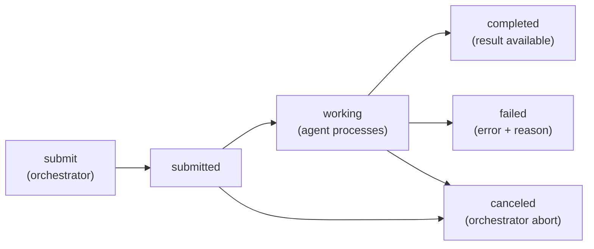
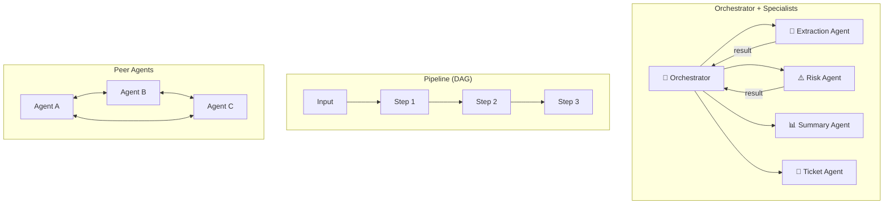

# Модуль 42 — A2A Protocol и Multi-Agent Systems

> **Для AI-архитектора:** Multi-agent system — это не «запустить несколько LLM в цикле». Это система коммуникации, состояния, делегирования, retry и accountability. A2A даёт protocol layer для agent-to-agent interaction.

## Содержание

1. [Введение и актуальность](#1-введение-и-актуальность)
2. [Архитектурная механика](#2-архитектурная-механика)
3. [Production trade-offs](#3-production-trade-offs)
4. [Security и failure modes](#4-security-и-failure-modes)
5. [Реальный кейс](#5-реальный-кейс)
6. [Антипаттерны](#6-антипаттерны)
7. [Задачи AI-кодеру](#задачи-ai-кодеру)
8. [Чеклист архитектора](#чеклист-архитектора)

---

## 1. Введение и актуальность

### 1.1. Что такое A2A

A2A — протокол коммуникации между агентами. Он нужен, когда один агент не владеет всеми компетенциями и вызывает специализированные агенты как сервисы.

```text
Orchestrator Agent
   │
   ├── Research Agent
   ├── Contract Extraction Agent
   ├── Legal Policy Agent
   └── Ticket Agent
```

Важно: A2A не отменяет MCP. Они решают разные задачи:

| Слой | Решает |
|:--|:--|
| MCP | агент ↔ инструменты/данные/UI |
| A2A | агент ↔ агент |
| Model Gateway | агент ↔ LLM providers |
| AgentOps | измерение и контроль agent system |


## Актуальные версии и сигналы

| A2A Protocol | v0.3.x ecosystem | июнь 2026 | agent-to-agent communication |
| `a2a-js` | 0.2.0 | июнь 2026 | JavaScript SDK |
| Python A2A SDK | active | июнь 2026 | Google A2A ecosystem |
| A2A Go SDK | active | июнь 2026 | backend/Go implementations |

---

## 2. Архитектурная механика

### 2.1. Agent Card — описание возможностей агента

Agent Card — JSON-документ, который агент публикует для discovery.
Содержит name, description, URL, authentication и список capabilities.

```typescript
interface AgentCard {
  name: string;
  description: string;
  url: string;
  version: string;
  capabilities: {
    tasks: string[];           // типы задач: "extraction", "research"
    maxInputSize: number;      // макс. размер входных данных (chars)
    maxOutputSize: number;     // макс. размер результата (chars)
    supportedFormats: string[]; // "json", "markdown", "text"
    maxConcurrent: number;     // параллельных task
  };
  authentication: {
    type: 'none' | 'bearer' | 'oauth2';
    scopes: string[];
  };
  // Пример:
  // {
  //   "name": "contract-extractor",
  //   "description": "Извлекает реквизиты из договоров",
  //   "url": "https://agents.internal/contract-extractor",
  //   "capabilities": {
  //     "tasks": ["extraction"],
  //     "maxInputSize": 100_000,
  //     "maxOutputSize": 10_000
  //   },
  //   "authentication": { "type": "bearer", "scopes": ["documents:read"] }
  // }
}
```

### 2.2. Task — единица работы

Task — контракт между агентами. Содержит вход, выход и статус.



```typescript
interface Task {
  taskId: string;          // UUID
  sessionId: string;       // группа связанных task
  parentTaskId?: string;   // для DAG иерархии
  agentId: string;         // целевой агент
  idempotencyKey?: string; // для safe retry

  input: TaskInput;
  status: TaskStatus;      // submitted | working | completed | failed | canceled
  output?: TaskOutput;
  error?: { code: string; message: string };

  metadata: {
    createdAt: string;     // ISO 8601
    updatedAt: string;
    attempts: number;
    maxAttempts: number;
    timeoutMs: number;
  };
}
```

### 2.3. Протокольный lifecycle

Агент-отправитель (orchestrator) вызывает агента-исполнителя:

```text
1. Orchestrator: POST /a2a/task → { taskId, status: "submitted" }
2. Orchestrator: GET /a2a/task/{taskId} (poll) → { status: "working" }
   или: SSE /a2a/task/{taskId}/stream (stream) → { status, delta }
3. Agent:       PATCH /a2a/task/{taskId} → { status: "completed", output }
4. Orchestrator: GET /a2a/task/{taskId} → { status: "completed", output }
```

Выбор между poll и stream — trade-off:

| Режим | Latency | Complexity | Нагрузка |
|-------|---------|-----------|----------|
| Poll (каждые 2s) | ~2s avg | Низкая | N агентов × N poll/сек |
| SSE streaming | ~200ms avg | Средняя (SSE парсер) | 1 соединение/task |
| Webhook callback | ~500ms avg | Высокая (нужен endpoint) | 1 вызов/task |

### 2.4. Паттерны multi-agent orchestration

| Паттерн | Плюсы | Минусы | Пример |
|---------|-------|--------|--------|
| Orchestrator + specialists | контроль, accountability, traceability | coordinator bottleneck, SPOF | review договора: extraction→risk→summary |
| Peer agents (decentralised) | гибкость, нет SPOF | сложнее tracing, blame | чат-агенты с маршрутизацией по навыку |
| Pipeline agents (DAG) | предсказуемость, throughput | неадаптивен | batch обработка: стабильные шаги |
| Market-style delegation | масштабируемость | trust/rating/auth | open agent networks |



### 2.5. State management и idempotency

Write operations должны быть идемпотентны:

```text
same taskId + same idempotencyKey → same result (no duplicate side effects)
```

```typescript
// Idempotent task submission
async function submitTask(task: Task): Promise<Task> {
  // Проверить существующий task по idempotencyKey
  const existing = await taskStore.findByIdempotencyKey(
    task.idempotencyKey!
  );
  if (existing) return existing; // уже создан — вернуть без изменений

  // Создать новый
  return taskStore.create(task);
}

// Durable task store
interface TaskStore {
  create(task: Task): Promise<Task>;
  updateStatus(taskId: string, status: TaskStatus, output?: TaskOutput): Promise<void>;
  findById(taskId: string): Promise<Task | null>;
  findByIdempotencyKey(key: string): Promise<Task | null>;
  listBySession(sessionId: string): Promise<Task[]>;
  markCanceled(taskId: string): Promise<void>;
}
```

### 2.6. Failure modes и observability

| Failure mode | Симптом | Контроль |
|:--|:--|:--|
| Infinite delegation | task уходит по кругу | max depth, visited agents set |
| Lost task | orchestrator не знает status | durable task store |
| Silent quality degradation | result есть, но плохой | per-agent evaluator |
| Context explosion | слишком много artifact | summary + references |
| No blame | непонятно кто сломал pipeline | per-agent traces + correlationId |
| Retry storm | failed agent вызывает лавину | backoff + circuit breaker |
| Credential propagation | compromised agent получает доступ других | scoped credentials, short-lived tokens |

**Observability для multi-agent:**

```typescript
// Каждый agent call логируется с correlationId и traceId
interface AgentCallLog {
  correlationId: string;     // сквозной ID всей сессии
  traceId: string;           // W3C Trace Context
  parentTaskId?: string;     // кто вызвал
  taskId: string;            // текущая task
  agentId: string;           // какой агент
  durationMs: number;
  status: 'success' | 'failure' | 'timeout';
  tokensUsed?: number;
  costUsd?: number;
}
```

### 2.7. Реальный кейс: агент обработки договора

Pipeline из 4 агентов: extraction → risk → summary → ticket.

```text
contract:DOC-789
 ├── extraction (12s) → { стороны: "ООО Ромашка / ИП Иванов",
 │                         сумма: "1 200 000 ₽", срок: "31.12.2026" }
 ├── risk (8s) → { уровень: "medium", риск: "отсутствие неустойки",
 │                 рекомендация: "добавить пункт 5.3" }
 ├── summary (6s) → { итого: "Договор поставки, типовой, рекомендовано
 │                     согласование с юристом" }
 └── ticket: created (id=LEGAL-1042)
```

Ключевые решения:
- extraction без human approval (read-only)
- ticket:create с idempotencyKey (повторный вызов не создаст дубль)
- risk agent использует другую модель чем extraction (специализация)
- всё логируется с `correlationId = "contract:DOC-789"`

---


---


---

## 5. Антипаттерны
### «Пять агентов вместо одного большого промпта»

**Почему ошибка:** если нет явных контрактов, state и evals — это усложнение без выигрыша.

---

### «Агент вызывает агента без timeout»

**Почему ошибка:** без timeout и cancellation один медленный агент блокирует весь workflow.

---

### «Retry без idempotency»

**Почему ошибка:** retry без idempotency создаёт дубликаты внешних действий.

---

## Anti-checklist ☠️

- [ ] Пять агентов вместо одного большого промпта — если нет контрактов и evals, это усложнение без выигрыша
- [ ] Агент вызывает агента без timeout — один медленный блокирует весь workflow
- [ ] Retry без idempotency — создаёт дубликаты тикетов, писем или платежей
- [ ] Всегда poll вместо stream — лишняя нагрузка на сервер при большом числе агентов
- [ ] Agent Card без версионирования — старый orchestrator не знает о новых capability
- [ ] Бесконечная глубина делегирования — A вызывает B, B вызывает C, C вызывает A

---

## 7. Задачи AI-кодеру

**Задача 1 — Task store**

> Реализуй `TaskStore` на TypeScript. Методы: `createTask`, `updateStatus`, `getTask`, `listTasksBySession`, `markCanceled`. Обязательные поля: `taskId`, `sessionId`, `agentId`, `status`, `attempts`, `createdAt`, `updatedAt`, `resultArtifactIds`. Добавь unit-тесты на idempotent create по `idempotencyKey`.

---

**Задача 2 — Delegation limiter**

> Реализуй `DelegationLimiter` с `maxDepth`, `maxTasksPerSession`, `visitedAgents`. Метод `canDelegate(currentAgent, targetAgent, sessionTrace)` возвращает `{allowed, reason}`. Если agent уже был в trace или depth превышен — запрет. Добавь тест на цикл A → B → C → A.

---

**Задача 3 — Artifact summarizer**

> Реализуй функцию `summarizeArtifact(artifact, maxChars)`, которая возвращает `{summary, references, truncated}`. Summary должен содержать: agentId, status, keyFacts, confidence, warnings. Raw data не включается, только ссылки на artifact IDs.


## 8. Чеклист архитектора

### Protocol
- [ ] Agent Cards описаны для каждого агента
- [ ] Task lifecycle явно определён
- [ ] Artifact format стабилен
- [ ] Streaming/polling выбран осознанно

### Orchestration
- [ ] Есть coordinator или понятный peer protocol
- [ ] Max depth задан
- [ ] Cycles запрещены
- [ ] Timeout есть на каждый agent call

### State
- [ ] Task store durable
- [ ] Idempotency keys есть для write actions
- [ ] Retry policy имеет backoff
- [ ] Cancellation обрабатывается

### Observability
- [ ] Per-agent traces есть
- [ ] Per-agent metrics есть
- [ ] Quality evals есть для критичных агентов
- [ ] Blame по pipeline можно установить по `correlationId`

---

*Модуль 42 завершён.*
*Следующий: [Модуль 43 — Agent Memory и Knowledge Graphs](../43-agent-memory-knowledge-graphs/README.md)
