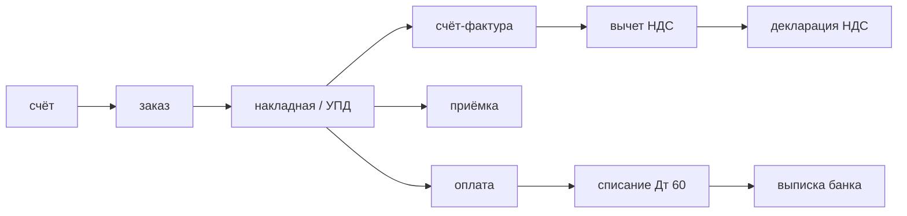

# Модуль 56 — Бухгалтерия как граф документов

> **Для AI-архитектора:** разработчику, который идёт в автоматизацию бухгалтерии, кажется, что задача — посчитать налоги. Это ложная постановка: считает учётная система, а её ошибки живут не в арифметике, а в связях между документами. Реальный предмет автоматизации — **граф первички**: какие документы обязаны сойтись, кто их породил, кто подтвердил и где разрыв стоит денег. Модуль даёт карту этого графа и правило отбора проверок, которые ловят разрывы до налоговой.
>
> Один день изучения — от вопроса «кто кому должен документ» до контрольного соотношения, которое поймало бы пропущенную оплату за 40 дней до проверки.

## Содержание

1. [Учёт — это не арифметика](#1-учёт--это-не-арифметика)
2. [Топология первички](#2-топология-первички)
3. [Три источника правды и почему они расходятся](#3-три-источника-правды-и-почему-они-расходятся)
4. [Оборотно-сальдовая ведомость как единственный интерфейс](#4-оборотно-сальдовая-ведомость-как-единственный-интерфейс)
5. [Контрольные соотношения](#5-контрольные-соотношения)
6. [Цена разрыва в рублях](#6-цена-разрыва-в-рублях)
7. [Правило отбора проверок](#7-правило-отбора-проверок)
8. [Реальный кейс](#8-реальный-кейс)
9. [Антипаттерны](#9-антипаттерны)
10. [Anti-checklist](#anti-checklist)
11. [Задачи AI-кодеру](#задачи-ai-кодеру)
12. [Чеклист архитектора](#чеклист-архитектора)

---

## Актуальные версии

> Проверено: октябрь 2026. Механики модуля — документные, версии привязаны к редакциям НК РФ на дату проверки.

| Источник | Редакция | Что задаёт для архитектуры |
|:--|:--|:--|
| НК РФ, ст. 88 | ред. от 01.01.2026 (425-ФЗ от 28.11.2025) | камеральная проверка: экстерритория, сроки, основания для требования |
| Письмо ФНС | ЕА-36-15/4924@ от 09.06.2026 | регламент камеральной проверки, порядок проверки уточнённой декларации |
| НК РФ, ст. 75 | действующая | пени: 1/300 ключевой ставки за каждый день просрочки |
| НК РФ, ст. 76 | действующая | приостановление операций по счёту при просрочке отчётности |
| НК РФ, ст. 122 | действующая | штраф за грубое нарушение: процент от неуплаченной суммы |
| НК РФ, ст. 11.3 | действующая | единый налоговый счёт: условия отражения уточнённой декларации |
| НК РФ, п. 8 ст. 164 | с 01.01.2026 | основная ставка НДС 22%, расчётная 22/122 для авансов |
| 54-ФЗ, ст. 14.5 КоАП | действующая | санкции за применение ККТ, размеры зависят от повторности |
| КНД | актуальный перечень ФНС | форма декларации — часть контракта с проверкой |

**Практический вывод для архитектора:** любая цифра в этом модуле — процент, срок или ставка — имеет дату. Проверяющий код, который их сравнивает, должен хранить правило с датой вступления в силу, а не константу.

---

## 1. Учёт — это не арифметика

Калькулятор налогов написан один раз и работает одинаково у всех. Ошибка в нём видна сразу: сумма не сходится с известной суммой. Ошибка в связях не видна нигде — она проявляется через 3–18 месяцев, когда налоговая задаёт вопрос про документ, который никто не создал.

Отсюда разница в предмете автоматизации:

| Что автоматизируют | Что ломается | Кто ловит |
|:--|:--|:--|
| расчёт налога | формула, ставка, база | проверяющий тест на эталоне |
| **связь документов** | пропущенный шаг, чужая подпись, другая версия | **внешняя проверка, через месяцы** |

Бухгалтер на аутсорсе не «считает» — он **следит за графом**: пришло ли, подписано ли, отражено ли, сошлось ли с оплатой. Это работа с состояниями документов и сроками, а не с формулами. Значит, и автоматизация здесь — про состояния и сроки.

**Практический вывод для архитектора:** продукт в этой нише продаётся не «быстрее считаем», а «раньше узнаём о разрыве». Первое — это скорость, второе — это снятие риска. Продаётся второе.

### Граничные случаи — где ломается

**Расчёт сходится, а учёт неверен.** Классика: НДС начислен верно, декларация подана верно, но входящий счёт-фактура не проведён — то есть нет суммы к вычету. Декларация с уменьшением не прошла, компания заплатила лишнее. Ни один тест на арифметику этого не видит: арифметика корректна, корректна и невыгодна.

**Один платёж закрывает четыре документа.** Входящее 500 000 ₽ — за четыре накладные по 125 000 ₽. Ни одна пара «платёж ↔ накладная» не равна, проверка по точному совпадению сумм молчит, а проверка по дате закрывает платёж первым документом и теряет три остальных. Дефект не в бухгалтерии — в модели правила.

**Дата документа ≠ дата признания.** Прибыль по отгрузке, НДС по отгрузке с особым порядком для авансов, вычеты — по факту счёта-фактуры. Граница периода проходит по разным датам для разных налогов. Правило «дата документа входит в период» неверно всегда.

**Почему это важно архитектору:** проверка, написанная на равенство двух чисел, даёт ноль сигнала на самых дорогих кейсах. Модель данных проверки должна хранить связь (документ, контрагент, период, сумма), а не пару чисел — иначе её придётся переписывать на первой же неделе работы с реальным клиентом.

---

## 2. Топология первички

Бизнес-процесс бухгалтерии — это несколько повторяющихся цепочек. Каждая цепочка — граф с обязательными вершинами и переходами.

```text
ЗАКУПКА
  счёт ─→ заказ ─→ накладная/УПД ─→ счёт-фактура ─→ оплата
   │                    │                    │            │
  (реквизиты)      (приёмка)           (вычет НДС)   (списание Дт)

ПРОДАЖА
  заказ ─→ отгрузка ─→ УПД ─→ оплата
              │          │        │
          (отпуск)  (выручка)  (дебиторка)

КАССА (розница, общепит, услуги)
  чек ОФД ─→ Z-отчёт ─→ выручка/расход в учёте

МАРКИРОВКА
  карточка ГИС МТ ─→ коды Data Matrix ─→ УПД с кодами ─→ ЭДО ─→ отчёт

ЗАРПЛАТА
  табель ─→ расчёт ─→ ведомость ─→ выплата ─→ выписка банка
```

Четыре свойства этого графа определяют, что автоматизируемо:

1. **Вершины принадлежат разным владельцам.** Накладная — ваша, счёт-фактура — контрагента, чек — кассе, код маркировки — ГИС МТ. Проверить можно только то, что вы получили.
2. **Переходы асинхронны.** Реализация разошлась с отгрузкой на 2 дня, подписание — на 11. Граф меняется после того, как сверка прошла.
3. **Часть вершин неизменяема.** Подписанный УПД не переписывается, исправление идёт отдельным документом. Значит, «поправить в учёте» не всегда допустимо.
4. **Есть обязательные, но не вычисляемые условия.** Подпись контрагента, оплата в срок, наличие в реестре маркировки. Это проверки факта, а не формулы.



**Практический вывод для архитектора:** автоматизируется не документ, а **переход между документами**. Отсюда естественная декомпозиция продукта: сверка переходов (быстро, дёшево, ручная настройка) и контроль фактов (дороже, требует доступа к внешним системам).

---

## 3. Три источника правды и почему они расходятся

Одна и та же сделка существует в трёх системах, и каждая считает себя правильной:

| Источник | Что видит | Скорость | Как узнать об изменении |
|:--|:--|:--|:--|
| Учётная система (1С) | свои документы, свои проводки, свой НДС | секунды после проведения | только внутри себя |
| Оператор ЭДО | факт подписания, отказа, маршрут подписи | минуты-часы | webhook, опрос событий |
| Банк | деньги | дни | выписка, инкрементальная выписка |

Расхождение между ними — не ошибка, а нормальное состояние. ЭДО отстаёт от учёта, банк — от ЭДО, и в каждом окне между ними есть минуты, где система права, а данные не дошли.

**Практический вывод для архитектора:** сверка должна иметь представление об ожидаемой задержке. Сравнение «здесь и сейчас» без модели задержки даёт ложные срабатывания — а продукт, который кричит об ошибке каждый день, отключают на третий день.

**Граничные случаи — где ломается:**

**Обновление выписки в середине дня.** Банк отдаёт операцию, позже меняет назначение платежа или дату исполнения. Если система считает деньги по первой выгрузке, она получает ложное расхождение. Значит, в модели сверки нужна идемпотентность по ключу операции, а не по позиции в файле.

**Двойной приём одного УПД через роуминг.** Документ приходит дважды: от двух операторов ЭДО, через роуминг. По счётчику совпадений это две операции, по номеру и дате — одна. Проверка без ключа идемпотентности удваивает долг.

**Снятие с учёта без закрытия сделки.** Контрагент вернул товар: у вас есть корректировка, у него — возврат, у банка — возврат денег. Граф расходится в трёх местах, и все три расхождения легитимны.

**Почему это важно архитектору:** «ложное срабатывание» в бухгалтерском продукте хуже пропущенного разрыва. Пропуск клиент обнаружит один раз, а раздражающий ложный сигнал отключит сверку навсегда. Следовательно, порог и приоритет — часть контракта продукта, а не настройка.

---

## 4. Оборотно-сальдовая ведомость как единственный интерфейс

Разработчику не нужен доступ к базе учётной системы. Нужна одна выгрузка, которая даёт ответ на «как сходится учёт»:

| Показатель | Что берётся из ведомости | Зачем |
|:--|:--|:--|
| начальное сальдо | входящий остаток периода | база для расчёта оборотов |
| обороты Дт / Кт | движения за период | сумма, участвующая в сверке |
| конечное сальдо | исходящий остаток | проверка арифметики: Нн + Дт − Кт = Кк |
| разбивка по субсчетам | 60, 62, 68, 90, 51 | предмет сверки |

Формула проверки целостности самой выгрузки:

```text
Сальдо_нач + Оборот_Дт − Оборот_Кт = Сальдо_кон      (для дебетового сальдо)
Сальдо_нач − Оборот_Дт + Оборот_Кт = Сальдо_кон      (для кредитового сальдо)
```

Если для счёта не выполняется — проблема в выгрузке, а не в бизнесе. Это первая проверка, которую нужно делать до всех остальных: она отсекает слой «мусор на входе» и не даёт анализировать чужой баг.

```sql
-- Проверка целостности выгрузки ОСВ до запуска сверок
SELECT account,
       opening_debit + turnover_debit - turnover_credit AS computed,
       closing_debit                                   AS reported,
       opening_credit + turnover_credit - turnover_debit AS computed_credit,
       closing_credit                                  AS reported_credit
  FROM osv_extract
 WHERE opening_debit + turnover_debit - turnover_credit <> closing_debit
    OR opening_credit + turnover_credit - turnover_debit <> closing_credit;
```

**Практический вывод для архитектора:** если данные не проходят арифметическую проверку на своей же таблице — их нельзя анализировать. Слой «проверить вход» отделяет ошибки источника от ошибок бизнес-правил и должен быть первым в конвейере.

---

## 5. Контрольные соотношения

Контрольное соотношение — утверждение о данных, нарушение которого имеет цену. Хорошее соотношение выполняется на 100% нормальных данных и ловит дорогие кейсы.

| Соотношение | Что ловит | Цена нарушения |
|:--|:--|:--|
| сальдо Дт 51 = выписка банка | неотраженный платёж, расхождение с банком | расхождение по требованию, пени |
| оборот по Дт 62 = сумма УПД покупателям | неотправленный УПД | вычет НДС не подтверждён, доначисление |
| сумма книг покупок = сумма СФ в учёте | расхождение декларации и регистра | камеральная проверка, доначисление |
| выручка по 90.1 = чеки ОФД за период (в рознице) | непробитый чек | штраф по ст. 14.5 КоАП |
| по каждому договору: Σ неоплаченных УПД = сальдо Дт 60 | расхождение дебиторки и фактов | спор с контрагентом, претензия |
| коды маркировки в УПД = коды в ГИС МТ | неполная передача сведений | предписание, запрет оборота |
| дата оплаты ≤ срок по договору + льготный период | просрочка контрагента | пени по договору, претензия |
| остатки в учёте = остатки в ГИС МТ | расхождение по маркированному товару | штраф за неприменение, предписание |
| НДС к вычету в декларации ≤ НДС по принятым СФ | вычет без документа | доначисление + пени |

### Почему соотношения — это данные, а не код

Набор соотношений меняется каждый год: ставка НДС, пороги, состав деклараций, перечень обязательных реквизитов. Если правило написано в коде, его изменение требует релиза. Если правило лежит в конфиге с датой — его меняют рядом с бухгалтером, без сборки.

```yaml
- id: bank-vs-ledger-51
  title: Сальдо счёта 51 не равно банковскому остатку
  severity: critical
  effectiveFrom: 2026-01-01
  sources: [osv, bank_statement]
  assertion: "osv.account('51').closingDebit == bank.closingBalance"
  tolerance: 0.00
  action: "сверить выписку с журналом банковских операций в учётной системе"
  owner: главный бухгалтер
```

Три поля здесь обязательны: `severity` (что делать с сигналом), `effectiveFrom` (с какого числа действует), `action` (кто и что делает). Правило без `action` — это статистика, а не инструмент.

**Граничные случаи — где ломается:**

**Допуск в 1 копейку накапливается.** Сверка с округлением до рубля проходит месяцами, потом накапливает расхождение в несколько тысяч, которое не имеет объяснения. Допуск должен быть нулевым на уровне копеек, а округление — только в отчёте для человека.

**Соотношение проходит, а бизнес разорван.** Сальдо Дт 62 сошёлся, потому что бухгалтер внёс фиктивную отгрузку. Арифметика цела, граф мёртв. Никакое соотношение на равенство сумм это не увидит — нужны соотношения на признаки: дата, контрагент, отсутствие первичного документа.

**Правило «на всё» даёт ноль сигнала.** Соотношение, которое срабатывает на 30% нормальных данных, не проверяется вообще: бухгалтер отключит его первым.

**Почему это важно архитектору:** ценность контрольного соотношения измеряется не полнотой, а долей срабатываний, которые действительно требуют действия. Продукт, где 9 из 10 сигналов — шум, продаётся один раз и отключается навсегда.

---

## 6. Цена разрыва в рублях

Пока цену разрыва нельзя посчитать, продукт нельзя продать: директор покупает не «контроль соотношений», а «чтобы счёт не заблокировали».

| Компонент | Механика | Что меняется в продукте |
|:--|:--|:--|
| пени | 1/300 ключевой ставки за каждый день просрочки | нужен расчёт «на сегодня», а не «на дату декларации» |
| штраф | процент от неуплаченной суммы по ст. 122 НК РФ | нужен сценарий «уточнёнка до обнаружения недоимки» |
| приостановление операций по счёту | ст. 76 НК РФ, при просрочке отчётности | нужен календарь сроков с опережением |
| камеральная проверка | ст. 88 НК РФ, экстерриториальная с 2026 | нужен список сценариев, которые ФНС проверяет |
| потеря вычета | вычет без подтверждающего документа | нужен контроль комплектности первички |
| санкции по ККТ | ст. 14.5 КоАП, размер зависит от повторности | нужен контроль чеков против учёта |

Условие, дающее клиенту способ избежать штрафа: уточнённая декларация подана до обнаружения недоимки **и** сальдо единого налогового счёта на дату подачи положительное и покрывает недоимку с пенями. Оба условия одновременно — выполнение одного не работает.

**Практический вывод для архитектора:** фича «проверить декларацию перед подачей» ценна ровно настолько, насколько она снижает вероятность попасть в акт проверки. Значит, метрика продукта — не «сколько соотношений сработало», а «сколько раз разрыв найден до срока подачи отчётности».

---

## 7. Правило отбора проверок

Проверок можно написать сотни. Клиент получит ноль ценности и двадцать сигналов в неделю. Правило отбора — из трёх вопросов:

1. **Можно ли узнать об этой ошибке дешевле, чем её последствия?** Если последствие — 500 ₽ пени, а проверка требует месяц интеграции — не делаем.
2. **Есть ли источник правды вне учётной системы?** Расхождение внутри одной системы не доказывает ошибку: это может быть корректная особенность учёта. Доказывает только второй источник — банк, ЭДО, ГИС МТ, ЕГРЮЛ.
3. **Что именно делать, если сработало?** Без действия сигнал не нужен. Если нельзя сформулировать действие — это метрика для внутреннего пользователя, а не продуктовая фича.

```text
Проверка проходит отбор, если:

  цена_пропуска  >  стоимость_проверки_в_месяц × срок_эксплуатации
  ∧ есть_внешний_источник_правды(проверка)
  ∧ сформулировано_действие(проверка)
```

**Практический вывод для архитектора:** первая версия продукта — это 3–5 проверок с самым высоким отношением цена пропуска к стоимости, а не покрытие темы. Расширение покрытия — следствие накопленных подтверждений от клиентов, а не плана на второй спринт.

---

## 8. Реальный кейс

**Входные данные.** Автор рассматривает выход на рынок автоматизации для бухгалтерии в России. Ограничение, заданное сразу: не встраиваться внутрь учётных систем. Гипотеза продукта: «дашборд контроля сходимости вместо доработки учёта».

**Ход рассуждения.** Первая версия продукта формулировалась как «контроль расхождений между источниками». При разборе графа первички выяснилось, что контролировать нечего без правил, а правила без графа — это список пар чисел. Реальный предмет — **переходы**: подписан ли УПД, оплачен ли, не истёк ли срок. Проверки перешли из плоскости «сходятся ли суммы» в плоскость «существует ли документ в нужном состоянии в нужный срок».

**Результат.** Три вывода, изменивших продукт:

- Камеральная проверка ФНС по ст. 88 с 2026 года проводится экстерриториально. Значит, «проверка идёт у меня в ИФНС» перестало быть утешительным аргументом — и перестало быть причиной для клиента откладывать.
- Условие освобождения от штрафа требует положительного сальдо ЕНС на дату подачи уточнённой декларации. Значит, продукт должен считать сальдо ЕНС, а не только сумму налога. Это одно требование добавило внешний источник данных и превратило продукт из сверки в подсказку к действию.
- Порог блокировки по ст. 76 НК РФ — 20 дней просрочки, и ФНС получила право предварительно уведомить за 14 дней. Значит, ценность продукта измеряется в календарных днях до срока, а не в количестве найденных ошибок. Метрика переписалась до первой продажи, а не после.

**Вывод, противоречащий интуиции.** Первая версия продукта строилась вокруг слова «автоматизация», и это было ошибкой. Пока продукт описывается как автоматизация, он сравнивается с бесплатным модулем внутри учётной системы. Переформулировка в «раннее предупреждение с переводом в рубли» сразу дала продукт, у которого нет бесплатного аналога: встроенный модуль не звонит бухгалтеру и не переносит вывод в отчёт для директора.

Второй вывод: граница «не лезем внутрь 1С» оказалась архитектурным требованием, а не ограничением. Единственные точки данных, которых реально хватало — выгрузка оборотно-сальдовой ведомости, выписка банка, состояния документов из ЭДО. Ни одна из них не требует доступа к внутренностям учётной системы.

---

## 9. Антипаттерны

### Продукт «посчитал налог сам»

Проверяющий код, который пересчитывает налог и сравнивает с декларацией, ввязывается в учётную политику, льготы и региональные правила. Ответственность за ошибку переходит на разработчика, а предмет спора смещается с бизнеса на софт. Считает учётная система — её верность подтверждает проверяющий тест, а не второй самодельный расчёт.

### Отчёт о расхождениях как финальный продукт

Список из 40 строк «платёж не найден» без действия и без суммы последствия читается один раз и дальше игнорируется. Каждая строка отчёта обязана отвечать на два вопроса: что делать и сколько это стоит.

### Единый движок правил для всех клиентов

Правило, настроенное под первого клиента, через второй месяц оказывается исключением для третьего. Конфиг правил должен быть данными с версией и датой, а общность — достигаться параметрами, а не ветвлением.

### Порог по умолчанию «чтобы не шумело»

Смягчение порога, чтобы сигналов было меньше, убирает ровно тот класс ошибок, который никогда не повторится второй раз. Мягче делать нужно не порог, а приоритет: редкий и дорогой сигнал показывается отдельной строкой «требует внимания», а не смешивается с рутиной.

### Сверка в облаке без разбора режима

Учётные данные — коммерческая тайна с правом клиента потребовать обработки внутри своей юрисдикции. Облачная сверка требует отдельного договора о передаче данных и выигрывает только у клиентов, которым уже можно отдать данные.

---

## Anti-checklist ☠️

- [ ] Проверка построена на равенстве двух сумм без модели связей — не срабатывает на самых дорогих кейсах
- [ ] Правило без `action` в конфиге — сигнал есть, решения нет, продукт отключают
- [ ] Правило без `effectiveFrom` — правка ставки требует релиза вместо смены конфига
- [ ] Допуск округления задан в копейках правила, а не в отчёте — расхождение растёт незаметно
- [ ] Сверка без модели ожидаемой задержки источника — ложные срабатывания в первый же день
- [ ] Идемпотентность по позиции в файле, а не по ключу операции — дубль при обновлении выписки
- [ ] Ошибка входной выгрузки попадает в бизнес-правила — диагностика уходит не туда
- [ ] Проверка срабатывает на 30% нормальных данных — её отключат в первую неделю
- [ ] Пересчёт налогов внутри продукта — ответственность за ошибку переносится на разработчика
- [ ] Цена пропуска не посчитана — директору нечем обосновать оплату

---

## Задачи AI-кодеру

Плохая формулировка:
> «Сделай проверку расхождений между банком и учётной системой для бухгалтерии.»

Разбор: не указано, что считается источником правды, какой допуск по сумме, что делать при срабатывании и кто владелец сигнала. Результат — отчёт со списком строк без действия и с порогом, откалиброванным на глаз.

Хорошая формулировка:
> «В модуле 56 зафиксировано контрольное соотношение `bank-vs-ledger-51`: остаток счёта 51 в ОСВ должен совпадать с банковским остатком на ту же дату, допуск 0, действие — «сверить выписку с журналом банковских операций».
>
> Задача: реализовать проверку как единый конфиг правил с полями `id`, `severity`, `effectiveFrom`, `sources`, `assertion`, `action`, `owner`.
>
> Границы: не трогать существующий код расчёта налогов; не реализовывать другие соотношения из таблицы модуля; не добавлять зависимостей.
>
> Критерии готовности:
> - `npm test` → зелёный, есть тест с расхождением в 1 копейку, ожидающий результат — сигнал
> - `npm test` → зелёный, есть тест с расхождением, помеченным как `effectiveFrom` в будущем, ожидающий результат — пропуск проверки
> - при срабатывании в отчёте присутствуют `severity` и `action`, а не только разница сумм
> - `npm run check` → код 0
>
> Контекст проекта: `AGENTS.md`, `docs/CONTEXT.md`, модуль 56 (раздел 5)».

Формула: что делает + границы + конкретные критерии с ожидаемым результатом + ссылка на источник требования в модуле.

Вторая задача — на формулировку требования:
> «Переформулируй это требование так, чтобы его можно было принять, не читая код: 'сделай так, чтобы бухгалтеру показывалось, что сошлось, а что нет'. Что должно быть в формулировке, чего не хватает сейчас и какой критерий готовности ты предложишь.»

Ожидаемый ответ: не хватает определения источников, модели задержки, критерия «сошлось» (счёт, период, допуск, источник правды), формулировки действия и владельца сигнала. Критерий готовности: тест на каждый из трёх исходов — сошлось, расхождение в пределах допуска, расхождение сверх допуска, — с указанием, что при нарушении даты правила проверка не выполняется.

---

## Чеклист архитектора

### Модель данных
- [ ] Проверка хранит связь (документ, контрагент, период, источник, сумма), а не пару чисел
- [ ] Ключи идемпотентности привязаны к идентификатору операции, а не к позиции в файле
- [ ] Деньги хранятся в копейках целым числом; округление — только на выходе отчёта
- [ ] Правила лежат в конфиге с `severity`, `effectiveFrom`, `action`, `owner`
- [ ] Источник правды у каждой проверки явно назван и отличается от проверяемой системы

### Конвейер проверок
- [ ] Первым шагом идёт проверка целостности входной выгрузки
- [ ] У каждой связи есть ожидаемая задержка источника
- [ ] Правила с `effectiveFrom` в будущем не выполняются
- [ ] Доля сигналов, требующих действия, измеряется и отслеживается
- [ ] Проверки, сработавшие на нормальных данных, разбираются до расширения покрытия

### Продукт и риск
- [ ] Цена пропуска посчитана в рублях для каждой проверки верхнего уровня
- [ ] Продукт позиционируется как предупреждение, а не как автоматизация расчёта
- [ ] Отчёт отвечает на «что делать» и «сколько стоит», а не «где разница»
- [ ] Режим обработки данных (локальный, в контуре клиента) выбран осознанно
- [ ] Ни одна проверка не пересчитывает налог

### Работа с клиентом
- [ ] Понятно, кто покупает (собственник) и кто пользуется (бухгалтер)
- [ ] Первый пилот ограничен 3–5 проверками, а не покрытием темы
- [ ] Сигнал доходит до человека без программирования

---

*Модуль 56 завершён.*
*Курс пройден: от механики языков до организации кода, контрактов, устойчивости и предметной области.*
*Следующий: [Модуль 57 — Сверка без доступа к учётной системе](../57-reconciliation-without-erp/README.md)*
