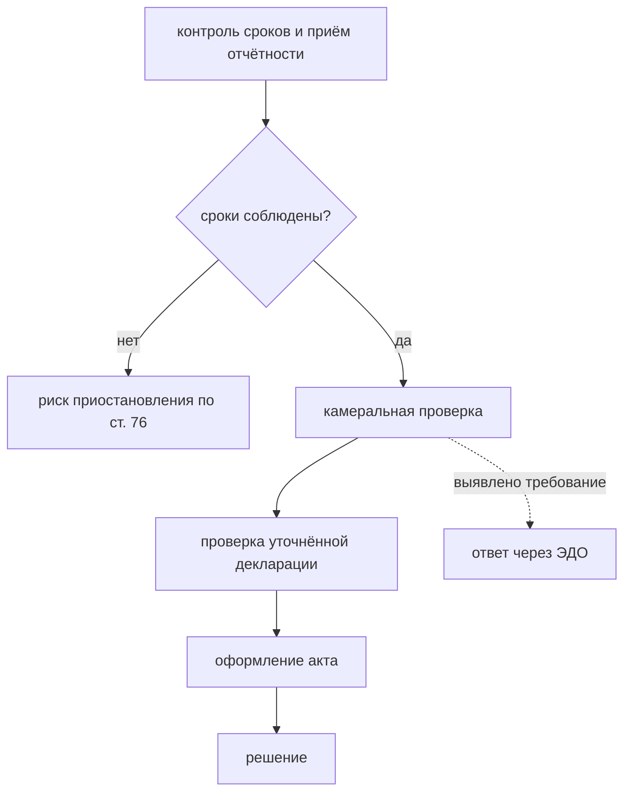

# Модуль 58 — Контроль соответствия требованиям ФНС

> **Для AI-архитектора:** модули 56 и 57 дали граф и доступ. Осталось превратить находку в продукт, который покупают: из «найдено расхождение» в «вот действие и вот сколько это стоит в рублях». Модуль разбирает механику налогового контроля 2026 года как набор проверяемых требований, показывает, почему pre-flight перед подачей декларации стоит больше любого отчёта после проверки, и отделяет контроль от учёта — границу, за которой продукт начинает брать чужую ответственность.
>
> Один день изучения — от регламента камеральной проверки до отчёта, который директор читает за минуту и который меняет решение о подаче уточнённой декларации.

## Содержание

1. [Налоговый контроль как протокол](#1-налоговый-контроль-как-протокол)
2. [Что именно проверяет ФНС машино](#2-что-именно-проверяет-фнс-машино)
3. [Pre-flight перед подачей](#3-pre-flight-перед-подачей)
4. [Дерево решений по декларации](#4-дерево-решений-по-декларации)
5. [Цена сигнала](#5-цена-сигнала)
6. [Контроль, а не учёт](#6-контроль-а-не-учёт)
7. [Регуляторный контур как данные](#7-регуляторный-контур-как-данные)
8. [Реальный кейс](#8-реальный-кейс)
9. [Антипаттерны](#9-антипаттерны)
10. [Anti-checklist](#anti-checklist)
11. [Задачи AI-кодеру](#задачи-ai-кодеру)
12. [Чеклист архитектора](#чеклист-архитектора)

---

## Актуальные версии

> Проверено: октябрь 2026. Регламент камеральной проверки изменился в 2026 году; ссылки на письмо 2013 года в подзаконных актах и методичках устарели.

| Источник | Редакция / дата | Что задаёт |
|:--|:--|:--|
| НК РФ, ст. 88 | с 01.01.2026 | экстерриториальная камеральная проверка, сроки, основания для требования |
| Письмо ФНС | ЕА-36-15/4924@ от 09.06.2026 | регламент: контроль сроков, камеральная проверка, проверка уточнённой декларации, акт, решение |
| Письмо ФНС | АС-4-2/12705 от 16.07.2013 | **утратило силу** с 09.06.2026 — ссылка на него устарела |
| НК РФ, ст. 75 | действующая | пени: 1/300 ключевой ставки за каждый день просрочки |
| НК РФ, ст. 76 | действующая | приостановление операций по счёту при просрочке отчётности, порог 20 дней |
| НК РФ, ст. 101 (п. 11) | ред. 201-ФЗ от 26.06.2026 | рассмотрение материалов без участия налогоплательщика по одному составу нарушения |
| НК РФ, ст. 122 | действующая | штраф за грубое нарушение |
| 425-ФЗ от 28.11.2025 | с 01.01.2026 | основная ставка НДС 22%, расчётная 22/122, порог НДС на УСН снижен |
| ФНС, перечень КНД | актуальная редакция | форма декларации как часть контракта с проверкой |

**Практический вывод для архитектора:** регуляторный контур меняется быстрее кода. Отсюда правило проектирования: суммы, ставки, сроки и пороги — версионируемые данные с датой, а не константы в коде. Продукт, который не может объяснить, по какой редакции закона выдан его вывод, нельзя предъявлять клиенту как основание для решения.

---

## 1. Налоговый контроль как протокол

Ключевое изменение 2026 года: **камеральная проверка стала экстерриториальной** — её может проводить налоговый орган, уполномоченный надзорным органом, а не только инспекция по месту учёта налогоплательщика. Аргумент «проверка придёт к нам в ИФНС, а это соседний регион» перестал работать как причина откладывать.

Новый регламент ФНС (письмо от 09.06.2026) описывает пять стадий, и каждая соответствует своей точке приложения продукта:



Стадии пронумерованы в тексте выше, а не в подписях узлов: подпись, начинающаяся с цифры и точки, вermaid разбирает как список и печатает на диаграмме «Unsupported markdown».

Три практических следствия для архитектуры:

1. **Стадия 1 не про налоги, а про сроки.** Продукт, который начинается с проверки декларации по существу, пропускает самую дешёвую по стоимости и самую болезненную по последствиям стадию.
2. **Ответ на требование для плательщиков НДС — только через оператора ЭДО.** Бумажный ответ считается непредставленным. Это делает канал ЭДО обязательным, а не дополнительным, и объясняет, почему состояние документов из модуля 57 нужно именно плательщику НДС.
3. **Проверка уточнённой декларации — самостоятельный контур.** Порядок зависит от того, когда подана уточнёнка: до окончашения камеральной проверки, после неё, но до акта, или после акта. Эти четыре случая дают разные последствия, и продукт обязан различать их.

**Практический вывод для архитектора:** продукт должен иметь компонент календаря сроков, независимый от проверки содержания. Клиент покупает в первую очередь «мы не пропустим», потому что пропуск срока стоит дороже любой ошибки в сумме.

---

## 2. Что именно проверяет ФНС машино

Регламент перечисляет инструменты, которыми инспектор пользуется. Почти все они работают на данных, а не на документах, — и это делает продукт возможным.

| Инструмент контроля | На чём основан | Что проверяем у себя |
|:--|:--|:--|
| автоматизированные сверки | данные декларации, сведения о сделках, данные банков | согласованность декларации с регистрами |
| межведомственный обмен | сведения о сделках, данные о контрсчётном объекте | наличие расхождений, которые увидит ФНС |
| запрос пояснений | конкретные показатели декларации | готовность объяснить каждое отклонение |
| истребование документов | ст. 93, 93.1 НК РФ, в том числе у контрагентов | наличие документов по цепочке |
| осмотр, выемка | расширено с 2026 года | целостность первички и её соответствие учёту |
| допрос свидетелей | люди, а не данные | риск противоречивых объяснений |
| экспертиза | специальные знания | качество оформления документов |

Отдельно регламент описывает контроль при операциях с использованием системы прослеживаемости и подтверждения ожидания поставки, а также при заявлении вычетов по НДС и при операциях с импортом из ЕАЭС. Для клиента это означает, что часть расхождений возникает не внутри его учёта, а между его декларацией и данными, которые он не формировал сам.

**Практический вывод для архитектора:** перечень источников, которыми располагает ФНС, определяет приоритет проверок продукта. Проверка «сходится ли у нас» без оглядки на внешние источники бесполезна: инспектор сравнивает с данными, которых у клиента нет.

---

## 3. Pre-flight перед подачей

Обычный отчёт отвечает на вопрос «что было». Pre-flight отвечает на вопрос «что будет, если подать это». Разница в цене решения.

```text
Обычный отчёт:   отчёт → бухгалтер разбирается → решение

Pre-flight:      проверка → «если подать, вот два расхождения;
                 вот что это стоит; вот вариант с уточнёнкой
                 и условие, при котором штрафа не будет»
                 → решение о подаче принимается с открытыми глазами
```

Три обязательных свойства pre-flight:

1. **Работает на данных, которые в реальности уйдут в налоговую.** Проверка по промежуточным остаткам бесполезна: в декларации суммы считаются иначе, чем в учёте, часть расхождений возникает именно на переходе.
2. **Даёт количественную оценку.** «Расхождение 120 000 ₽, потенциальные пени 1 400 ₽, штраф при грубом нарушении — до 40% от суммы» переводит вопрос в плоскость, где решение принимается за секунды.
3. **Даёт варианты, а не только факты.** Минимум: подать как есть; подать уточнёнку с доплатой; снять вычет и подать без него. Каждый вариант — с суммой и с условиями.

**Практический вывод для архитектора:** pre-flight — это не отчётность, а калькулятор решений. Единица полезности — «сколько денег сэкономлено на конкретном решении», а не «сколько строк в отчёте».

---

## 4. Дерево решений по декларации

Центральная развилка, вокруг которой строится продукт: подавать уточнённую декларацию или нет.

```text
Уточнённая декларация подана
├── до окончачения камеральной проверки первичной
│     → предыдущая проверка прекращается, счёт заново
├── после окончачения проверки, до составления акта
│     → акт всё равно составляется по первичной декларации,
│       уточнёнка проверяется отдельно
└── после составления акта, до вынесения решения
      → инспекция вправе не учитывать уточнёнку с учётом
        объёма изменений и действительной цели подачи

Освобождение от штрафа требует ОДНОВРЕМЕННО:
  ✓ уточнёнка подана до обнаружения недоимки
  ✓ сальдо ЕНС на дату подачи положительное
    и покрывает недоимку с пенями
```

Отсюда предметная область продукта — не «сверка декларации», а **сценарии декларации**. Их конечное число, они перечислимы и покрывают большую часть реальных случаев:

| Сценарий | Что проверяем | Что советуем |
|:--|:--|:--|
| суммы сходятся | контрольные соотношения | подавать можно |
| вычет без подтверждающего документа | наличие СФ на дату подачи | снять вычет или приложить документ |
| вычет есть, сальдо ЕНС отрицательное | состояние ЕНС | внести разницу до подачи |
| уточнёнка на уменьшение | сальдо ЕНС после окончания проверки | срок уменьшения отложен, учитывать в планировании |
| нарушен срок подачи | календарь | минимизировать и описать причину |
| формат декларации не проходит проверку приёма | КНД и формат | декларация считается непредставленной |

**Практический вывод для архитектора:** ограниченный перечень сценариев — преимущество, а не ограничение. Он делает продукт объяснимым, позволяет покрыть его тестами и делает цену разработки предсказуемой: это десятки проверок, а не тысячи.

---

## 5. Цена сигнала

Отчёт для директора существует ровно в одной форме: сумма риска, действие и цена решения.

```text
Отчёт для собственника
  Риск: 2 расхождения, суммарная величина 138 400 ₽
    1. Вычет НДС 120 000 ₽ по счёту-фактуре от контрагента,
       который не сдал декларацию. Пени: 1 400 ₽
    2. Просрочка представления расчёта по взносам 21 день.
       Блокировка счёта: риск с 20-го дня
  Решение: снять вычет в текущем квартале (штраф исключается
           при подаче уточнёнки до обнаружения недоимки
           при положительном сальдо ЕНС)
  Стоимость решения: снять 120 000 ₽ из вычета сейчас
                     или рисковать доначислением
```

Три требования к формулировке сигнала:

1. **Называть контрагента и документ.** «Расхождение 120 000 ₽» нельзя закрыть. «Вычет по СФ от такого-то контрагента» — можно.
2. **Давать срок.** «Пени растут каждый день, до 20-го числа счёт могут заблокировать» — это информация, на основе которой решают сегодня.
3. **Давать вариант с условиями.** Не «снимите вычет», а «снять вычет в этом квартале — штраф не начисляется, если уточнёнка подана до обнаружения недоимки и сальдо ЕНС положительное».

**Практический вывод для архитектора:** разделение интерфейсов на «для бухгалтера» (что именно не так и где документ) и «для собственника» (сколько стоит и что делать) — не косметика. Смешанный отчёт читают только бухгалтеры, а платит собственник.

### Граничные случаи — где ломается

**Пени посчитаны на дату запуска, а не на дату отчётности.** Ключевая ставка меняется, и сумма в отчёте перестаёт совпадать с расчётом налоговой. Признак: пользователь сверил цифру, получил расхождение в десятки рублей и перестал доверять сумме — а вместе с ней и всему отчёту.

**Штраф показан как «до 40%», прочитан как «40%».** Клиент планирует на максимуме, которого не будет. Реальная величина зависит от признания нарушения грубым, от добровольной корректировки и от позиции инспектора. Диапазон полезен только рядом с условиями, при которых применяется каждая граница.

**Единый порог «малозначительности» на все правила.** Правило, срабатывающее на нормальных данных, отключается; правило с широким порогом выкидывает разовую потерю вычета — ошибку, которая не повторится и которую клиент зафиксирует как недосмотр продукта.

**Данные для проверки есть, данных для решения нет.** Вычет по контрагенту без декларации — факт. Сумма пени — расчёт. Рекомендация — суждение, требующее позиции клиента по контракту. Продукт, выдающий рекомендацию без отмеченной границы собственных знаний, получает претензию за совет, который клиент принял.

**Уточнёнка подана по устаревшей методике.** Порядок проверки уточнённой декларации изменился в 2026 году, и правило, написанное по письму 2013 года, даёт клиенту неверный вывод о последствиях. Здесь отсутствие `effectiveFrom` стоит дороже, чем где-либо ещё в продукте.

**Почему это важно архитектору:** цена сигнала — самый доверительный элемент продукта. Ошибка в ней не приводит к падению: она приводит к тому, что клиент перестаёт открывать отчёт. Отсюда решение: расчёт цены изолируется в отдельный компонент с собственными тестами и редакцией, а его результат всегда сопровождается условиями применения.

---

## 6. Контроль, а не учёт

Граница, за которой продукт из помощника бухгалтера превращается в лицо, отвечающее за цифры.

| Контроль | Учёт |
|:--|:--|
| находит расхождение и спрашивает | формирует проводку и налог |
| формулирует «здесь не сходится» | формулирует «правильно так» |
| опирается на правила и первичку | берёт на себя применение учётной политики |
| отвечает за полноту проверки | отвечает за правильность цифр |
| бухгалтер принимает решение | система заменяет решение |

Практический критерий: **продукт не должен ни разу сказать «правильная сумма — такая»**. Любая фраза такого рода переносит ответственность за учёт на разработчика. Формулировки в интерфейсе — не стилистика, а юридическая позиция:

```text
❌ «Счёт-фактура №41 от 12.03 содержит ошибку, НДС должен быть 12 400 ₽»
✅ «Счёт-фактура №41 от 12.03: сумма НДС 12 400 ₽.
    Проверьте расчёт — расхождение с регистром НДС за период»
```

Плюс явный дисклеймер в интерфейсе и в отчёте: результат проверки не является заключением и не заменяет решение бухгалтера. Это не формальность — это то, что позволяет продавать продукт бухгалтерии, а не конкурировать с ней за подпись.

**Практический вывод для архитектора:** ограничение «не говорить, что правильно» проще соблюдать, чем объяснять. Если в продукте нет места, где нужно вынести суждение о правильности цифры, ответственность не возникает.

---

## 7. Регуляторный контур как данные

Правила проверок стареют быстрее кода. Раз в год ставка, раз в год формы, раз в год процедура проверки. Архитектура обязана вынести это в данные.

```yaml
- id: vat-basic-rate
  kind: constant
  value: 22
  unit: percent
  effectiveFrom: 2026-01-01
  source: "425-ФЗ от 28.11.2025, п. 8 ст. 164 НК РФ"

- id: payment-block-threshold
  kind: threshold
  value: 20
  unit: days
  effectiveFrom: 2026-06-09
  source: "письмо ФНС ЕА-36-15/4924@ от 09.06.2026, ст. 76 НК РФ"

- id: vat-advance-rate
  kind: formula
  value: "22/122"
  effectiveFrom: 2026-01-01
  source: "п. 8 ст. 164 НК РФ, расчётная ставка"
```

Обязательные поля каждого правила: `effectiveFrom`, `source`, и — для проверок — `severity` и `action` из модуля 56. Поле `source` обязательно: вывод продукта, который нельзя сослаться на норму, не является основанием для решения клиента.

Механизм выбора редакции:

```typescript
type Rule = {
  id: string;
  effectiveFrom: string;   // ISO-дата
  effectiveTo?: string;    // открытая редакция не имеет этой даты
  source: string;
  // ...содержимое правила
};

// Правило действует на дату расчёта: начало ≤ дата < конец
const rulesFor = (rules: Rule[], onDate: string): Rule[] =>
  rules.filter(r => r.effectiveFrom <= onDate && (!r.effectiveTo || onDate < r.effectiveTo));
```

**Практический вывод для архитектора:** дату расчёта результата нужно хранить вместе с правилами и отображать в отчёте. Отчёт без даты и без ссылки на норму нельзя использовать как обоснование перед налоговой, а значит, он не работает как продукт.

---

## 8. Реальный кейс

**Входные данные.** Продукт определён как контроль соответствия требованиям до подачи отчётности. Первый вопрос, который задал себе автор: от чего именно продукт защищает.

**Ход рассуждения.** Первая версия проверок строилась по контрольным соотношениям модуля 56: сходятся суммы внутри декларации, сходится ли НДС, нет ли арифметических ошибок. Разбор регламента ФНС показал, что это проверки первого уровня — их делает сам налоговый орган автоматически, и на них клиент и так не попадает.

Реальная работа инспектора начинается с другого: он сравнивает декларацию с данными, которые у клиента нет, — сведения о сделках, банковские данные, данные систем прослеживаемости. Значит, ценность для клиента — не «у меня всё сходится», а «я знаю, где ФНС увидит расхождение раньше меня».

Вторая находка была про порог блокировки: приостановление операций по счёту наступает при просрочке свыше 20 дней, при этом налоговый орган вправе заранее уведомить. Это превращается в продуктовую фичу: мониторинг сроков с упреждением, где результат не «расхождение», а «до приостановления осталось N дней».

**Результат.** Набор проверок первого релиза сократился с 40 до 6, и каждый из них отвечал на вопрос «что увидит инспектор, чего не видим мы»:

1. вычет НДС по контрагенту, не сдавшему декларацию;
2. сальдо ЕНС, не покрывающее сумму к уплате;
3. просрочка сроков с упреждением до порога блокировки;
4. расхождение выручки с данными кассовых чеков;
5. комплектность первички по договору перед подачей;
6. расхождение остатков маркированного товара с учётом.

Формулировка отчёта перешла на язык директора: сумма, срок, действие с условиями. Метрика продукта — не количество найденного, а «сколько раз решение принято до подачи».

**Вывод, противоречащий интуиции.** Покрытие 6 проверок продавалось лучше, чем покрытие 40. Причина: 40 проверок дают 40 сигналов в месяц, и у клиента формируется привычка их не читать. Шесть проверок, каждая с суммой и сроком, дают решение, которое можно принять в тот же день.

Второй вывод: самая простая фича — календарь сроков с упреждением — оказалась самой востребованной, потому что её результат считывается без участия бухгалтера. Продукт, который можно открыть собственнику и увидеть «до приостановления счёта 9 дней», продаётся быстрее, чем продукт, который требует разбираться в расхождениях.

Третий вывод, архитектурный: граница «контроль, а не учёт» оказалась не юридической осторожностью, а требованием к продукту. Пока продукт проверяет, у него нет ответа за цифры. Как только он начинает предлагать «правильную сумму», ответственность уходит к нему, и остаётся только убрать продукт.

---

## 9. Антипаттерны

### Продукт, пересчитывающий налог

Проверка, которая пересчитывает налог по своей формуле, ввязывается в учётную политику, льготы и региональные правила. Ответственность смещается с бизнеса на софт, а предмет спора — с расхождения на «кто неправ». Калькуляция налога — зона учётной системы.

### Декларация как чёрный ящик

Продукт проверяет сводные показатели декларации и не может сказать, из чего они сложились. Бухгалтер не может устранить причину, потому что не видит строку. Pre-flight работает только тогда, когда спускается до документа, породившего цифру.

### Один порог на все правила

Правило «отправить в малозначительные» выглядит бережливостью по отношению к пользователю. На практике оно выкидывает именно тот класс ошибок, который не повторится второй раз: разовую потерю вычета, разовую просрочку.

### Абстрактные штрафы в отчёте

Отчёт, использующий валовые суммы штрафов из учебников, дезориентирует. Реальная величина зависит от фактической суммы налога, позиции инспектора и факта добровольной корректировки. Показывать надо диапазон и условия, при которых он применяется.

### Продукт, который просит доверять

Доверие — это не текст в интерфейсе, а накопительное свойство: каждое точное срабатывание его повышает, каждое ложное обнуляет. Поэтому качество данных о важнее количества фич, а «мы почти уверены» в интерфейсе — это потеря доверия, а не честность.

---

## Anti-checklist ☠️

- [ ] Продукт пересчитывает налог сам — ответственность за цифры уходит от бухгалтера к разработчику
- [ ] В интерфейсе есть фраза «правильная сумма такая» — это позиция по ответственности, а не стилистика
- [ ] Pre-flight проверяет сводные цифры, но не доводит до документа — бухгалтер не может устранить причину
- [ ] В отчёте нет даты и ссылки на норму — вывод нельзя использовать как обоснование
- [ ] Ставки, сроки и пороги зашиты в код — изменение нормы требует релиза вместо правки данных
- [ ] Правило без `effectiveTo` при изменении нормы — старая редакция применяется после новой
- [ ] Один порог «о малозначительности» на все правила — отсекаются разовые дорогие ошибки
- [ ] Штрафы показаны одной цифрой без условий применения — цифра не соответствует реальности
- [ ] Отчёт смешивает технический разбор и решение для собственника — читает только бухгалтер
- [ ] Продвижение основано на страхе без указания, что именно делать с сигналом

---

## Задачи AI-кодеру

Плохая формулировка:
> «Сделай проверку налоговой декларации перед отправкой в ФНС, чтобы находить ошибки.»

Разбор: не указаны источник данных, перечень сценариев, правило расчёта пени, требование к формулировке вывода. Результат — пересчёт налога в лучшем случае или абстрактное сообщение об ошибке в худшем, и в обоих случаях продукт берёт на себя чужую ответственность.

Хорошая формулировка:
> «В модуле 58 описаны сценарии декларации и условия освобождения от штрафа: уточнённая декларация подана до обнаружения недоимки при положительном сальдо ЕНС, покрывающем сумму с пенями.
>
> Задача: реализовать сценарий «вычет НДС по контрагенту, не сдавшему декларацию»: найти в декларации вычеты по контрагентам без сведений о представленной декларации на дату проверки, оценить пени по ставке 1/300 ключевой ставки на дату расчёта и сформировать сигнал.
>
> Границы: не пересчитывать налог; не предлагать «правильную сумму» — формулировки только в форме вопроса к бухгалтеру; не реализовывать остальные сценарии из модуля 58; правило хранить в конфиге с `effectiveFrom` и `source`.
>
> Критерии готовности:
> - `npm test` → зелёный, тест на контрагента с поданной декларацией — сигнала нет
> - `npm test` → зелёный, тест на контрагента без декларации — сигнал есть, сумма пени равна ожидаемой по формуле
> - `npm test` → зелёный, тест на правило с `effectiveFrom` в будущем — проверка не выполняется
> - в сигнале присутствуют `severity`, `action`, `source`, дата расчёта и сумма
> - `npm run check` → код 0
>
> Контекст проекта: `AGENTS.md`, `docs/CONTEXT.md`, модули 56 (раздел 5) и 58 (разделы 3, 4, 5, 7)».

Формула: что делает + границы с явным запретом на пересчёт + конкретные проверяемые свойства + критерии готовности.

Вторая задача — на границу ответственности:
> «Просмотри интерфейсные формулировки этого продукта и найди места, где система сообщает правильную сумму или правильный способ учёта, вместо того чтобы указывать на расхождение. Что должно быть в каждом месте вместо этого и как это проверить автоматически.»

Ожидаемый ответ: перечислить места (подсказки, автозаполнение, «должно быть», «рекомендуемая сумма»), предложить формулировку в форме вопроса с указанием источника расхождения и критерий проверки: в строках интерфейса нет формулировок с указанием единственно верного значения; плюс наличие дисклеймера в отчёте. Критерий готовности: список мест с заменой формулировки и тест, падающий при появлении в интерфейсе запрещённых конструкций.

---

## Чеклист архитектора

### Продукт
- [ ] Первая версия ограничена 3–7 проверками, а не покрытием темы
- [ ] Каждая проверка отвечает на вопрос «что увидит инспектор, чего не видим мы»
- [ ] Метрика продукта — сумма предотвращённого риска, а не количество найденного
- [ ] Сигнал содержит контрагента, документ, сумму, срок и действие
- [ ] Есть интерфейс для бухгалтера (где документ) и для собственника (сколько стоит)

### Ответственность
- [ ] Продукт не пересчитывает налог и не формирует проводки
- [ ] Ни одна формулировка не называет правильную сумму
- [ ] В отчёте есть дисклеймер о статусе результата проверки
- [ ] Ответственность за применение учётной политики остаётся на бухгалтере

### Регуляторный контур
- [ ] Ставки, сроки и пороги — версионируемые данные с `effectiveFrom` и `source`
- [ ] При изменении нормы у правила появляется `effectiveTo`
- [ ] Выбор редакции выполняется по дате расчёта, а не по текущей дате запуска
- [ ] Дата расчёта и ссылка на норму попадают в отчёт
- [ ] Изменения норм отслеживаются как задача, а не как реакция на жалобу клиента

### Эксплуатация
- [ ] Календарь сроков работает независимо от проверки содержания
- [ ] У порога блокировки счёта есть упреждающее предупреждение
- [ ] Отсутствие данных источника отличается от отсутствия расхождений
- [ ] Покрытие тестами опирается на обезличенные реальные данные

---

*Модуль 58 завершён.*
*Курс пройден: от механицы языков до предметной области с реальными внешними системами и регуляторным контуром.*
*Следующий шаг — собрать первые 3–5 проверок для одного клиента руками и посмотреть, где предметная область расходится с ожиданиями.*
