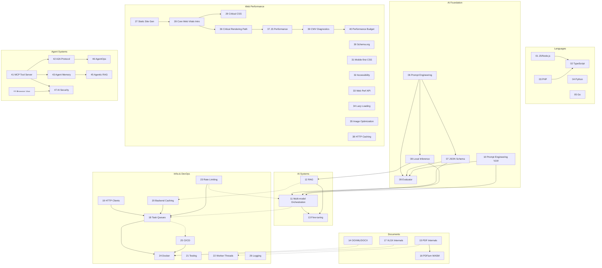

# Architecture Landscape — карта курса

> Как модули связаны между собой, какие production-системы из них собираются,
> и где в курсе лежит какая компетенция.

---

## Треки курса

```
╔═══════════════════════════════════════════════════════════════════╗
║                    AI Architect Course                           ║
╠═══════════════════════════════════════════════════════════════════╣
║                                                                   ║
║  Languages ──► AI Foundation ──► AI Systems ──► Agent Systems    ║
║       │               │                │              │          ║
║       ▼               ▼                ▼              ▼          ║
║  Documents ◄─────── Infra/DevOps ◄── Web Perf     Security      ║
║                                                                   ║
╚═══════════════════════════════════════════════════════════════════╝
```

```
01-05  Languages         │  JS/TS, PHP, Python, Go — механика, не синтаксис
06-10  AI Foundation     │  Prompt, JSON Schema, Local Inference, VLM, Eval
11-13  AI Systems        │  Multi-model, RAG, Fine-tuning
14-17  Documents         │  DOCX, PDF, PDFium WASM, XLSX internals
18-26  Infra / DevOps    │  Queues, HTTP, Caching, Testing, Workers, Rate Limiting,
                         │  Docker, CI/CD, Logging
27-40  Web Performance   │  SSG, Core Web Vitals, Critical CSS, Schema.org,
                         │  A11y, Lazy Loading, Image Opt, CRP, JS Perf,
                         │  HTTP Caching, Diagnostics, Perf Budget
41-47  Agent Systems     │  MCP, A2A, Agent Memory, Browser Use, Agentic RAG,
                         │  AgentOps, AI Security
```

---

## Карта production-систем

Каждая production-система собирается из нескольких модулей.
Ниже — типовые сборки и их покрытие курсом.

### Система 1: Document Processing Pipeline

```
Входящий документ → extraction → LLM → validation → output
```

| Слой | Модули |
|------|--------|
| Document parsing | 14 (DOCX), 15 (PDF internals), 16 (PDFium WASM), 17 (XLSX) |
| Text extraction / OCR | 15 §2 (classify), 10 (VLM), 05 (Go) |
| LLM inference | 08 (Local Inference), 06 (Prompt Engineering), 07 (JSON Schema) |
| Structured output | 07 (Structured Output), 04 §6 (Pydantic) |
| Orchestration | 18 (Task Queues), 11 (Multi-model) |
| Quality control | 09 (Evaluator), 12 (RAG) |
| Infrastructure | 24 (Docker), 25 (CI/CD), 26 (Logging) |

**Архитектурные решения:**
- Модуль 14 vs 15: `docx npm` vs raw XML vs PizZip (14 §7)
- Модуль 15 vs 16: PDF.js vs PDFium WASM (16 §1)
- Модуль 10 vs 04: VLM vs pytesseract + text LLM (10 §7, Real case)
- Модуль 18 vs 18: BullMQ vs pg-boss (18 §1)

### Система 2: AI Agent / Assistant

```
User → orchestrator agent → tools + memory → LLM → response
```

| Слой | Модули |
|------|--------|
| Agent protocol | 41 (MCP), 42 (A2A) |
| Memory & Knowledge | 43 (Agent Memory), 12 (RAG) |
| Tool execution | 41 (MCP tools), 44 (Browser Use) |
| LLM / Multi-model | 11 (Multi-model), 08 (Local Inference) |
| Observability | 46 (AgentOps), 26 (Logging) |
| Security | 47 (AI Security), 06 §7 (Prompt Injection) |
| Infrastructure | 18 (Queues), 24 (Docker), 25 (CI/CD) |

**Архитектурные решения:**
- MCP vs direct tool calls (41 §1)
- Local vs cloud LLM for agents (08)
- Agentic RAG vs standard RAG (12 §8, 45)

### Система 3: Static Site / Web Performance

```
Content → SSG build → optimized HTML → CDN → user
```

| Слой | Модули |
|------|--------|
| SSG framework | 27 (Static Site), 03 (PHP WebForge) |
| Performance optimization | 28–40 (Web Performance блок) |
| Structured data | 30 (Schema.org) |
| Accessibility | 32 (Accessibility/WCAG) |
| Build pipeline | 25 (CI/CD), 24 (Docker) |
| Image pipeline | 35 (Image optimization), 16 (PDFium render) |

### Система 4: Data Extraction Pipeline (batch)

```
N источников → queue → LLM batch → validation → storage
```

| Слой | Модули |
|------|--------|
| Rate limiting | 23 (Rate Limiting), 11 §2 (Key Rotation) |
| Queuing | 18 (Task Queues), 22 (Worker Threads) |
| Batch inference | 08 (Local Inference), 10 (VLM), 07 (JSON Schema) |
| Retry / Resilience | 19 (HTTP clients), 18 §4 (DLQ) |
| Caching | 20 (Backend Caching), 12 §3 (Embedding cache) |
| Quality gates | 09 (Evaluator), 21 (Testing) |
| Cost control | 11 §4 (Cascade Filter), 20 §7 (LLM cache) |

---

## Cross-cutting concerns

Какая тема в каком модуле раскрыта.

| Concern | Основные модули | Дополнительно |
|---------|----------------|---------------|
| **Security** | 47 (AI Security), 06 §7 (Prompt Injection) | 24 §4 (Docker hardening), 19 §10 (Supply chain), 01 §5 (Permission Model) |
| **Cost** | 11 §4 (Cascade economics), 08 §1 (VRAM budget), 09 §6 (CI cost) | 20 (Caching), 19 §7 (Connection pooling) |
| **Observability** | 26 (Logging), 09 (Evaluator) | 18 §9 (Queue metrics), 19 §9 (HTTP metrics), 20 §9 (Cache metrics) |
| **Resilience** | 19 §6 (Circuit breaker), 19 §5 (Retry), 18 §4 (DLQ) | 23 (Rate Limiting), 18 §8 (Graceful shutdown) |
| **Testing** | 21 (Testing) | 09 (Eval dataset), 19 §2 (undici MockAgent), 05 §6 (Go table tests) |
| **Performance** | 36 (Critical Rendering Path), 37 (JS Perf), 08 §7 (TTF/TPS) | 04 §2 (GIL), 22 (Worker Threads), 20 (Caching) |

---

## Архитектурные пустоты

Темы, которые не покрыты ни одним модулем (potential future modules):

| Пробел | Почему важен | Когда добавить |
|--------|-------------|----------------|
| **SQL / Database schema design** | Архитектор проектирует схемы, индексы, миграции | При расширении RAG (12) до production |
| **Frontend architecture** | AI-продукт = не только API | При появлении UI-ориентированных проектов |
| **Domain-Driven Design** | Event storming, bounded context для AI pipeline | При усложнении agent systems |
| **Cost engineering** | Total cost of ownership AI системы | Когда cost станет узким местом |
| **Resilience patterns** | Bulkhead, Saga, Retry storm | При переходе к multi-agent |
| **API design (general)** | Не LLM API, а general API design | При проектировании API для внешних потребителей |
| **Auth / IAM** | OAuth 2.1, RBAC, API keys management | Когда появится multi-tenant |

---

## Граф зависимостей модулей



> **Легенда:** `A --> B` = A необходим для понимания B. `A -.-> B` = практическая связь при построении production-системы.

---

## Как читать курс под задачу

### «Нужно спроектировать extraction pipeline»

1. Start: 06 (Prompt Engineering) + 07 (JSON Schema)
2. Expand: 08 (Local Inference) — hardware constraints
3. Scale: 11 (Multi-model) — rate limits, fallbacks
4. Document parsing: 14 (DOCX), 15 (PDF), 17 (XLSX) — по типу входа
5. Validate: 09 (Evaluator) — quality gates
6. Deploy: 18 (Queues) + 24 (Docker) + 25 (CI/CD)

### «Нужно добавить AI-агента в существующую систему»

1. Start: 06 (Prompt) + 07 (JSON Schema) + 41 (MCP)
2. Expand: 42 (A2A) — multi-agent
3. Productionize: 43 (Memory) + 46 (AgentOps)
4. Secure: 47 (AI Security) — threat model, injection
5. Infra: 18 (Queues) + 19 (HTTP) + 26 (Logging)

### «Нужно оптимизировать веб-производительность»

1. Measure: 28 (Core Web Vitals intro) + 39 (Diagnostics)
2. Fix CRP: 36 (Critical Rendering Path) + 29 (Critical CSS)
3. Fix images: 35 (Image Optimization)
4. Fix JS: 37 (JS Performance) + 38 (HTTP Caching)
5. Budget: 40 (Performance Budget)

---

*Этот файл — living document. Обновляй при добавлении или изменении модулей.*
