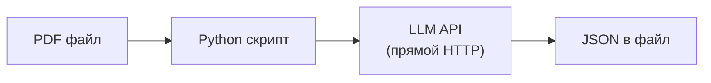
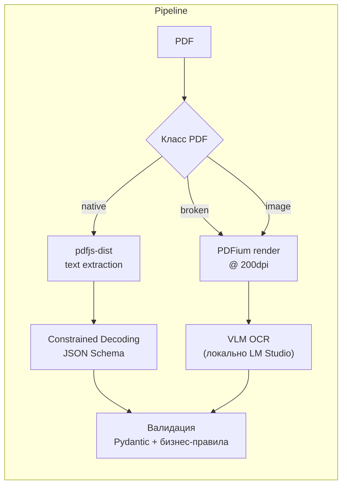
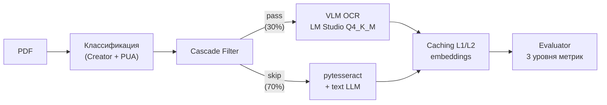
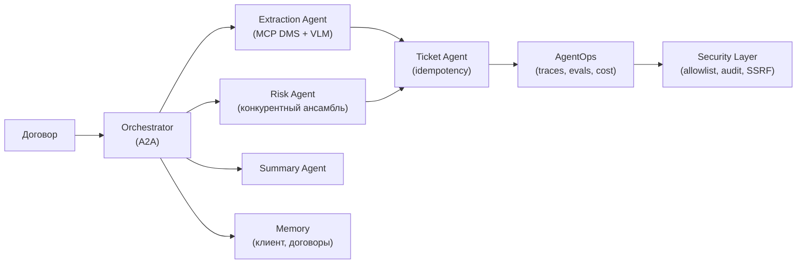

# Эволюция архитектуры: от прототипа к production

> Narrative: как одна система (обработка входящих документов) проходит
> три итерации, применяя модули курса. Каждая итерация — реальные
> архитектурные решения с trade-offs.

---

## Итерация 0: Прототип («чтобы работало»)

### Задача
Заказчик приносит 50 PDF-счетов и просит «достать оттуда реквизиты».

### Решение
Прямой LLM-вызов, всё на одной машине, без очереди, без БД.



### Код

```python
# prototype.py — 30 строк, работает на 50 документах
import openai, json, sys

def extract(text: str) -> dict:
    resp = openai.chat.completions.create(
        model="gpt-4o-mini",  # исторический пример: модель 2024 года
        messages=[{"role": "user",
          "content": f"Извлеки реквизиты: {text}"}],
    )
    return json.loads(resp.choices[0].message.content)

for pdf in sys.argv[1:]:
    text = pdf_to_text(pdf)           # магия, работает не всегда
    data = extract(text)
    with open(f"{pdf}.json", "w") as f:
        json.dump(data, f, ensure_ascii=False)
```

### Проблемы
- **Текста нет** — PDF с битым ToUnicode даёт мусор
- **JSON разный** — модель возвращает поля то так, то этак
- **Нет retry** — при ошибке API скрипт падает на 47-м документе
- **Rate limit** — 30 RPM, через минуту 429
- **Нет метрик** — «работает?» — «вроде да»

### Какие модули курса применимы
- **06** (Prompt Engineering) — качество промпта
- **07** (JSON Schema) — стабильный формат вывода
- **15** (PDF) — text extraction vs render

---

## Итерация 1: Production («стабильно»)

### Задача
50 → 500 документов/день. Нужна надёжность, метрики, retry.

### Что изменилось



### Ключевые решения

**1. Классификация PDF перед extraction** (Модуль 15)
```typescript
// Поле Creator определяет стратегию
const STRATEGY = {
  '1C:Enterprise':    { render: true },   // 80% — render → VLM
  'Microsoft Word':   { extract: true },  // 100% — text extraction
  'Adobe Acrobat':    { extract: true },  // 95% — text extraction
  'PdfPint':          { render: true },   // битый ToUnicode
};
```

**2. Constrained decoding вместо `json.loads`** (Модуль 07)
```typescript
const response = await client.beta.chat.completions.parse({
  response_format: CourtRecord,  // Pydantic → гарантия структуры
});
```

**3. Queuing + DLQ** (Модуль 18)
```typescript
const queue = new Queue('doc-process', {
  defaultJobOptions: {
    attempts: 3,
    backoff: { type: 'exponential', delay: 2000 },
  },
});
```

**4. Retry с Retry-After уважением** (Модуль 19)
```typescript
// 429 → читаем Retry-After → ждём → retry
// Не все 4xx — только 429, 5xx + network errors
```

**5. Circuit breaker + Pool** (Модуль 19)
```typescript
const groqPool = new Pool('https://api.groq.com', { connections: 20 });
const breaker = new CircuitBreaker(callGroq, {
  errorThresholdPercentage: 50,
  resetTimeout: 60_000,
});
```

### Новая проблема
- **Cost неконтролируемый** — 500 документов × $0.03 = $15/день
- **SLOW PDF** — VLM OCR на 50-страничном документе = 15 секунд
- **Метрики есть, но никто не смотрит**

### Задействованные модули
- **06** — Prompt Engineering (промпт для extraction)
- **07** — JSON Schema (Structured Output)
- **15** — PDF internals (классификация, ToUnicode)
- **16** — PDFium WASM (рендер для VLM)
- **18** — Task Queues (BullMQ, DLQ)
- **19** — HTTP clients (retry, circuit breaker, pool)
- **24** — Docker (multi-stage, non-root)
- **26** — Logging (Pino, requestId)

---

## Итерация 2: Scale («дёшево и быстро»)

### Задача
500 → 2000 документов/день. Бюджет $50/мес. Заказчик жалуется на latency.

### Что изменилось



### Ключевые решения

**1. Cascade Filter: SLM gate** (Модуль 11)
```text
SLM 0.8B (локально): «На изображении есть цена?» → yes/no
→ 30% проходят gate → VLM OCR
→ 70% skip → pytesseract + text LLM (быстрее в 5×)
```

**2. L1/L2 кэш для embeddings** (Модуль 20)
```typescript
// L1 LRUCache hit: 63% | L2 Redis hit: 31% | combined: 94%
// Cost saving: $0.05 → $0.003/день на embeddings
```

**3. Two-pass pipeline** (Модуль 06)
```text
Pass 1: все документы без thinking → 96% accuracy
Pass 2: только документы с null-полями → thinking → +3% accuracy
Total speedup: 41% при минимальной потере качества
```

**4. Evaluator в CI** (Модуль 09)
```yaml
jobs:
  evaluate:
    steps:
      - run: python check_quality_gate.py
            --max-regression 0.03
            --min-score 0.80
```

### Итоговые метрики

| Метрика | Итерация 1 | Итерация 2 |
|---------|-----------|-----------|
| Документов/день | 500 | 2000 |
| Cost/день | $15 | $4.20 |
| Среднее время | 8s | 3.2s |
| Success rate | 94% | 98.5% |
| Semantic accuracy | 87% | 94% |
| Infra cost/мес | $450 | $85 |

### Задействованные модули (дополнительно)
- **08** — Local Inference (VRAM budget, Q4_K_M)
- **09** — Evaluator (quality gates, structural diff)
- **11** — Multi-model (Cascade Filter, Key Rotation)
- **20** — Backend Caching (L1/L2, stampede)
- **23** — Rate Limiting (tiered limits per user)
- **25** — CI/CD (evaluation pipeline)

---

## Итерация 3: Multi-agent («нужна оркестрация, память, security»)

### Задача
2000 документов/день + юридический анализ. Заказчик хочет: «агент сам проверит договор и подготовит тикет юристу». Нужны: оркестрация, память о клиентах, observability, security.

### Что изменилось



### Ключевые решения

**1. MCP как boundary инструментов** (Модуль 41)
```typescript
// DMS, OCR, Policy, Tickets — отдельные MCP servers
// documents:read без approval, tickets:create с idempotencyKey
// documents:write — только после human approval
```

**2. A2A-оркестрация** (Модуль 42)
```text
contract:DOC-789 → extraction (12s) → risk (8s, ансамбль) → summary (6s)
→ ticket LEGAL-1042 (idempotencyKey, без дублей)
Всё логируется с correlationId, blame по pipeline восстановим
```

**3. Agent Memory** (Модуль 43)
```text
(Company:ООО Ромашка) -[HAS_CONTRACT]-> (Contract:DOC-789)
Каждый факт — с provenance и tenantId. GDPR-delete работает.
```

**4. AgentOps** (Модуль 46)
```yaml
quality-gate:
  - run: agentops-gate --results results.json --baseline baseline.json
        --max-regression 0.03 --min-score 0.80
```

**5. Security** (Модуль 47)
```text
Retrieved documents = untrusted
Tool allowlist: only documents:read, policy:read, tickets:create
URL allowlist на всех fetch (SSRF-фикс из реального инцидента)
Immutable audit trail каждого tool call
```

### Итоговые метрики

| Метрика | Итерация 2 | Итерация 3 |
|---------|-----------|-----------|
| Критичные пропущенные риски | — | −33% (ансамбль) |
| Дубликаты тикетов | периодически | 0 (idempotency) |
| Время ручной проверки юриста | 15 мин/договор | 5 мин/договор |
| Инциденты безопасности | SSRF найден в проде | закрыт allowlist |

### Задействованные модули (дополнительно)
- **41** — MCP (tool boundary, idempotency, kill switch)
- **42** — A2A (orchestrator + specialists, конкурентный ансамбль)
- **43** — Agent Memory (graph, provenance, GDPR)
- **44** — Browser Use (только для legacy-систем без API)
- **45** — Agentic RAG (verifier, temporal, abstain)
- **46** — AgentOps (traces, golden dataset, cost)
- **47** — AI Security (threat model, allowlist, SSRF, audit)

---

## Вывод

Каждая итерация решает проблемы предыдущей и открывает новые.
Архитектор не проектирует «правильную систему» сразу — он
выбирает направление эволюции и знает trade-offs каждого шага.

```
Итерация 0:  простота       → «не работает на production данных»
Итерация 1:  надёжность     → «дорого и медленно»
Итерация 2:  эффективность  → «нужен evaluator чтобы не потерять качество»
Итерация 3:  multi-agent    → «нужна security, память и observability»
Следующая:   самообучение   → «нужны контур обратной связи и fine-tuning»
```

Каждый шаг — осознанный trade-off, а не компромисс.

---

*Июль 2026. AI Architect Course.*
